# Implementation Plan

## Request Summary
- Objective: dar à sessão de treino um **nome opcional do usuário** (`training_sessions.name`, nullable), que passa a ser o título da linha na folha de sessões, com afford de renomear na própria linha, persistido pelo `PUT /api/sessions/{trainingSession}` existente por um envio dedicado.
- Scope:
  - **In**: migration aditiva + `#[Fillable]`/`@property`; validação do nome na `TrainingSessionUpdateRequest` (opcional, aparado, teto 60, só-espaços ≡ nulo); `name` no `TrainingSessionResource` logo após `problem_id`; `title` e `metaLabel` prontos em `SessionRow`; botão "Renomear" + `PranchetaInput` em `SessionList.vue`; `renameSession()` em `lib/sessionTransport.ts`; realimentação de `store.serverUpdatedAt` + `saveLocal()` quando a renomeada é a corrente; testes Pest e Vitest, incluindo as três emendas aprovadas TA-01/TA-02/TA-03; atualização de `docs/agents/*` e registro da regra durável em `.ai/rules/js-prancheta.md` via `record-rule`.
  - **Out**: diálogo antes de criar; qualquer alteração em `SessionCreator::create()`; rota nova; `name` em `SessionBody`/`bodyFrom()`; dependência nova de teste (`@vue/test-utils`, `happy-dom`) ou mudança no `include`/`environment` do `vitest.config.ts`; nome sugerido automaticamente; unicidade; busca/filtro/ordenação por nome; nome fora da folha (barra superior, aba, arquivo do SVG); qualquer mudança em cronômetro, checklist, estimativa, autosave do diagrama ou catálogo.
- Tier: standard
- Architecture references: `AGENTS.md`, `docs/agents/architecture.md`, `docs/agents/domain_rules.md` (consultados também: `docs/agents/api_contracts.md`, `docs/agents/data_model.md`) + regras obrigatórias `CLAUDE.md` e `.ai/rules/{migrations,controllers,requests,resources,services,feature,prancheta,js-prancheta}.md`.

### Regras de camada/delegação que este plano obedece (nomeadas na fonte)

| Regra concreta | Fonte | Onde aparece no plano |
| --- | --- | --- |
| `routes/` só nomeia; **Controller** só `Gate::authorize` + delegação + status; **FormRequest** dona da normalização e dos limites; **Service** grava e não tem apresentação; **Resource** é a forma do fio | `docs/agents/architecture.md` §"Layer responsibilities" (linhas 46-59) | T04 (Resource), T06 (FormRequest), T07 (Service). Nenhuma tarefa toca o controller nem `routes/web.php` — o rename reusa `sessions.update` (verified at `routes/web.php:20`) |
| Duas trancas de isolamento: binding escopado por `ownedBy` (404 antes do controller) + `Gate::authorize` por ação; `user_id` nunca vem do cliente nem sai no Resource | `AGENTS.md` §2; `.ai/rules/controllers.md`; verified at `app/Providers/AppServiceProvider.php:49`, `app/Models/TrainingSession.php:84` | T06 (regras sem `user_id`), T04 (Resource sem `user_id`), T09 (isolamento cruzado) |
| Conceitos de domínio são **lookup, não Enum**; nenhuma coluna `enum` | `AGENTS.md` §2; `CLAUDE.md` | T01/T02 — `name` é texto livre, sem lookup, sem Enum, sem cast |
| Limite de payload é **validação, não coluna** | `docs/agents/domain_rules.md` §"Autosave contract and limits"; `.spec/init/database-schema.md:264` | T01 usa `string` padrão (255) e T06 põe o teto 60 na FormRequest |
| `$fillable` sincronizado com a migration; PHPDoc `@property` para o Larastan nível 7 | `AGENTS.md` §2; verified at `app/Models/TrainingSession.php:39` | T02 |
| `#[PreserveKeys]` no `TrainingSessionResource` (o mapa `checks` não pode ser reindexado) | `.ai/rules/resources.md`; verified at `app/Http/Resources/TrainingSessionResource.php:16` | T04 mantém o atributo intacto |
| Lógica de negócio no servidor; `.vue` só liga, valida e apresenta; nenhuma requisição em `resources/js/prancheta/**` | `AGENTS.md` §2 "Frontend"; `.ai/rules/js-prancheta.md` | T12/T17 (arranjo e orquestração puros, transporte injetado), T15 (requisição só em `lib/`), T19/T20 (componentes só ligam) |
| Sujo é derivado do payload — nada de bandeira manual, nada de payload montado em componente | `.ai/rules/js-prancheta.md` | T16: `name` fora do `SessionBody`; setter de baseline que **não** mexe em `savedSignature`; T24 registra a proibição como regra durável |
| Avisos passam sempre pelo toast único (`useToast().warn()` + `prancheta/warnings.ts`); nada de `alert()` | `.ai/rules/prancheta.md` | T14, T19, T20, T22 |
| `data-testid` é contrato entre fases — não remover os existentes | `.ai/rules/prancheta.md`; verified at `tests/Feature/Frontend/SessionSheetTest.php:11-21` | T19 preserva os sete existentes e acrescenta `session-rename`/`session-rename-input` |
| Todo teste que bate em `/prancheta` chama `seedCatalog()`; nada de seed global | `.ai/rules/feature.md` | T08, T10 |
| `dropForeign` antes de `dropColumn` **quando há FK**, sem guarda por driver | `.ai/rules/migrations.md` | T01 — coluna nullable sem FK e sem índice, portanto `dropColumn` direto; a regra é citada para não ser aplicada por engano |
| Nunca encadear dois comandos que criam migration com `&&` | `AGENTS.md` §2; `CLAUDE.md` | T01 roda `php artisan make:migration` sozinho |
| Regra durável se registra com `record-rule` (glob + título + nota), nunca em memória nativa | `CLAUDE.md` §Project Rules | T24 |
| Runner: `composer ci:check` no host (`npm run lint:check` → `format:check` → `types:check` → `npm test` → `composer test`), sem Sail | `AGENTS.md` §1; memória do projeto (VPS nativo) | RNF-01 em todas as fases |

## AS IS — Componentes impactados

```mermaid
flowchart LR
  User["Candidato"] -->|"abre a folha"| Board["resources/js/pages/Board.vue"]
  Board -->|"fetchSessions()"| Tx["resources/js/lib/sessionTransport.ts"]
  Tx -->|"GET /api/sessions"| Ctrl["app/Http/Controllers/TrainingSessionController.php"]
  Ctrl --> Res["app/Http/Resources/TrainingSessionResource.php"]
  Res --> Rows["resources/js/prancheta/sessions.ts · sessionRows()"]
  Rows -->|"problemName ou 'Prancheta livre'"| List["resources/js/components/prancheta/SessionList.vue"]
  Board -->|"autosave · bodyFrom()"| Store["resources/js/prancheta/session.ts · SessionStore"]
  Store -->|"PUT /api/sessions/{trainingSession}"| Req["app/Http/Requests/TrainingSessionUpdateRequest.php"]
  Req --> Writer["app/Services/SessionStateWriter.php · Arr::only"]
  Writer --> Model["app/Models/TrainingSession.php"]
  Ctrl --> Model
  Model --> DB[("training_sessions · sem coluna de nome")]
  Boot["resources/js/prancheta/resume.ts · resolveBoot()"] -->|"compara serverUpdatedAt"| Store
```

Hoje a folha rotula cada linha pelo nome do problema (`resources/js/prancheta/sessions.ts:121`) com `FREE_BOARD_LABEL` de reserva, e o `SessionList.vue` imprime esses rótulos montando o texto no próprio template (verified at `resources/js/components/prancheta/SessionList.vue:41`, `56`). O único caminho de escrita em uso é o autosave: `SessionBody` → `PUT` → `TrainingSessionUpdateRequest` → `SessionStateWriter::write()` (`Arr::only` de oito chaves, verified at `app/Services/SessionStateWriter.php:23`). O baseline `serverUpdatedAt` do store é o que `resolveBoot()` compara no boot para decidir entre rascunho local e versão do servidor (verified at `resources/js/prancheta/resume.ts:121-127`).

## TO BE — Componentes propostos

```mermaid
flowchart LR
  User["Candidato"] -->|"clica 'Renomear'"| List["components/prancheta/SessionList.vue (alterado · T19)"]
  List -->|"rename: id, nome"| Board["pages/Board.vue (alterado · T20)"]
  Board -->|"transporte injetado"| Orch["prancheta/sessions.ts · orquestração pura (novo · T17)"]
  Orch --> NewTx["lib/sessionTransport.ts · renameSession() (novo · T15)"]
  NewTx -->|"PUT /api/sessions/{trainingSession} · corpo somente name"| Req["Http/Requests/TrainingSessionUpdateRequest.php (alterado · T06)"]
  Req --> Writer["Services/SessionStateWriter.php · Arr::only + name (alterado · T07)"]
  Writer --> Model["Models/TrainingSession.php · Fillable + property (alterado · T02)"]
  Model --> DB[("training_sessions · +name nullable (alterado · T01)")]
  Ctrl["Http/Controllers/TrainingSessionController.php · inalterado"] --> Model
  Ctrl --> Res["Http/Resources/TrainingSessionResource.php · +name após problem_id (alterado · T04)"]
  Res --> Rows["prancheta/sessions.ts · title e metaLabel (alterado · T12)"]
  Rows --> List
  Orch -.->|"ack.updated_at quando id === store.id"| Store["prancheta/session.ts · setServerUpdatedAt() (novo · T16)"]
  Store -->|"autosave.saveLocal()"| Cache[("localStorage · rascunho preservado")]
  Warn["prancheta/warnings.ts · chaves novas (alterado · T14)"] --> Board
  Rule[".ai/rules/js-prancheta.md · name proibido no SessionBody (alterado · T24)"] -.->|"trava a regra para o próximo agente"| Store
  Creator["Services/SessionCreator.php · INALTERADO"] --> Model
```

A coluna `name` nasce nullable (T01) e atravessa model (T02) e Resource (T04) até o arranjo da linha, que passa a entregar `title` e `metaLabel` prontos (T12) — `SessionList.vue` só imprime (T19). O afford de renomear emite para o `Board.vue` (T20), que chama a orquestração pura (T17) com o transporte dedicado injetado (T15); a resposta grava o novo baseline pelo setter dedicado (T16) seguido de `saveLocal()` **somente** quando o id renomeado é o da corrente, e a proibição que sustenta esse desenho vira regra versionada (T24). `SessionCreator::create()` e `routes/web.php` não são tocados por nenhuma tarefa; `SessionBody`/`bodyFrom()` seguem sem `name`, e a validação/gravação reusam a FormRequest (T06) e o writer transacional (T07).

## Tasks

### T01 — Migration aditiva `add_name_to_training_sessions_table`
- **Files**: `database/migrations/<timestamp>_add_name_to_training_sessions_table.php` (novo)
- **Change**: criar com `php artisan make:migration add_name_to_training_sessions_table --no-interaction` — **comando isolado**, nunca encadeado com `&&` (AGENTS §2). `up()`: `Schema::table('training_sessions', fn (Blueprint $table) => $table->string('name')->nullable()->after('problem_id'));`. Sem backfill: a coluna nullable já nasce nula em toda linha preexistente (RF-03), diferente da migration `2026_08_23_085307`, que precisou reescrever JSON. `down()`: `$table->dropColumn('name')` — sem FK e sem índice, logo **sem** `dropForeign` (a regra de `.ai/rules/migrations.md` só vale para coluna com FK). PHPDoc `/** */` em `up()`/`down()` explicando o porquê, no molde das migrations irmãs; o teto de 60 fica na FormRequest, não no `varchar` (`docs/agents/domain_rules.md`).
- **Covers**: RF-01, RF-03, RNF-03
- **Tests**: `tests/Feature/Migrations/TrainingSessionsMigrationTest.php` (T03, T11)
- **Risk**: Low — aditiva, nullable, sem índice; o risco real é a posição `after('problem_id')`, que o SQLite dos testes ignora sem erro
- **Dependencies**: none

### T02 — `TrainingSession`: `#[Fillable]` e `@property`
- **Files**: `app/Models/TrainingSession.php`
- **Change**: acrescentar `'name'` ao `#[Fillable]` logo após `'problem_id'` (verified at linha 39) e `@property string|null $name` no bloco PHPDoc, na mesma posição relativa. **Nenhum cast** (string nativa), nenhum Enum, nenhum lookup, nenhuma relação — `name` é texto livre do usuário (`AGENTS.md` §2, `CLAUDE.md`).
- **Covers**: RF-01
- **Tests**: coberto por T08/T11 (persistência e `fresh()`) e por `composer types:check` (Larastan nível 7, sem baseline)
- **Risk**: Low
- **Dependencies**: none

### T03 — TA-01: lista exata de colunas de `training_sessions`
- **Files**: `tests/Feature/Migrations/TrainingSessionsMigrationTest.php`
- **Change**: emenda mecânica aprovada — incluir `'name'` no array de `toEqualCanonicalizing` (verified at linha 41-44) e acrescentar `->and($columns['name']['nullable'])->toBeTrue()` ao bloco de nulabilidade que já existe logo abaixo. Nenhum teste removido.
- **Covers**: TA-01, RF-01
- **Tests**: o próprio teste — `php artisan test --compact --filter=TrainingSessionsMigrationTest`
- **Risk**: Low
- **Dependencies**: T01

### T04 — `TrainingSessionResource` emite `name`
- **Files**: `app/Http/Resources/TrainingSessionResource.php`
- **Change**: `'name' => $this->name,` **imediatamente após** `'problem_id'` em `toArray()` — a posição é contrato (TA-02 assere a lista ordenada de chaves). `#[PreserveKeys]` permanece na classe (`.ai/rules/resources.md`) e `user_id` continua fora, com o docblock atual intacto.
- **Covers**: RF-08, CT-02
- **Tests**: T05 (lista ordenada das props do board), T10 (emissão nas quatro rotas de sessão)
- **Risk**: Low
- **Dependencies**: T02

### T05 — TA-02: lista ordenada de chaves do Resource
- **Files**: `tests/Feature/Sessions/BoardPageTest.php`
- **Change**: emenda mecânica aprovada — inserir `'name',` logo após `'problem_id',` no `expect(array_keys($session))->toBe([...])` do teste `the_board_payload_never_leaks_the_owner_column` (verified at linha ~204). Nenhum teste removido; a asserção continua provando que `user_id` não vaza.
- **Covers**: TA-02, RF-08
- **Tests**: o próprio teste — `--filter=BoardPageTest`
- **Risk**: Low
- **Dependencies**: T04

### T06 — Regra e normalização de `name` na FormRequest
- **Files**: `app/Http/Requests/TrainingSessionUpdateRequest.php`
- **Change**: `private const MAX_SESSION_NAME = 60;` junto das demais constantes de limite (ao lado de `MAX_LABEL`, verified at linha 25), com o docblock existente cobrindo o porquê de o limite ser validação e não coluna. Regra `'name' => ['sometimes', 'nullable', 'string', 'max:'.self::MAX_SESSION_NAME]`. Em `prepareForValidation()`, um método privado curto e com PHPDoc explicando o porquê: **só age quando a chave veio no payload** (`$this->has('name')`) e o valor é `string` — apara com `trim()` e converte o resultado vazio em `null`. Nunca injetar a chave quando ausente, senão `sometimes` deixa de proteger o nome já gravado (RF-05). Mensagem PT-BR em `messages()`: `'name.max' => 'O nome da sessão tem no máximo '.self::inWords(self::MAX_SESSION_NAME).' caracteres.'`. `user_id` continua fora das regras (`.ai/rules/controllers.md`).
- **Covers**: RF-05, RF-06, CT-01
- **Tests**: T08 (dataset de nomes válidos/inválidos), T22 (par de constantes travado)
- **Risk**: Medium — injetar a chave normalizada quando ela não veio apagaria silenciosamente nomes gravados em todo autosave
- **Dependencies**: T02

### T07 — `SessionStateWriter` grava `name`
- **Files**: `app/Services/SessionStateWriter.php`
- **Change**: acrescentar `'name'` ao `Arr::only(...)` de `write()` (verified at linha 23). Nada mais: o rename entra pela mesma transação, e o fato de o `Arr::only` só preencher chaves presentes é o que dá RF-07 de graça (um corpo com apenas `name` não toca diagrama, notas, duração, `elapsed_seconds` nem `last_opened_at`). Sem apresentação, sem `request()`/`auth()` (`docs/agents/architecture.md`, `.ai/rules/services.md`).
- **Covers**: RF-04, RF-07, CT-01
- **Tests**: T08
- **Risk**: Low
- **Dependencies**: T02

### T08 — Pest: rename ponta a ponta, validação e imutabilidade
- **Files**: `tests/Feature/Sessions/SessionRenameTest.php` (novo — `php artisan make:test --pest SessionRenameTest`, movido para `tests/Feature/Sessions/` na convenção dos irmãos)
- **Change**: cobrir (a) **RF-04** round-trip: `PUT` com `{"name":"Feed — 2ª tentativa"}` e `GET /api/sessions` devolvendo exatamente esse valor para o id; repetir com outro nome substitui. (b) **RF-05** com datasets `validNames` / `invalidNames` (chaves descritivas, corpo e asserções comuns): `"  Feed  "` → `Feed`; `"   "` → `null`; `""` → `null`; 60 caracteres → 200; omissão da chave preserva o nome gravado; `null` explícito apaga; 61 caracteres → 422 com a mensagem PT-BR; número e array → 422. (c) **RF-07**: sessão com diagrama, marcações, `elapsed_seconds = 742` e `last_opened_at` conhecido — comparação coluna a coluna após `fresh()` provando que só `name` e `updated_at` mudaram, e que a ordem de `GET /api/sessions` (`last_opened_at DESC, id DESC`) é idêntica antes e depois. (d) **CT-01**: 200 no sucesso, 422 na violação, 404 para sessão de outro usuário. Factories para tudo (`TrainingSession::factory()`), `seedCatalog()` em qualquer caso que bata em `/prancheta` (`.ai/rules/feature.md`).
- **Covers**: RF-04, RF-05, RF-07, CT-01
- **Tests**: é o teste
- **Risk**: Low
- **Dependencies**: T06, T07

### T09 — Isolamento cruzado cobre o corpo do rename
- **Files**: `tests/Feature/Sessions/CrossUserIsolationTest.php`
- **Change**: acrescentar `'name' => 'invadido'` ao corpo que o intruso envia em `cross_user_read_write_delete_is_blocked_on_every_session_route` (verified at linhas 47-51) — a rota `sessions.update` já está no dataset `sessionRoutes` (verified at `tests/Pest.php:313-320`) e `sessionRowSnapshot()` compara **todos** os atributos da linha (verified at linha 25-28), de modo que a asserção "nada mudou" passa a cobrir a coluna nova. Conferir que `no_authenticated_route_accepts_a_client_sent_user_id` continua verde.
- **Covers**: RF-06
- **Tests**: o próprio teste — `--filter=CrossUserIsolationTest`
- **Risk**: Low
- **Dependencies**: T06, T07

### T10 — Pest: nasce sem nome e o nome viaja no fio
- **Files**: `tests/Feature/Sessions/TrainingSessionCrudTest.php`
- **Change**: (a) **RF-02/CT-03**: `POST /api/sessions` com corpo vazio → 201 e `data.name` nulo (estender `store_creates_empty_session_with_defaults`, verified at linha 53); `POST /api/sessions` com `{"name":"X"}` → 201 e a linha gravada com `name` nulo — chave **ignorada**, não 422, porque `TrainingSessionStoreRequest` continua com duas chaves; `GET /prancheta` para usuário sem sessão cria a corrente com `name` nulo (`seedCatalog()` obrigatório). (b) **RF-08/CT-02**: `name` presente em cada item de `data[]` de `GET /api/sessions`, em `GET /api/sessions/{trainingSession}` e na resposta de `POST /api/sessions/{trainingSession}/open`; o mapa `checks` continua chaveado por `checklist_items.id`, sem reindexação.
- **Covers**: RF-02, RF-08, CT-02, CT-03
- **Tests**: é o teste
- **Risk**: Low — `git diff app/Services/SessionCreator.php` precisa terminar **vazio** na entrega; qualquer edição ali é rework proibido por RF-02
- **Dependencies**: T04

### T11 — Pest: migration aditiva sobre base existente e reversível
- **Files**: `tests/Feature/Migrations/TrainingSessionsMigrationTest.php`
- **Change**: (a) **RF-03**: inserir N sessões com diagrama pelo helper `insertTrainingSession()` que o arquivo já tem (verified at linha 10) e asserir que 100% delas têm `name` nulo e que `problem_id`, `session_duration_id`, `show_connection_order`, `elapsed_seconds`, `notes`, `nodes`, `edges`, `checks`, `estimate` e `last_opened_at` continuam com o conteúdo gravado, byte a byte nas colunas JSON. (b) **RNF-03**: reversibilidade — instanciar a migration de T01 e chamar `down()`/`up()` dentro do teste, asserindo que a coluna some e volta, que nenhuma sessão desaparece e que nenhuma outra coluna muda. Se o ciclo se mostrar frágil no SQLite em memória do `phpunit.xml`, a alternativa aprovada é asserção de fonte de que `down()` executa **somente** `dropColumn('name')` — registrar a escolha no corpo do teste. [UNVERIFIED: nenhum teste de `tests/Feature/Migrations/` hoje reexecuta uma migration]
- **Covers**: RF-03, RNF-03
- **Tests**: é o teste
- **Risk**: Medium — reexecutar migration dentro da suíte é o único ponto do plano sem precedente no repositório
- **Dependencies**: T01, T03

### T12 — Arranjo da linha: `title`, `metaLabel` e o espelho do teto
- **Files**: `resources/js/prancheta/sessions.ts`, `resources/js/prancheta/fixtures.ts`, `resources/js/types/board.ts`
- **Change**: em `sessions.ts` — `SessionSummary` ganha `name: string | null`; `SessionRow` ganha `title: string` e `metaLabel: string` **mantendo** `problemName`, `date`, `durationLabel`, `elapsedLabel`, `blockCount`, `current` (sem colisão: `problemName` continua com o nome que tem); `export const SESSION_NAME_MAX_LENGTH = 60;` com docblock, no molde de `NOTES_MAX_LENGTH` (`prancheta/notes.ts:8`); `sessionRows()` monta `title` = nome aparado quando não vazio, senão `problemName` (que já cai em `FREE_BOARD_LABEL`), e `metaLabel` = com nome, `problemName` **primeiro**, seguido de data, duração, tempo e contagem de blocos; sem nome, exatamente a cadeia de hoje (`data · duração · tempo · N blocos`), sem token novo. Em `fixtures.ts` — `name` nas três `SessionSummary` de `sessionSummariesFixture()` (verified at linha 331), cobrindo com-nome, sem-nome e só-espaços sem alterar ids, datas nem `problem_id`, que os testes existentes fixam. Em `types/board.ts` — `name?: string | null` em `SessionPayload`, **opcional** no molde de `show_connection_order`, para não quebrar `payloadWith()` em `prancheta/autosave.test.ts:434`. Nenhuma requisição neste módulo (`.ai/rules/js-prancheta.md`).
- **Covers**: UI-01, UI-02, RF-05 (espelho do teto), RF-08
- **Tests**: T13 (emenda), T18 (casos novos), T21/T22 (asserção de fonte)
- **Risk**: Medium — muda o tipo `SessionRow`, que `SessionList.vue` e `Board.vue` consomem; a suíte Vitest fica vermelha até T13
- **Dependencies**: T04

### T13 — Emendar as asserções Vitest existentes da linha
- **Files**: `resources/js/prancheta/sessions.test.ts`
- **Change**: o `toEqual` exato de `each_row_shows_date_problem_duration_and_time_used` (verified at linha 43) passa a incluir `name`, `title` e `metaLabel`; as demais asserções de `problemName`, ordenação e desempate ficam como estão. Nenhum caso novo aqui — T18 acrescenta.
- **Covers**: UI-01, UI-02
- **Tests**: `npm test`
- **Risk**: Low
- **Dependencies**: T12

### T14 — Chaves de aviso do rename
- **Files**: `resources/js/prancheta/warnings.ts`
- **Change**: duas chaves novas em `BOARD_WARNINGS` — decisão confirmada pelo desenvolvedor —, uma frase cada, PT-BR, no estilo das existentes (dizendo o que continua valendo): `sessionRenameFailed` para a falha de requisição (UI-03) e `sessionNameTooLong` para o excesso de caracteres avisado e nunca cortado (RF-05, mesma política de `notesLimitReached`). Canal único `useToast().warn()`; nenhum `alert()` e nenhuma mensagem inline (`.ai/rules/prancheta.md`).
- **Covers**: UI-03, RF-05
- **Tests**: T22 (asserção de fonte das duas chaves e do uso em `Board.vue`)
- **Risk**: Low
- **Dependencies**: none

### T15 — `renameSession()` no transporte
- **Files**: `resources/js/lib/sessionTransport.ts`
- **Change**: `export async function renameSession(id: number, body: { name: string | null }): Promise<SessionAck>` ao lado de `sendSessionState()`, pelo mesmo `http.getClient()` (cookie de sessão + `X-XSRF-TOKEN`), `method: 'put'`, `url: update.url(id)` pelo Wayfinder, `headers: { Accept: 'application/json' }`, reusando `ackFrom()` e `rejectionFrom()` já existentes. O corpo é **só** `{ name }` — `SessionBody` não é importado nem montado aqui. Nenhuma rota nova; nenhuma URL literal `/api/sessions` no arquivo (o teste de fonte existente proíbe).
- **Covers**: RF-04, CT-01, RNF-02
- **Tests**: T18 (contagem de chamadas com transporte falso), T22 (asserção de fonte)
- **Risk**: Low
- **Dependencies**: none

### T16 — Setter de baseline no `SessionStore`
- **Files**: `resources/js/prancheta/session.ts`
- **Change**: método público `setServerUpdatedAt(updatedAt: string | null): void` que escreve **apenas** `this.serverUpdatedAt`, com PHPDoc/TSDoc explicando o porquê: reusar `markSaved()` marcaria como salvo o payload de agora e o diagrama sujo deixaria de subir. `SessionBody` e `bodyFrom()` ficam **exatamente** como estão — incluir `name` ali é proibido (RF-04/CT-01: tornaria o nome campo sujo e reintroduziria o clobber entre abas); a proibição vira regra versionada em T24.
- **Covers**: RF-07 (AC de baseline), RF-04 (restrição)
- **Tests**: T20 é quem o usa; T22 assere por fonte que `SessionBody`/`bodyFrom()` não têm `name` e `npm run types:check` quebra se tiverem
- **Risk**: Low
- **Dependencies**: none

### T17 — Orquestração pura do rename
- **Files**: `resources/js/prancheta/sessions.ts`
- **Change**: função pura no molde de `deleteIntent()`, com o **transporte injetado como parâmetro** (nenhuma requisição mora neste módulo, `.ai/rules/js-prancheta.md`): recebe a lista de `SessionSummary`, o id, o texto cru e o transporte; apara o texto; se o aparado passar de `SESSION_NAME_MAX_LENGTH`, devolve aviso `sessionNameTooLong` **sem** chamar o transporte e **sem** cortar; caso contrário chama o transporte uma única vez com `{ name }` (`''` → `null`); sucesso devolve a lista com o nome aplicado na sessão do id mais o `updated_at` do ack; falha devolve aviso `sessionRenameFailed` com a lista anterior intacta. Nome e forma de retorno são FLEXIBLE — sugestão: `commitSessionRename()` devolvendo união discriminada `{ status: 'saved'; sessions; updatedAt } | { status: 'warned'; warning }`.
- **Covers**: UI-03, RF-05, RNF-02
- **Tests**: T18
- **Risk**: Medium — é o ponto onde a contagem de 1 requisição por rename (RNF-02) é provada
- **Dependencies**: T12, T14, T15

### T18 — Vitest: precedência do título, metadados e orquestração
- **Files**: `resources/js/prancheta/sessions.test.ts`
- **Change**: casos novos, `environment: 'node'`, **zero dependência nova** e **zero mudança** no `include` do `vitest.config.ts` — (a) `title`: com nome e com problema → nome; com nome e sem problema → nome; sem nome e com problema → nome do problema; sem nome e sem problema → `Prancheta livre`; nome só de espaços cai na regra de "sem nome". (b) `metaLabel`: com nome e problema "Feed de rede social", começa por esse texto e o `title` não o contém; com nome e sem problema, começa por `Prancheta livre`; sem nome, idêntica à linha atual, sem token novo. (c) orquestração com transporte falso (`vi.fn()`): sucesso atualiza a linha em memória com o nome aparado; falha dispara exatamente um aviso e a linha volta ao nome anterior; nome acima de `SESSION_NAME_MAX_LENGTH` avisa e não corta; nada acima do teto chama o transporte mais de uma vez; o caminho recusado não chama o transporte. Nomes dos testes em `snake_case`, para entrarem no dataset de `pranchetaTestNames()` (T22).
- **Covers**: UI-01, UI-02, UI-03, RNF-02
- **Tests**: é o teste — `npm test`
- **Risk**: Low
- **Dependencies**: T17

### T19 — `SessionList.vue`: título, metadados e afford de renomear
- **Files**: `resources/js/components/prancheta/SessionList.vue`
- **Change**: imprimir `{{ row.title }}` no `data-testid="session-row-name"` e `{{ row.metaLabel }}` no `data-testid="session-row-meta"`, removendo a montagem de texto do template (o arranjo é de `prancheta/sessions.ts`, `AGENTS.md` §2 "Frontend"). Preservar **todos** os `data-testid` existentes (`session-list`, `session-row`, `session-row-name`, `session-row-meta`, `session-current-badge`, `session-open`, `session-delete`, `session-empty`) e o selo de corrente. Acrescentar `PranchetaButton` com `data-testid="session-rename"` ao lado de "Abrir"/"Apagar"; estado local de edição (id em edição + rascunho) que troca o título por `PranchetaInput` com `data-testid="session-rename-input"`, pré-preenchido com o nome atual (vazio quando não houver) e focado ao abrir. `@keydown.enter` e `@blur` confirmam emitindo `rename: [sessionId, name]`; `@keydown.esc` fecha sem emitir — mesma forma de `beginEdit`/`commit` de `CanvasNode.vue:151`, **sem** copiar o `contenteditable`. Raiz única no componente; nenhuma requisição, nenhuma regra de negócio, nenhum `alert()`.
- **Covers**: UI-01, UI-02, UI-03
- **Tests**: T21, T22 (asserções de fonte em PHP — não há `@vue/test-utils` e nenhum será adicionado)
- **Risk**: Medium — o componente é contrato de `data-testid` entre fases; remover um quebra `SessionSheetTest`/`BoardShellTest`
- **Dependencies**: T12

### T20 — `Board.vue`: fio do rename e baseline da sessão corrente
- **Files**: `resources/js/pages/Board.vue`
- **Change**: handler de `@rename` no `<SessionList>` que chama a orquestração de T17 passando `renameSession` (T15) e `savedSessions.value`. Sucesso: atualiza `savedSessions.value` **no lugar** — zero `router.visit`, zero `loadSessions()`, zero navegação Inertia (RNF-02) — e, **somente quando** `sessionId === store.id`, chama `store.setServerUpdatedAt(ack.updated_at)` seguido de `autosave.saveLocal()`, para que `resolveBoot()` continue elegendo o rascunho local no próximo boot e `serverVersionIsNewer` não dispare (RF-07). Falha ou excesso: `warn('sessionRenameFailed')` / `warn('sessionNameTooLong')`. `startNewSession()` fica **intocado** (UI-04): `await saveNow()` → `await createSession()` → `reloadBoard()`, sem diálogo, sem campo, sem passo intermediário. Nenhuma regra de negócio nova na página.
- **Covers**: UI-03, UI-04, RF-07 (baseline), RNF-02
- **Tests**: T22 (asserção de fonte do caminho, do baseline e da ausência de `router.visit`)
- **Risk**: High — é aqui que o rascunho local do diagrama se perde se o baseline não for realimentado; e é aqui que um `router.visit` acidental quebraria RNF-02
- **Dependencies**: T16, T17, T19

### T21 — TA-03: strings literais do template da linha
- **Files**: `tests/Feature/Frontend/SessionSheetTest.php`
- **Change**: emenda mecânica aprovada no teste `escreve data, problema, duração escolhida e tempo usado em cada linha` (verified at linhas 23-33): as asserções sobre `SessionList.vue` passam a ser `{{ row.title }}` e `{{ row.metaLabel }}`; as asserções sobre `prancheta/sessions.ts` (`date: formatSessionDate(...)`, `durationLabel:`, `elapsedLabel:`) continuam, acrescidas das linhas que montam `title` e `metaLabel`. Nenhum teste removido.
- **Covers**: TA-03, UI-01, UI-02
- **Tests**: o próprio teste — `--filter=SessionSheetTest`
- **Risk**: Low
- **Dependencies**: T19

### T22 — Contrato de fonte do rename e par de constantes travado
- **Files**: `tests/Feature/Frontend/SessionSheetTest.php`
- **Change**: acrescentar ao dataset de `data-testid` as entradas `['components/prancheta/SessionList.vue', 'session-rename']` e `['components/prancheta/SessionList.vue', 'session-rename-input']`, mantendo as nove existentes. Testes novos, todos por asserção de fonte (decisão Q-03 — nenhuma dependência de teste de componente): gesto (handlers de Enter, de blur e o caminho de cancelamento por `Escape` em `SessionList.vue`, referência a `PranchetaInput`, ausência de `alert(`); avisos (`sessionRenameFailed` e `sessionNameTooLong` em `warnings.ts`, usados via `warn('...')` em `Board.vue`); transporte (`renameSession` em `lib/sessionTransport.ts` com `update.url(id)`, sem `/api/sessions` literal); RNF-02 (o caminho do rename em `Board.vue` não chama `router.visit` nem `loadSessions`, e a realimentação do baseline é condicionada a `store.id`); restrição do `SessionBody` (`prancheta/session.ts` não contém `name` em `SessionBody`/`bodyFrom`); custo zero de ferramental (`package.json` sem `@vue/test-utils` e sem `happy-dom`; `vitest.config.ts` com o `include` e o `environment` atuais); par travado `MAX_SESSION_NAME` (regex sobre `TrainingSessionUpdateRequest.php`) × `SESSION_NAME_MAX_LENGTH` (regex sobre `prancheta/sessions.ts`) = `'60'`, no molde exato de `DrillRoteiroTest.php:132-146`. Acrescentar ao dataset de `pranchetaTestNames()` os nomes `snake_case` dos testes Vitest de T18.
- **Covers**: UI-03, UI-04, RF-04 (restrição), RF-05, RNF-02
- **Tests**: é o teste
- **Risk**: Low
- **Dependencies**: T14, T15, T16, T18, T19, T20, T21

### T23 — Documentos de arquitetura com o campo novo
- **Files**: `docs/agents/api_contracts.md`, `docs/agents/data_model.md`, `docs/agents/domain_rules.md`
- **Change**: **api_contracts.md** — `"name"` logo após `"problem_id"` no exemplo JSON de `GET /api/sessions` (linhas ~155-180) e no 201 de `POST /api/sessions` (linhas ~200-225, valor `null`); na seção do `PUT`, linha do campo na tabela de regras (`sometimes`, `nullable`, `string`, `max:60`), a normalização nova no parágrafo de `prepareForValidation` (apara nas pontas; só-espaços → `null`), o teto na lista de causas de 422, e uma nota de que o rename usa envio dedicado (`renameSession()`) e **não** integra o `SessionBody` do autosave. **data_model.md** — linha `name` na tabela de colunas de `training_sessions` (string nullable, teto de 60 na FormRequest, texto livre do usuário, sem lookup) e atualização da contagem de migrations do parágrafo "Schema location" (linha 11: passa a haver uma migration aditiva a mais). **domain_rules.md** — a tabela de "A session is born exactly one way" (linhas 49-57) ganha `name` = `null` at birth, com a nota de que a coluna nullable ausente do `create()` já nasce nula e que `SessionCreator` não muda; registrar que renomear não promove a corrente (só `open()` toca `last_opened_at`). Nenhum exemplo de payload de sessão pode ficar sem o campo.
- **Covers**: RNF-04
- **Tests**: verificação por `grep` nos exemplos de payload de sessão dos três arquivos; `composer ci:check` (o `OrderContractTest` varre `docs/agents` por vocabulário revogado e não pode acender)
- **Risk**: Low
- **Dependencies**: T04, T06, T07

### T24 — Registrar como regra durável a proibição de `name` no `SessionBody`
- **Files**: `.ai/rules/js-prancheta.md` (escrito pela ferramenta `record-rule` do Laravel Boost — não editar o arquivo à mão; `.ai/rules/index.md` já mapeia o glob para ele)
- **Change**: chamar `record-rule` com `glob: resources/js/prancheta/**`, título curto (sugestão: "Nome da sessão não entra no SessionBody") e nota de poucas linhas explicando o porquê: o nome trafega pelo envio dedicado `renameSession()` de `lib/sessionTransport.ts` (T15); incluí-lo em `SessionBody`/`bodyFrom()` o tornaria campo sujo — "sujo é derivado do payload" — e reintroduziria o clobber entre abas; o `updated_at` da resposta realimenta `store.serverUpdatedAt` por `setServerUpdatedAt()` seguido de `saveLocal()` **somente** quando o id renomeado é o da corrente. Nunca usar memória nativa: só `.ai/rules` é compartilhado com o time e versionado (`CLAUDE.md` §Project Rules). Decisão do desenvolvedor: entra nesta entrega.
- **Covers**: RF-04 (restrição), RF-07 — complementa RNF-04 sem substituí-lo
- **Tests**: `grep -n "SessionBody" .ai/rules/js-prancheta.md` encontra a nota nova; `php artisan test --compact --filter=OrderContractTest` (varre `.ai/rules`) continua verde
- **Risk**: Low
- **Dependencies**: T16, T20

## Execution Phases

| Phase | Tasks | Parallel-safe? |
|-------|-------|----------------|
| 1 — Coluna `name` no schema e no model | T01, T02, T03 | Não — T03 depende de T01 |
| 2 — Contrato do servidor: Resource, validação e gravação | T04, T05, T06, T07 | Não — T05 depende de T04; T06/T07 são paralelos entre si |
| 3 — Cobertura Pest do rename | T08, T09, T10, T11 | Sim — quatro arquivos de teste distintos |
| 4 — Cliente: arranjo da linha, avisos, transporte e baseline | T12, T13, T14, T15, T16 | Não — T13 depende de T12; T14/T15/T16 são paralelos entre si |
| 5 — Cliente: orquestração pura do rename | T17, T18 | Não — T18 depende de T17 |
| 6 — Cliente: folha de sessões e prancheta | T19, T20 | Não — interface de emits compartilhada |
| 7 — Contrato de fonte em PHP (TA-03 + gesto + par de constantes) | T21, T22 | Não — mesmo arquivo |
| 8 — Documentos de arquitetura e regra durável | T23, T24 | Sim — `docs/agents/*` e `.ai/rules/js-prancheta.md` são arquivos distintos |

## Risks

| Risk | Blast radius | Mitigation | Rollback |
|------|-------------|------------|----------|
| Baseline de `updated_at` não realimentado após renomear a corrente | Perda silenciosa do rascunho local do diagrama no próximo boot + toast `serverVersionIsNewer` indevido | T16 (setter dedicado) + T20 (condicionado a `sessionId === store.id`, seguido de `saveLocal()`); T22 assere o caminho por fonte | Reverter T20; sem o handler, a folha volta a ser somente leitura de nome |
| `name` acabar no `SessionBody`/`bodyFrom()` | O nome vira campo sujo, o autosave o reenvia e volta o clobber entre abas | Proibição explícita em T16; `npm run types:check` quebra, T22 assere por fonte e T24 registra a regra para o próximo agente | Remover a chave de `SessionBody`; nenhuma migração de dados envolvida |
| `prepareForValidation()` injetar `name` quando a chave não veio | Todo autosave apagaria o nome gravado — perda de dado do usuário em massa | T06 age só sob `$this->has('name')`; T08 tem AC explícita de "omitir não altera" | Reverter T06; a coluna permanece, sem escrita |
| Posição de `name` no Resource fora de `problem_id` | TA-02 vermelho e contrato de chaves ordenadas quebrado para o cliente | T04 fixa a posição; T05 a trava no teste | Reordenar a chave em `toArray()` |
| Migration aditiva sobre base real | Nenhuma sessão pode ser perdida; ambiente MySQL do `.env` já é conhecido por recusar conexão (roda em SQLite) | Coluna nullable sem FK, sem índice, sem backfill; T11 prova N sessões intactas e o `down()` | `php artisan migrate:rollback --step=1` — `down()` só derruba a coluna nova |
| Dependência nova de teste entrando pela porta dos fundos | Quebra a AC de custo zero (UI-02/RNF-02) e o `include` do vitest | Toda cobertura de cliente é Vitest puro sobre `prancheta/sessions.ts` (T18) + asserção de fonte em PHP (T22), que checa `package.json` e `vitest.config.ts` | Remover a dependência e o teste que a exigiu |
| Remoção acidental de `data-testid` ao reescrever `SessionList.vue` | Quebra `SessionSheetTest` e `BoardShellTest` — contrato entre fases | T19 lista os oito existentes como intocáveis; T22 amplia o dataset em vez de substituí-lo | Restaurar os atributos; nenhuma mudança de dados |
| Suíte vermelha entre fases (T12 antes de T13, T04 antes de T05) | CI local vermelho no meio da entrega | Cada emenda mecânica foi colocada na **mesma fase** da mudança que a quebra (T03 com T01, T05 com T04, T13 com T12) | Concluir a fase; nenhuma fase termina com a suíte vermelha |

## Open Questions

- RNF-03 pede reversibilidade provada, e nenhum teste de `tests/Feature/Migrations/` reexecuta uma migration hoje (todos asseram o schema já migrado). **Impacto**: se o ciclo `down()`/`up()` se mostrar frágil no SQLite em memória do `phpunit.xml`, T11 cai para asserção de fonte sobre o `down()` — cobertura mais fraca, mas suficiente para a AC "o `down()` remove só a coluna nova". Não bloqueia; a decisão é local ao teste, conforme o desenvolvedor.

## Assumptions

- **Decidido pelo desenvolvedor**: o registro da regra durável entra nesta entrega — T24, via `record-rule` com glob `resources/js/prancheta/**`, na Phase 8.
- **Decidido pelo desenvolvedor**: duas chaves de toast, `sessionRenameFailed` (falha de requisição) e `sessionNameTooLong` (excesso avisado, nunca cortado) — T14.
- `sessions.update` já integra o dataset `sessionRoutes`, então RF-06 é uma emenda de payload e não um teste novo (verified at `tests/Pest.php:313-320`; `sessionRowSnapshot()` compara todos os atributos, verified at `tests/Feature/Sessions/CrossUserIsolationTest.php:25-28`).
- Não há `throttle` no grupo `api` de `routes/web.php` (verified at `routes/web.php:15-22`), logo a contagem de 1 requisição por rename (RNF-02) não sofre com limite de taxa.
- `ConvertEmptyStringsToNull` do framework já converte `""` em `null` na entrada — `"   "` chega como string e é o caso que `prepareForValidation()` precisa aparar (verified pelo docblock e pelo método `withTextKeysBack()` em `app/Http/Requests/TrainingSessionUpdateRequest.php`).
- `PranchetaInput.vue` usa `defineOptions({ inheritAttrs: false })` + `v-bind="$attrs"` no `<input>`, então `data-testid="session-rename-input"` cai no elemento certo (verified at `resources/js/components/prancheta/PranchetaInput.vue`).
- `autosave.saveLocal()` é público e grava o cache com `serverUpdatedAt: newestVersion(store.serverUpdatedAt, cached)` — por isso o setter de T16 precisa vir **antes** da chamada (verified at `resources/js/prancheta/autosave.ts:159-172`).
- `SessionStore.serverUpdatedAt` é campo público e poderia ser escrito direto pela página; o plano usa setter dedicado para manter o store como fonte única do que é persistido (verified at `resources/js/prancheta/session.ts`).
- `TrainingSessionCrudTest.php` é o arquivo certo para RF-02/CT-03 — já contém `store_creates_empty_session_with_defaults` e `store_makes_new_session_current` (verified at linhas 53 e 89).
- `.ai/rules/index.md` já mapeia `resources/js/prancheta/**` → `.ai/rules/js-prancheta.md`, então T24 acrescenta uma nota ao arquivo existente em vez de criar um mapeamento novo (verified at `.ai/rules/index.md`).
- Runner e ambiente: host, sem Sail; gate é `composer ci:check` e a invocação de trabalho é `php artisan test --compact --filter=...` (verified em `AGENTS.md` §1 e `composer.json`).
- **Nenhum contrato formal emitido**: o repositório não tem `openapi.yaml`, `*.proto` nem `asyncapi.yaml` (verificado por busca em toda a árvore fora de `node_modules`), e a convenção de contrato do projeto é a prosa versionada de `docs/agents/api_contracts.md`. CT-01..CT-03 descrevem uma rota interna **já existente** (`sessions.update`, `sessions.store`) consumida só pelo próprio cliente Inertia; emitir um OpenAPI novo criaria uma segunda fonte de verdade contra a convenção do repositório. A obrigação de contrato é cumprida por T23 (documentos) + T08/T10 (testes por status).
