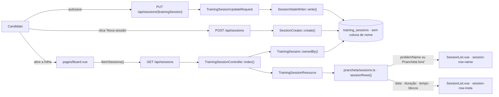
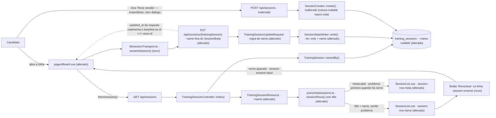

# SPEC: nomear-sessao-de-treino

## Metadata
- Source: developer description via /plan
- Service: maxdraw — Prancheta de System Design (mono-repo Laravel 13 + Inertia v3 + Vue 3 + motor TS próprio)
- Tier: standard
- Version: 1.1
- Architecture references: `AGENTS.md`, `docs/agents/architecture.md`, `docs/agents/domain_rules.md` (+ consultados: `docs/agents/api_contracts.md`, `docs/agents/data_model.md`, `.ai/rules/index.md` → `.ai/rules/migrations.md`, `controllers.md`, `requests.md`, `resources.md`, `services.md`, `feature.md`, `prancheta.md`, `js-prancheta.md`)
- Init chain: `.spec/init/project-description.md`, `.spec/init/user-stories.md` (US-11.1, US-11.2, US-11.3), `.spec/init/database-schema.md`, `.spec/init/project-phases.md`

## Context

Hoje uma sessão de treino **não tem nome**. A tabela `training_sessions` (verified at `database/migrations/2026_08_22_210054_create_training_sessions_table.php:17`) tem apenas `user_id`, `problem_id`, `session_duration_id`, `show_connection_order`, `elapsed_seconds`, `notes`, os quatro blocos JSON e `last_opened_at` — nenhuma coluna de rótulo do treino. A folha de sessões identifica cada linha pelo **nome do problema**: `sessionRows()` escreve `problemName: problemOf(problems, session.problem_id)?.name ?? FREE_BOARD_LABEL` (verified at `resources/js/prancheta/sessions.ts:121`), com `FREE_BOARD_LABEL = 'Prancheta livre'` (verified at `resources/js/prancheta/sessions.ts:41`), e `SessionList.vue` renderiza esse valor no título da linha, sob `data-testid="session-row-name"` (verified at `resources/js/components/prancheta/SessionList.vue:41`).

A consequência prática: dois treinos do mesmo problema são indistinguíveis na folha — a única diferença visível é a data na linha de metadados (`data-testid="session-row-meta"`, verified at `resources/js/components/prancheta/SessionList.vue:56`), e todo treino sem problema escolhido aparece como "Prancheta livre". Esta feature dá à sessão **um nome opcional, do próprio usuário**, que passa a ser o título da linha quando existir.

Nada no ciclo de vida da sessão muda: a sessão continua nascendo por um caminho único (`SessionCreator::create()`, verified at `app/Services/SessionCreator.php:34`), a corrente continua sendo derivada por `MAX(last_opened_at)` (`docs/agents/domain_rules.md`, "The current session is derived, never pointed at"), e o clique em **Nova sessão** (`data-testid="new-session"`, verified at `resources/js/pages/Board.vue`) continua instantâneo — **não existe diálogo pré-criação**, por decisão explícita do desenvolvedor. Nomear é sempre um ato posterior, pelo mesmo afford que renomeia.

### Regras de arquitetura que esta feature obedece (citadas das referências)

| Regra | Fonte | Como se aplica aqui |
| --- | --- | --- |
| Camadas: **routes → Controller → FormRequest → Service → Model → Resource**; o controller não valida nem persiste, o Service não tem apresentação | `docs/agents/architecture.md`, "Layer responsibilities" | A regra do campo `name` mora na FormRequest; a gravação, no `SessionStateWriter`; o controller só autoriza e delega |
| **Duas trancas** de isolamento: route binding escopado por `ownedBy` + `Gate::authorize` por ação; `user_id` nunca vem do cliente e nunca sai no Resource | `AGENTS.md` §2; `.ai/rules/controllers.md`; verified at `app/Providers/AppServiceProvider.php:49` e `app/Models/TrainingSession.php:84` | RF-06 |
| **Conceitos de domínio são lookup, não Enum**; nenhuma coluna `enum` | `AGENTS.md` §2; `CLAUDE.md` | `name` é texto livre do usuário, não catálogo — nenhum lookup novo, nenhum Enum |
| Limites de payload são **validação, não coluna** | `docs/agents/domain_rules.md`, "Autosave contract and limits"; `.spec/init/database-schema.md:264` | O teto de caracteres do nome vive na FormRequest (espelhado no cliente), não num `varchar` apertado |
| `$fillable` sincronizado com a migration; casts no model | `AGENTS.md` §2; verified at `app/Models/TrainingSession.php:39` (`#[Fillable]`) | RF-01 |
| `TrainingSessionResource` é a forma do fio e **nunca emite `user_id`** | `.ai/rules/resources.md`; verified at `app/Http/Resources/TrainingSessionResource.php:18` | RF-08 |
| Lógica de negócio fica no servidor; `.vue` só liga, valida e apresenta | `AGENTS.md` §2 "Frontend"; `CLAUDE.md` | O arranjo da linha continua em `prancheta/sessions.ts`, não no componente |
| Avisos ao usuário passam **sempre** pelo toast único (`useToast().warn()` + `prancheta/warnings.ts`) | `.ai/rules/prancheta.md`; verified at `resources/js/prancheta/warnings.ts` | UI-03 |
| `data-testid` é contrato entre fases — não remover os existentes | `.ai/rules/prancheta.md`; verified at `tests/Feature/Frontend/SessionSheetTest.php:11-21` | UI-01/UI-02 mantêm `session-row-name` e `session-row-meta`; UI-03 acrescenta `session-rename` e `session-rename-input` |
| Todo teste que bate em `/prancheta` chama `seedCatalog()`; nada de seed global | `.ai/rules/feature.md` | Testes de RF-01..RF-08 |

### Conflito com a init chain

`.spec/init/database-schema.md` (linhas 189-209) e `.spec/init/user-stories.md` US-11.1/11.2 descrevem a sessão **sem** nome e a lista identificada por "data, problema, duração e tempo usado". As ACs confirmadas prevalecem: a coluna de nome é uma adição aprovada, e US-11.1 passa a ter o nome como título quando existir. Não é divergência acidental — fica registrada aqui e nos documentos de arquitetura tocados pela entrega.

## AS IS — Estado atual

A folha de sessões rotula cada linha pelo nome do problema da sessão, com "Prancheta livre" como reserva quando `problem_id` é nulo; a linha de metadados carrega data, duração, tempo usado e contagem de blocos. Nenhum caminho — nem a criação por `POST /api/sessions`, nem o autosave por `PUT` — grava ou lê qualquer rótulo escolhido pelo usuário, porque a coluna não existe.

## TO BE — Estado proposto

A coluna `name` nullable em `training_sessions` (RF-01) atravessa o Resource (RF-08) até o arranjo da linha, onde o título passa a ser o nome quando existir e o problema desce para os metadados (UI-01, UI-02). O botão "Renomear" na linha (UI-03) manda o nome aparado pelo mesmo `PUT /api/sessions/{trainingSession}` — por um envio dedicado (`renameSession()`), **fora** do `SessionBody` do autosave —, validado na FormRequest (RF-05) e gravado pelo `SessionStateWriter` (RF-04, CT-01). O `updated_at` da resposta realimenta o baseline do cliente quando a sessão renomeada é a corrente, para que o rascunho local sobreviva (RF-07). A criação segue **inteiramente** intocada: `SessionCreator::create()` não muda uma linha — a coluna nullable ausente do `create()` já nasce nula (RF-02) — e o clique em "Nova sessão" continua sem diálogo (UI-04).

## Scope

- **In**: coluna `name` nullable em `training_sessions` com migration e backfill; `$fillable`; validação do nome (opcional, aparado, teto de 60, só-espaços ≡ ausente); exposição de `name` no `TrainingSessionResource`; `title` e `metaLabel` da linha na folha de sessões; botão "Renomear" na linha, com persistência pelo `PUT` dedicado; realimentação do baseline de `updated_at` da sessão corrente; autorização por dono (route binding + policy `update`); garantia de que renomear não toca diagrama, `elapsed_seconds` nem `last_opened_at`; testes Pest + Vitest correspondentes, incluindo as três emendas TA-01/TA-02/TA-03; atualização dos documentos de arquitetura que descrevem o payload da sessão.
- **Out**: diálogo de nome antes de criar a sessão (decisão explícita do desenvolvedor); qualquer alteração em `SessionCreator::create()`; rota nova para o rename; `name` no `SessionBody`/`bodyFrom()` do autosave; dependência nova de teste de componente (`@vue/test-utils`, `happy-dom`) ou mudança no `include` do `vitest.config.ts`; nome sugerido/gerado automaticamente a partir do problema ou da data; unicidade do nome entre sessões do mesmo usuário; busca, filtro ou ordenação da folha por nome; exibição do nome fora da folha de sessões (barra superior da prancheta, aba do navegador, nome do arquivo do export SVG); nome em sessões de outros usuários; qualquer alteração no cronômetro, checklist, estimativa, autosave do diagrama ou catálogo.

## RIGID (Non-Negotiable)

### Functional Requirements

- RF-01 [Ubiquitous]: A tabela `training_sessions` (verified at `database/migrations/2026_08_22_210054_create_training_sessions_table.php:17`) DEVE ganhar a coluna **`name`, nullable**, adicionada por migration própria posicionada com `after('problem_id')`, declarada no `#[Fillable]` e no PHPDoc `@property` do model `TrainingSession` (verified at `app/Models/TrainingSession.php:39`). A coluna é texto livre do usuário — nenhum lookup, nenhum Enum, nenhuma FK. **Decidido**: o literal é `name` na coluna, no campo do contrato JSON e no campo do Resource. No cliente não há colisão — `SessionRow.problemName` (verified at `resources/js/prancheta/sessions.ts:32`) permanece com o nome que tem, e `name` entra como campo distinto.
  - AC: `php artisan migrate:fresh --seed --force` roda limpo; o schema de `training_sessions` tem `name` nullable; `TrainingSession::create([... 'name' => 'X'])` persiste o valor e um `fresh()` o devolve idêntico; `composer types:check` (Larastan nível 7) passa com o PHPDoc `@property` atualizado.
  - AC (emenda de teste aprovada — TA-01): `tests/Feature/Migrations/TrainingSessionsMigrationTest.php:41` assere a lista **exata** de colunas de `training_sessions`; a lista DEVE ganhar `name`. É emenda mecânica, não remoção de teste.

- RF-02 [Event-Driven]: QUANDO uma sessão é criada por `SessionCreator::create()` (verified at `app/Services/SessionCreator.php:34`) — o único caminho de nascimento, por `POST /api/sessions` (verified at `routes/web.php:17`) ou pelo `CurrentSessionResolver` no boot da prancheta —, ela DEVE nascer **sem nome**. O contrato de `POST /api/sessions` NÃO DEVE aceitar nome: `TrainingSessionStoreRequest` continua com exatamente duas chaves (`problem_id`, `duration_minutes`). **`SessionCreator::create()` NÃO DEVE ser alterado**: a coluna nullable, ausente do `create()`, já nasce nula — qualquer edição no serviço para "setar `name = null`" é rework proibido.
  - AC: `POST /api/sessions` com corpo vazio retorna 201 e o recurso traz `name` nulo; `POST /api/sessions` com um nome no corpo retorna 201 e a sessão gravada continua com `name` nulo (chave ignorada, não 422); `GET /prancheta` para usuário sem nenhuma sessão cria a corrente com `name` nulo; `git diff app/Services/SessionCreator.php` na entrega é vazio.

- RF-03 [Event-Driven]: QUANDO a migration de RF-01 roda sobre uma base existente, toda sessão preexistente DEVE ficar com nome nulo e conservar sem perda `problem_id`, `session_duration_id`, `show_connection_order`, `elapsed_seconds`, `notes`, `nodes`, `edges`, `checks`, `estimate` e `last_opened_at`.
  - AC: dada uma base com N sessões contendo diagramas, após `php artisan migrate` as N sessões existem, 100% delas têm nome nulo e o conteúdo de `nodes`/`edges`/`checks`/`estimate` é byte a byte o anterior; o `down()` remove só a coluna nova e nenhuma sessão desaparece.

- RF-04 [Event-Driven]: QUANDO o usuário confirma um nome para uma sessão existente — nomear pela primeira vez e renomear são a mesma operação —, o sistema DEVE persistir o novo nome na sessão, de modo que ele sobreviva a um recarregamento da prancheta e a uma releitura da folha.
  **Transporte decidido**: reusa `PUT /api/sessions/{trainingSession}` (`sessions.update`, verified at `routes/web.php:20`) por um **envio dedicado** — `renameSession(id, { name })` em `resources/js/lib/sessionTransport.ts`, ao lado de `sendSessionState()`. `TrainingSessionUpdateRequest` passa a aceitar `name` e `SessionStateWriter::write()` ganha a chave no `Arr::only` (verified at `app/Services/SessionStateWriter.php:23`). Nenhuma rota nova é criada.
  - **Restrição (não-negociável)**: `name` NÃO DEVE entrar em `SessionBody` nem ser produzido por `bodyFrom()` (verified at `resources/js/prancheta/session.ts:41`). O autosave nunca reenvia o nome. Incluí-lo no `SessionBody` o tornaria um campo que **suja** a sessão (`.ai/rules/js-prancheta.md`: "sujo é derivado do payload") e reintroduziria o clobber entre abas — é proibido.
  - AC: confirmar o nome "Feed — 2ª tentativa" numa sessão sem nome faz um `GET /api/sessions` subsequente devolver exatamente `Feed — 2ª tentativa` para aquele id; repetir a operação com outro nome substitui o valor; recarregar `/prancheta` mantém o nome.
  - AC (restrição do `SessionBody`): o tipo `SessionBody` e o retorno de `bodyFrom()` em `resources/js/prancheta/session.ts` não contêm a chave `name` — assertável por `npm run types:check` (a chave a mais quebraria o tipo) e por asserção de fonte; um autosave disparado logo após um rename envia um corpo **sem** `name`, e uma sessão com nome gravado não é marcada como suja por causa dele.

- RF-05 [Ubiquitous]: O nome DEVE ser validado no servidor como **opcional, string, aparado nas pontas e limitado a 60 caracteres**, e um valor composto só de espaços em branco DEVE ser normalizado para ausência de nome (nulo), não gravado como string vazia. A normalização acontece em `prepareForValidation()`, antes das regras, como manda `.ai/rules/requests.md`. **Teto decidido: `MAX_SESSION_NAME = 60`**, constante privada em `TrainingSessionUpdateRequest`, alinhada a `MAX_LABEL = 60` (verified at `app/Http/Requests/TrainingSessionUpdateRequest.php:25`), espelhada por `SESSION_NAME_MAX_LENGTH` exportada de `resources/js/prancheta/sessions.ts` — no padrão de `NOTES_MAX_LENGTH` (`resources/js/prancheta/notes.ts:8`). O teto é medido **depois** do aparo.
  - AC: enviar `"  Feed  "` grava `Feed`; enviar `"   "` ou `""` grava nulo; omitir o campo (`sometimes`) não altera o nome já gravado; enviar `null` explícito apaga o nome; enviar 61 caracteres retorna 422 com mensagem em PT-BR e exatamente 60 caracteres retorna 200; enviar um valor não-string (número, array) retorna 422.
  - AC (par travado): um teste PHP assere que `MAX_SESSION_NAME` da FormRequest e `SESSION_NAME_MAX_LENGTH` de `prancheta/sessions.ts` valem o mesmo número, na convenção que `DrillRoteiroTest` já usa para as notas.
  - AC (nunca cortar em silêncio): o excesso de caracteres é **avisado por toast** no cliente, nunca truncado sem aviso — mesma política de `NOTES_MAX_LENGTH`.

- RF-06 [Unwanted]: SE o pedido de nomear/renomear referir uma sessão que não pertence ao usuário autenticado, ENTÃO o sistema DEVE recusá-lo pelas **duas trancas** já existentes, sem revelar existência: o route binding escopado por `TrainingSession::ownedBy()` (verified at `app/Providers/AppServiceProvider.php:49` e `app/Models/TrainingSession.php:84`) responde 404 antes do controller, e a ação chama `Gate::authorize('update', $trainingSession)` contra `TrainingSessionPolicy::update()` (verified at `app/Policies/TrainingSessionPolicy.php:42`). `user_id` NÃO DEVE aparecer nas regras da FormRequest nem no Resource.
  - AC: usuário A pedindo o rename de uma sessão de B recebe 404 e o nome da sessão de B permanece inalterado no banco; o teste de isolamento cruzado (`tests/Feature/Sessions/CrossUserIsolationTest.php`) cobre a rota de rename; `grep -n "user_id" app/Http/Requests/TrainingSessionUpdateRequest.php app/Http/Resources/TrainingSessionResource.php` retorna 0 ocorrências.

- RF-07 [Ubiquitous]: Nomear ou renomear NÃO DEVE alterar `nodes`, `edges`, `checks`, `estimate`, `notes`, `problem_id`, `session_duration_id`, `show_connection_order`, `elapsed_seconds` nem `last_opened_at`. A única outra coluna que pode mudar é `updated_at`, por consequência do `save()`.
  - AC: dada uma sessão com diagrama, marcações, `elapsed_seconds = 742` e `last_opened_at` conhecido, um rename deixa todas essas colunas com exatamente os mesmos valores (comparação coluna a coluna após `fresh()`), muda apenas `name` e `updated_at`; a sessão renomeada **não** é promovida a corrente (a ordem de `GET /api/sessions`, `last_opened_at DESC, id DESC`, verified at `app/Http/Controllers/TrainingSessionController.php`, permanece a mesma antes e depois). O "não promove a corrente" já é verdade no servidor — `update()` não toca `last_opened_at`, só `open()` toca —, e o AC existe para travar isso contra regressão.
  - **AC nova (baseline de `updated_at`, obrigatória)**: renomear a **sessão corrente** com o diagrama sujo e recarregar `/prancheta` DEVE preservar o rascunho local e **não** DEVE disparar o toast `serverVersionIsNewer`. Razão: `resolveBoot()` (verified at `resources/js/prancheta/resume.ts:121-127`) descarta o rascunho quando `cached.serverUpdatedAt !== server.updatedAt` e `cached.savedAt <= timeOf(server.updatedAt)`, e `useAutosave.ts:54` então avisa. Portanto o `updated_at` devolvido pelo rename DEVE realimentar `store.serverUpdatedAt` (via `SessionStore::markSaved()` ou setter dedicado), seguido de `autosave.saveLocal()`, **somente quando o id renomeado for o da sessão corrente** (`id === store.id`). Renomear uma sessão que não é a corrente não mexe em baseline nenhum. Isso continua custando 1 requisição HTTP (RNF-02 preservada).

- RF-08 [Ubiquitous]: O nome DEVE integrar a forma do fio da sessão em `TrainingSessionResource` (verified at `app/Http/Resources/TrainingSessionResource.php:18`), aparecendo em `GET /api/sessions`, `GET /api/sessions/{trainingSession}`, `POST /api/sessions`, `POST /api/sessions/{trainingSession}/open` e nas props Inertia do `BoardController`. O atributo `#[PreserveKeys]` do Resource DEVE permanecer (`.ai/rules/resources.md`).
  - AC: `GET /api/sessions` devolve `name` em cada item de `data[]` (nulo quando ausente); `assertInertia` na rota `board` encontra o campo nas props da sessão; o mapa `checks` continua chegando chaveado por `checklist_items.id`, sem reindexação.
  - AC (emenda de teste aprovada — TA-02): `tests/Feature/Sessions/BoardPageTest.php:204` assere a lista **ordenada** de chaves do Resource; a lista DEVE ganhar `name` **logo após `problem_id`**, o que fixa também a posição de `name` em `TrainingSessionResource::toArray()`. Emenda mecânica, não remoção.

### UI Requirements

- UI-01 [State-Driven]: ENQUANTO uma sessão tiver nome, a folha de sessões DEVE usar esse nome como **título da linha**, no elemento `data-testid="session-row-name"` (verified at `resources/js/components/prancheta/SessionList.vue:41`). ENQUANTO a sessão não tiver nome, o título DEVE continuar sendo o nome do problema, ou `FREE_BOARD_LABEL = 'Prancheta livre'` quando não houver problema escolhido (verified at `resources/js/prancheta/sessions.ts:41`, `121`). A decisão do título é do arranjo — `SessionRow` ganha `title: string`, string pronta, e `SessionList.vue` passa a só imprimir `{{ row.title }}` (`AGENTS.md` §2 "Frontend"). `problemName` permanece no tipo, sem colisão com `name`.
  - AC (Vitest sobre `sessionRows()`): sessão com nome e com problema → `title` é o nome; sessão com nome e sem problema → `title` é o nome; sessão sem nome e com problema → `title` é o nome do problema; sessão sem nome e sem problema → `title` é `Prancheta livre`; sessão com nome só de espaços → `title` cai na regra de "sem nome" (RF-05). AC (PHP): `SessionSheetTest` continua encontrando `data-testid="session-row-name"` e `session-row-meta` em `SessionList.vue`.

- UI-02 [State-Driven]: ENQUANTO o título da linha for o nome da sessão, a **linha de metadados** (`data-testid="session-row-meta"`, verified at `resources/js/components/prancheta/SessionList.vue:56`) DEVE começar pelo **nome do problema, ou `Prancheta livre` quando não houver problema escolhido**, seguido de data, duração escolhida, tempo usado e contagem de blocos — o token do problema vai **primeiro**, antes da data, e não se duplica no título. ENQUANTO a sessão não tiver nome, a linha de metadados DEVE permanecer exatamente como está hoje (`data · duração · tempo · N blocos`), sem o token novo, porque o problema já é o título. O arranjo entrega `metaLabel: string` já montada em `SessionRow` (`resources/js/prancheta/sessions.ts`); `SessionList.vue` só imprime `{{ row.metaLabel }}`.
  - AC (Vitest sobre `sessionRows()`, no molde de `formatSessionDate`): para sessão com nome e problema "Feed de rede social", `metaLabel` começa por `Feed de rede social` e `title` não o contém; para sessão com nome e sem problema, `metaLabel` começa por `Prancheta livre`; para sessão sem nome, `metaLabel` é idêntica à linha atual, sem token novo.
  - AC (custo zero de ferramental): a cobertura é Vitest **puro sobre `prancheta/sessions.ts`**, em `environment: 'node'`. NÃO DEVE haver dependência nova no `package.json` (nada de `@vue/test-utils`, nada de `happy-dom`) nem mudança no `include` do `vitest.config.ts`, que hoje cobre apenas `resources/js/canvas/**/*.test.ts` e `resources/js/prancheta/**/*.test.ts`. Assertável por `git diff package.json vitest.config.ts` vazio nessas linhas.
  - AC (emenda de teste aprovada — TA-03): `tests/Feature/Frontend/SessionSheetTest.php:23-33` assere strings literais do template de `SessionList.vue` que UI-01/UI-02 reescrevem; essas asserções DEVEM ser emendadas para as novas (`row.title` / `row.metaLabel`). Emenda mecânica, não remoção.

- UI-03 [Event-Driven]: QUANDO o usuário aciona o **botão "Renomear"** numa linha da folha, o sistema DEVE oferecer um campo de texto pré-preenchido com o nome atual (vazio quando não houver), confirmar com Enter ou saída do campo (blur), cancelar com `Escape` sem gravar, e atualizar a linha com o nome gravado sem recarregar a prancheta. **Gesto decidido**: `PranchetaButton` ao lado de "Abrir"/"Apagar" em `SessionList.vue` — não é duplo clique no título, não é campo inline sempre visível. **`data-testid` fixados** (contrato entre fases, `.ai/rules/prancheta.md`): `session-rename` no botão e `session-rename-input` no campo — dois testids, porque os ACs asserem estados distintos (afford fechado versus edição aberta). O campo usa `PranchetaInput.vue` (verified at `resources/js/components/prancheta/PranchetaInput.vue`); o tratamento de Enter / blur / `Escape` segue a forma de `beginEdit`/`commit` de `CanvasNode.vue` (verified at `resources/js/components/prancheta/CanvasNode.vue:151`), **sem** copiar o `contenteditable`. Falha de requisição DEVE avisar por **toast**, pelo canal único (`useToast().warn()` + uma chave nova em `resources/js/prancheta/warnings.ts`, verified at `resources/js/prancheta/warnings.ts`) — nada de `alert()` nem mensagem inline.
  - AC (asserção de fonte em PHP, no molde de `tests/Feature/Frontend/SessionSheetTest.php`): `SessionList.vue` contém `data-testid="session-rename"` e `data-testid="session-rename-input"`; os `data-testid` existentes (`session-row-name`, `session-row-meta`, `new-session`) continuam presentes; o template referencia `PranchetaInput`; nenhum `alert(` é introduzido; a chave nova de toast existe em `resources/js/prancheta/warnings.ts` e é usada via `useToast().warn()`.
  - AC (gesto — rebaixado para asserção de fonte em PHP, por decisão de Q-03): o tratamento de Enter, blur e `Escape` é verificado por asserção de fonte sobre `SessionList.vue` (existência dos handlers de tecla/blur e do caminho de cancelamento), **não** por teste de componente montado — não há `@vue/test-utils` nem `happy-dom` no projeto e nenhum será adicionado.
  - AC (Vitest sobre a orquestração pura): a orquestração do rename é função pura em `resources/js/prancheta/sessions.ts`, no molde de `deleteIntent()`, com o **transporte injetado como parâmetro** (`.ai/rules/js-prancheta.md`: requisição nenhuma mora nesse módulo). Com transporte falso: sucesso atualiza a linha em memória com o nome aparado; falha dispara exatamente um aviso e a linha volta ao nome anterior; nome acima de `SESSION_NAME_MAX_LENGTH` avisa e não corta em silêncio; cancelar não chama o transporte.

- UI-04 [Ubiquitous]: O botão **Nova sessão** (`data-testid="new-session"`, verified at `resources/js/pages/Board.vue` e `tests/Feature/Frontend/SessionSheetTest.php:20`) DEVE continuar criando a sessão imediatamente, sem nenhum diálogo, campo ou etapa de nome antes da criação. Nomear-após-criar usa o mesmo afford de UI-03.
  - AC: o fluxo de `startNewSession()` permanece `saveNow()` → `createSession()` → `router.visit(board.url(), { preserveState: false })` (verified at `resources/js/pages/Board.vue`), sem passo intermediário; nenhum modal, prompt ou campo novo é montado entre o clique e a requisição; `SessionSheetTest` ("grava a sessão corrente antes de trocar e antes de criar outra") continua verde.

### Contracts

- CT-01: `PUT /api/sessions/{trainingSession}` (rota `sessions.update`, verified at `routes/web.php:20`) passa a aceitar `name`, `sometimes|nullable|string|max:60` (`MAX_SESSION_NAME`), aparado em `prepareForValidation()`, validado por `TrainingSessionUpdateRequest` (verified at `app/Http/Requests/TrainingSessionUpdateRequest.php:15`) e gravado por `SessionStateWriter::write()` via `Arr::only` (verified at `app/Services/SessionStateWriter.php:23`). Resposta inalterada: 200 `{"id":…,"updated_at":…}`; 422 na violação do teto ou de tipo; 404 quando a sessão não é do usuário. Nenhuma rota nova é criada.
  - **Restrição de cliente (não-negociável)**: o rename usa um envio dedicado — `renameSession(id, { name })` em `resources/js/lib/sessionTransport.ts`. `name` NÃO DEVE integrar `SessionBody` nem o retorno de `bodyFrom()` (`resources/js/prancheta/session.ts`); o autosave nunca o reenvia e ele nunca conta como campo sujo. O `updated_at` da resposta realimenta o baseline do cliente conforme a AC de RF-07.

- CT-02: `TrainingSessionResource` (verified at `app/Http/Resources/TrainingSessionResource.php:18`) passa a emitir o campo de nome (`string|null`) em `GET /api/sessions`, `GET /api/sessions/{trainingSession}`, `POST /api/sessions`, `POST /api/sessions/{trainingSession}/open` (verified at `routes/web.php:16-19`) e nas props Inertia da rota `board`. `user_id` continua fora do payload.

- CT-03: `POST /api/sessions` (`sessions.store`, verified at `routes/web.php:17`) permanece com o mesmo contrato de entrada — `problem_id` e `duration_minutes`, ambos `sometimes|nullable` (verified at `app/Http/Requests/TrainingSessionStoreRequest.php`). Nenhuma chave nova é aceita.

### Non-Functional Requirements

- RNF-01: `composer ci:check` — `npm run lint:check`, `npm run format:check`, `npm run types:check`, `npm test`, depois `composer test` (`AGENTS.md` §1) — DEVE terminar com exit code 0 na entrega, incluindo Larastan nível 7 sem baseline e sem `ignoreErrors`.
- RNF-02: Um rename DEVE custar exatamente **1 requisição HTTP** e **0 navegações Inertia**: a folha atualiza a linha em memória, sem `router.visit` e sem novo `GET /api/sessions`. Realimentar o baseline de `updated_at` (RF-07) e gravar o rascunho local não acrescentam requisição — `saveLocal()` é local. Não há `throttle` no grupo `api` de `routes/web.php`, então a contagem não sofre com limite de taxa. (Contraste deliberado com trocar/criar sessão, que remontam a página porque o id da corrente muda — `.ai/rules/js-prancheta.md`.)
  - Verificação **sem ferramental novo**: a contagem é feita em Vitest sobre a orquestração pura de `prancheta/sessions.ts` com transporte falso (UI-03), somada à ausência de `router.visit` no caminho do rename por asserção de fonte. NÃO DEVE haver dependência nova no `package.json` nem mudança no `include` do `vitest.config.ts`.
- RNF-03: A migration de RF-01 DEVE ser aditiva e reversível: `php artisan migrate` seguido de `php artisan migrate:rollback --step=1` sobre uma base com sessões deixa 0 sessões perdidas e 0 colunas preexistentes alteradas. Se a coluna receber FK ou índice, `dropForeign` antes de `dropColumn`, sem guarda por driver (`.ai/rules/migrations.md`) — a versão nullable sem FK prevista aqui não precisa disso.
- RNF-04: Os documentos de arquitetura que descrevem o payload da sessão — `docs/agents/api_contracts.md` (exemplos de `GET /api/sessions` e `PUT`, linhas 141-240), `docs/agents/data_model.md` (colunas de `training_sessions`) e `docs/agents/domain_rules.md` ("A session is born exactly one way") — DEVEM refletir o campo novo na mesma entrega; 0 exemplo de payload da sessão pode ficar sem ele.

## FLEXIBLE (Implementation Suggestions)

- Migration dedicada `add_name_to_training_sessions_table` com `$table->string('name')->nullable()->after('problem_id')`; o `string` padrão de 255 cobre o teto de 60 com folga, deixando o limite como validação — a linha que `.spec/init/database-schema.md:264` defende.
- Normalização no `prepareForValidation()` da `TrainingSessionUpdateRequest`, ao lado das duas normalizações que já moram lá (estimativa negativa → 0; `''` de volta a `''`), seguindo o mesmo formato de método privado curto com PHPDoc explicando o porquê.
- Constante de teto privada na FormRequest (padrão `MAX_NOTES`/`MAX_LABEL`) espelhada por uma constante exportada em `resources/js/prancheta/sessions.ts` (padrão `NOTES_MAX_LENGTH` em `notes.ts`), com um teste PHP travando o par — é a convenção que `DrillRoteiroTest` já usa para as notas.
- No cliente: `SessionRow` ganha `title` e `metaLabel` como strings prontas (UI-01/UI-02 as tornam obrigatórias); `SessionSummary` ganha `name` vindo do Resource. Manter `problemName` como está e derivar o título dele — evita reescrever os testes de linha existentes.
- `renameSession(id, { name })` em `resources/js/lib/sessionTransport.ts`, pelo mesmo `http.getClient()` e pelas rotas Wayfinder (`update.url(id)`), no formato dos `openSession`/`deleteSession` existentes; `Board.vue` atualiza `savedSessions.value` no lugar em vez de rebuscar a lista.
- Reaproveitar o padrão `beginEdit`/`commit` de `CanvasNode.vue`, que já trata Enter, blur e `Escape`, para o campo `PranchetaInput.vue` aberto pelo botão "Renomear".
- Baseline de RF-07: expor um setter dedicado em `SessionStore` em vez de reusar `markSaved()`, se `markSaved()` carregar efeito colateral indesejado no rename.
- Chave nova em `BOARD_WARNINGS` no estilo das existentes (`sessionRenameFailed`, uma frase, PT-BR, dizendo o que continua valendo).
- Testes: Pest em `tests/Feature/Sessions/` (rename persiste, validação com dataset `validNames`/`invalidNames`, isolamento cruzado, imutabilidade das demais colunas) e em `tests/Feature/Migrations/`; Vitest em `resources/js/prancheta/sessions.test.ts` para a precedência do título, a `metaLabel` e a orquestração pura do rename; `tests/Feature/Frontend/SessionSheetTest.php` para `session-rename` / `session-rename-input` e para as asserções de fonte do gesto. Todo teste que bate em `/prancheta` chama `seedCatalog()`. As três emendas aprovadas (TA-01/TA-02/TA-03) são tarefas do plano, rastreadas nas ACs de RF-01, RF-08 e UI-02.

## Acceptance Criteria Summary

| ID | Criterion | Testable? |
|----|-----------|-----------|
| RF-01 | Coluna `name` nullable em `training_sessions` (`after('problem_id')`), no `#[Fillable]` e no `@property`, `migrate:fresh --seed` limpo | Sim — Pest + `database-schema` + `composer types:check` |
| TA-01 | `TrainingSessionsMigrationTest.php:41` — lista exata de colunas ganha `name` | Sim — emenda aprovada, roda no próprio teste |
| RF-02 | Sessão nasce sem nome; `POST /api/sessions` não aceita nome; `SessionCreator` inalterado | Sim — Pest (201 + valor nulo; chave extra ignorada) + diff vazio do serviço |
| RF-03 | Migration sobre base existente: 100% das sessões com nome nulo, 0 dado perdido | Sim — Pest em `tests/Feature/Migrations/` |
| RF-04 | Nome confirmado persiste e sobrevive a recarregamento; `name` **fora** do `SessionBody`/`bodyFrom()` | Sim — Pest (round-trip `PUT` → `GET`) + `types:check` e asserção de fonte |
| RF-05 | Opcional, aparado, `MAX_SESSION_NAME = 60` (60 passa, 61 dá 422), só-espaços ≡ nulo, tipo inválido 422, par de constantes travado, excesso avisado nunca cortado | Sim — Pest com dataset de nomes válidos/inválidos + teste do par |
| RF-06 | Sessão de outro usuário: 404 pelo binding + `Gate::authorize('update')`; `user_id` ausente de Request e Resource | Sim — `CrossUserIsolationTest` + grep |
| RF-07 | Rename não altera diagrama, marcações, notas, duração, `elapsed_seconds`, `last_opened_at`; só `name` e `updated_at` | Sim — Pest, comparação coluna a coluna + ordem de `GET /api/sessions` |
| RF-07b | Renomear a corrente com diagrama sujo preserva o rascunho e não dispara `serverVersionIsNewer` (baseline realimentado só quando `id === store.id`) | Sim — Vitest sobre `resolveBoot()`/baseline + asserção de fonte |
| RF-08 | `name` no `TrainingSessionResource` em todas as respostas de sessão e nas props do board; `#[PreserveKeys]` mantido | Sim — Pest + `AssertableInertia` + asserção do mapa `checks` |
| TA-02 | `BoardPageTest.php:204` — lista ordenada de chaves ganha `name` logo após `problem_id` | Sim — emenda aprovada, roda no próprio teste |
| UI-01 | `title` = nome quando existir; senão problema; senão `Prancheta livre` | Sim — Vitest sobre `sessionRows()` (4 casos) + `SessionSheetTest` |
| UI-02 | Com nome, `metaLabel` começa pelo problema (ou `Prancheta livre`), antes da data, e o título não o repete; sem nome, metadados inalterados; 0 dependência nova e 0 mudança no `include` do vitest | Sim — Vitest (3 casos) + diff de `package.json`/`vitest.config.ts` |
| TA-03 | `SessionSheetTest.php:23-33` — strings literais do template emendadas para `row.title`/`row.metaLabel` | Sim — emenda aprovada, roda no próprio teste |
| UI-03 | Botão "Renomear" (`session-rename`) abre `PranchetaInput` (`session-rename-input`) pré-preenchido; Enter/blur gravam, `Escape` cancela; falha avisa por toast | Sim — `data-testid`, gesto, ausência de `alert(` e chave de toast por asserção de fonte em PHP; orquestração pura por Vitest com transporte falso |
| UI-04 | "Nova sessão" continua instantâneo, sem diálogo | Sim — `SessionSheetTest` + ausência de passo intermediário em `Board.vue` |
| CT-01 | `PUT /api/sessions/{trainingSession}` aceita `name` por envio dedicado; 200/422/404 conforme o caso; nenhuma rota nova | Sim — Pest por status + `route:list` |
| CT-02 | Nome emitido em index/show/store/open e nas props Inertia | Sim — Pest nas 4 rotas + `assertInertia` |
| CT-03 | `POST /api/sessions` sem chave nova | Sim — Pest + leitura de `TrainingSessionStoreRequest` |
| RNF-01 | `composer ci:check` exit 0 | Sim |
| RNF-02 | 1 requisição HTTP e 0 navegações por rename, sem ferramental novo de teste | Sim — Vitest com transporte falso contando chamadas + ausência de `router.visit` no caminho do rename |
| RNF-03 | Migration aditiva e reversível, 0 sessão perdida no rollback | Sim — Pest de migration |
| RNF-04 | `api_contracts.md`, `data_model.md` e `domain_rules.md` com o campo novo | Sim — grep pelos exemplos de payload de sessão |

## Open Questions

Nenhuma. As quatro questões abertas na v1.0 foram respondidas pelo desenvolvedor (`.handoff/clarifier-answers.md`) e estão incorporadas aos requisitos:

1. **Nome da coluna e do campo de contrato** (RF-01) — resolvido: `name`, nullable, `after('problem_id')`. Sem colisão com `problemName`, que permanece.
2. **Teto de caracteres** (RF-05) — resolvido: `MAX_SESSION_NAME = 60`, espelhado por `SESSION_NAME_MAX_LENGTH`, par travado por teste PHP; excesso avisado por toast, nunca cortado.
3. **Transporte do rename** (RF-04/CT-01) — resolvido: reuso do `PUT` com envio dedicado `renameSession()`; `name` **proibido** no `SessionBody`. Consequência tratada em RF-07: o `updated_at` da resposta realimenta o baseline quando a sessão renomeada é a corrente.
4. **Gesto e `data-testid`** (UI-03) — resolvido: botão "Renomear" (`session-rename`) + `PranchetaInput` (`session-rename-input`); ACs de gesto rebaixadas para asserção de fonte em PHP, sem dependência nova de teste.

Emendas de teste aprovadas e rastreadas: TA-01 (`TrainingSessionsMigrationTest.php:41`), TA-02 (`BoardPageTest.php:204`), TA-03 (`SessionSheetTest.php:23-33`).
