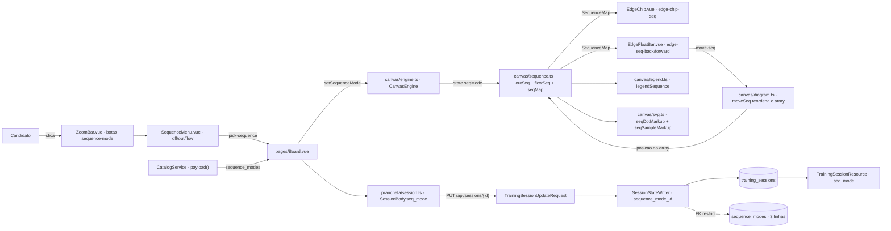
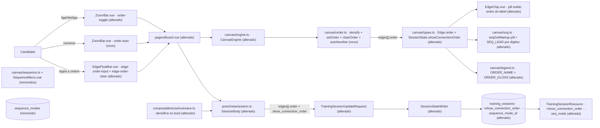

# Implementation Plan

## Request Summary

- **Objective**: substituir a numeração derivada das setas (três modos de catálogo, ordem = posição no array `edges`) por uma **ordem explícita por aresta** (`order: number | null`), sequência única densa por diagrama, flag global de exibição (`showConnectionOrder` / `show_connection_order`) e numeração automática por BFS — removendo o lookup `sequence_modes`, a coluna `training_sessions.sequence_mode_id`, o campo de contrato `seq_mode` e `resources/js/canvas/sequence.ts`.
- **Scope in**: `resources/js/canvas/**` (tipos, novo motor de ordem, legenda, SVG, engine), `resources/js/components/prancheta/**` (EdgeChip, EdgeFloatBar, ZoomBar, StageCanvas, LegendContent), `resources/js/pages/Board.vue`, `resources/js/prancheta/{session,resume}.ts` + `composables/useAutosave.ts`, `resources/js/types/board.ts`, persistência Laravel (2 migrations, `TrainingSession`, `TrainingSessionUpdateRequest`, `TrainingSessionResource`, `SessionStateWriter`, `SessionCreator`, `CatalogService`, `TrainingSessionFactory`, remoção de `SequenceMode` model/resource/seeder/factory), suíte Pest + Vitest, `README.md`, `docs/agents/*.md`, `.ai/rules/{canvas,requests}.md`.
- **Scope out**: numeração hierárquica/por camadas, `kind` semântico happy/error/read, validador de nó órfão na UI, alteração de limites de payload (200/400/60/5000), qualquer avaliação do diagrama (proibida por `tests/Feature/Sessions/NoDiagramEvaluationTest.php`).
- **Tier**: complete
- **Architecture references**: `AGENTS.md`, `docs/agents/architecture.md`, `docs/agents/domain_rules.md`, `docs/agents/data_model.md`, `docs/agents/api_contracts.md`, `docs/agents/coding_guidelines.md`, `docs/agents/project_overview.md`, `.ai/rules/index.md` (+ `canvas.md`, `js-prancheta.md`, `prancheta.md`, `requests.md`, `resources.md`, `services.md`, `feature.md`, `general.md`), init chain `.spec/init/{project-description,user-stories,database-schema,project-phases}.md`.
- **Ambiente**: host nativo, sem Sail. `php artisan test --compact`, `npm test`, `npm run types:check`, `npm run lint:check`, `npm run build`, `vendor/bin/pint --dirty --format agent`, `composer ci:check`. Nenhuma fase mistura host e container.

## AS IS — Componentes impactados

O número da seta nunca é armazenado: `seqMap()` o recalcula a cada render, e a ordem de saída de um bloco é literalmente a posição da aresta em `state.edges`, trocada por `moveSeq()`. O que atravessa a persistência é só o **modo**, por FK contra o lookup, e a legenda da tela e a do SVG tiram o texto da seção "Sequência" do `legend_text` dessa tabela. Sete testes Pest de `tests/Feature/Frontend/**` leem esses arquivos TS como texto e travam a forma atual.

## TO BE — Componentes propostos

`canvas/order.ts` (novo) nasce em **T02** e ganha a BFS em **T06**; `Edge.order` vem de **T01** e `SessionState.showConnectionOrder` de **T09**. Os renderizadores alterados são **T10** (`legend.ts`), **T11** (`svg.ts`), **T12** (`EdgeChip.vue` + `LegendContent.vue`) e **T13** (`Board.vue`). Os controles vêm de **T15** (`ZoomBar.vue`/`StageCanvas.vue`), **T16** (`EdgeFloatBar.vue`) e **T17** (`Board.vue`); o contrato do cliente de **T18**/**T19** e as remoções de **T20**. A persistência alterada é **T22**–**T26** (duas migrations, model, FormRequest, writer/creator/resource/catálogo/factory), e as referências de arquitetura reescritas saem de **T29**/**T30**.

## Tasks

### T01 — `Edge.order` no tipo do motor

- **Files**: `resources/js/canvas/types.ts`
- **Change**: acrescentar `order: number | null` ao tipo `Edge`, depois de `bidir`, com PHPDoc/TSDoc explicando que a posição no array deixou de ter significado semântico e que `null` é "fora da sequência". Não tocar em `DiagramSnapshot` (já serializa `edges` inteiras) nem em `SessionState` nesta task.
- **Covers**: RF-01
- **Tests**: `tests/Feature/Frontend/CanvasSequenceTest.php` — o regex que trava a forma de `Edge` sem `order` passa a exigir `order: number \| null` (é a task que quebra o teste de propósito, então é a task que o atualiza).
- **Risk**: Medium — campo obrigatório em `Edge` quebra a compilação de todo fixture/teste que monta aresta à mão (`canvas/fixtures.ts`, `canvas/*.test.ts`); resolvido em T05.
- **Dependencies**: none

### T02 — Motor de ordem: `canvas/order.ts`

- **Files**: `resources/js/canvas/order.ts` (novo), `resources/js/canvas/index.ts`
- **Change**: módulo TypeScript puro (sem Vue, sem `document`/`window` — `.ai/rules/canvas.md`, RNF-04) exportando: `densify(edges)` (varre `state.edges` inteiro, **aresta órfã inclusa** — RF-16 —, ordena os `order` não nulos por valor com desempate pela posição no array e reescreve `1..N`); `numberedCount(edges)` (o `N` que a UI usa para clampar); `setOrder(edges, id, k)` (empurra `+1` quem já ocupava `>= k` e redensifica — RF-04); `clearOrder(edges, id)` (grava `null` e redensifica — RF-09). Arestas com `order === null` não contam para `N`, não ocupam posição e não deslocam ninguém (RF-08). A densificação é o **único ponto de saída** de toda mutação de ordem, de modo que RF-05 seja consequência e não regra extra.
- **Covers**: RF-03, RF-04, RF-05 (lado cliente), RF-06, RF-08, RF-09, RF-16
- **Tests**: `resources/js/canvas/order.test.ts` (novo) — `[A=1,B=2,C=3]` + `setOrder(C,1)` ⇒ `[C=1,A=2,B=3]`; `setOrder(A,3)` ⇒ `[B=1,C=2,A=3]`; `clearOrder(B)` ⇒ `A=1,B=null,C=2`; 2 numeradas + 5 nulas ⇒ `N=2`; nenhuma sequência de operações produz duplicata ou buraco.
- **Risk**: Low — módulo novo, sem consumidor até T03.
- **Dependencies**: T01

### T03 — Mutações do diagrama gravam e redensificam

- **Files**: `resources/js/canvas/diagram.ts`
- **Change**: `addEdge()` cria a aresta com `order: null` (RF-02) e a aresta pré-existente devolvida sem inserção continua intocada; `removeEdge()` e `removeNode()` chamam `densify()` **uma única vez ao final** da remoção (RF-06, RF-07). `snapshot()`/`restore()` continuam copiando `edges` inteiras e **não** densificam — desfazer/refazer devolvem o mapa `id → order` como estava (RF-15, RF-16).
- **Covers**: RF-02, RF-03, RF-06, RF-07
- **Tests**: `resources/js/canvas/diagram.test.ts` — aresta nova tem `order === null`; remover `B` de `[A=1,B=2,C=3]` deixa `[A=1,C=2]`; remover um bloco com 3 arestas numeradas de um diagrama com 6 numeradas deixa `[1,2,3]`; `restore()` de um snapshot esparso não densifica.
- **Risk**: Medium — `removeNode` já é o caminho que gera órfãs por desfazer parcial; densificar no lugar errado quebraria RF-16.
- **Dependencies**: T02

### T04 — `CanvasEngine`: definir e limpar a ordem

- **Files**: `resources/js/canvas/engine.ts`
- **Change**: `setEdgeOrder(id, k)` e `clearEdgeOrder(id)` passando por `mutateEdge()` — o único ponto que empilha desfazer —, cada commit valendo **um** passo (RF-15b: o input commita em `change`/Enter/blur, digitar não empilha, porque quem chama é a Vue). Getter `numberedCount` para o clamp de UI-03 e `orderOf(edge)` para os renderizadores. Nenhuma mudança de assinatura de `seqMap`/`outSeq`/`moveSeq` nesta fase — eles continuam vivos até T20.
- **Covers**: RF-04, RF-09, RF-15
- **Tests**: `resources/js/canvas/engine.test.ts` — definir `order` empilha um passo e desfazer restaura o mapa `id → order` de **todas** as arestas afetadas pelo empurrão; `clearEdgeOrder` idem.
- **Risk**: Low
- **Dependencies**: T02

### T05 — Fixtures e cobertura Vitest do campo `order`

- **Files**: `resources/js/canvas/fixtures.ts`, `resources/js/canvas/*.test.ts`, `resources/js/prancheta/fixtures.ts`, `tests/Feature/Frontend/CanvasSequenceTest.php`
- **Change**: `edgeFixture()` passa a aceitar `order` (default `null`) e todo objeto `Edge` montado à mão nos testes ganha o campo; o dataset "cobre no Vitest cada teste que a fase pede" de `CanvasSequenceTest.php` recebe os nomes dos testes de `order.test.ts` (os nomes de `outSeq`/`flowSeq`/`moveSeq` só saem em T21, quando `sequence.ts` for removido).
- **Covers**: RF-01, RF-02, RF-03, RF-04, RF-06, RF-08, RF-09, RF-16
- **Tests**: `npm test` verde; `npm run types:check` sem erro de propriedade faltante; `php artisan test --compact --filter=CanvasSequence` verde.
- **Risk**: Medium — é a task que segura a suíte PHP verde nesta fase; esquecer um fixture derruba `vue-tsc`.
- **Dependencies**: T01, T02, T03, T04

### T06 — Numeração automática por BFS

- **Files**: `resources/js/canvas/order.ts`
- **Change**: `autoNumber(edges, nodes, index)` numera **todas as arestas vivas** (`liveEdges`) por BFS determinística, sobrescrevendo qualquer `order` anterior, inclusive `null` (RF-10). Raízes com o mesmo fallback de três degraus de `sequenceRoots()` hoje: (1) nós de categoria cliente sem aresta de entrada (`isClientComponent` / `CLIENT_CATEGORY`, `canvas/catalog.ts:34`), (2) demais nós sem entrada, (3) todos os nós. A travessia segue **somente** `from → to`, e `bidir` não conta como entrada em `from` (RF-17). Desempate, dentro do degrau e na expansão, é a ordem do array `edges`. Cada aresta é visitada uma vez (o que faz um grafo cíclico terminar). **Regra da órfã (decisão confirmada pelo desenvolvedor, não reabrir)**: a aresta órfã não é visitada pela BFS — ela mantém o `order` que tinha e é ranqueada **depois** de todas as vivas, preservando a ordem relativa entre as órfãs numeradas; a `densify()` final fecha o conjunto exato `[1..N]`, com `N` **incluindo** as órfãs numeradas (RF-03, RF-16). Órfã com `order === null` continua `null`.
- **Covers**: RF-10, RF-17, RF-03
- **Tests**: `resources/js/canvas/order.test.ts` — BFS cobre toda aresta viva exatamente uma vez; 0 arestas vivas com `order === null` depois; grafo cíclico termina; `bidir` ocupa **um** `order` e um nó cuja única aresta incidente é uma `bidir` que dele parte continua elegível como raiz; **órfã numerada**: diagrama com 1 órfã numerada + 3 vivas ⇒ as vivas ficam `1,2,3` na ordem da BFS, a órfã fica `4`, o conjunto é `[1..4]` e `N = 4`; duas órfãs numeradas preservam a ordem relativa entre si.
- **Risk**: Medium — determinismo depende de nunca iterar sobre `Set`/`Map` sem ordem estável derivada do array.
- **Dependencies**: T02

### T07 — `CanvasEngine.autoNumberOrder()`

- **Files**: `resources/js/canvas/engine.ts`
- **Change**: método que empilha **um único** snapshot antes de chamar `autoNumber()` sobre o estado e devolve `boolean` (mudou/não mudou), para que um clique em "numerar automaticamente" seguido de um desfazer restaure o mapa `id → order` do diagrama inteiro de uma vez (RF-15a).
- **Covers**: RF-10, RF-15
- **Tests**: `resources/js/canvas/engine.test.ts` — auto-numerar aumenta `undoDepth` em exatamente 1; um desfazer restaura o mapa `id → order` anterior de todas as arestas.
- **Risk**: Low
- **Dependencies**: T06

### T08 — Determinismo e desempenho do motor de ordem

- **Files**: `resources/js/canvas/order.test.ts`, `tests/Feature/Frontend/CanvasSequenceTest.php`
- **Change**: testes de contrato não-funcional: 50 execuções consecutivas de `autoNumber` sobre o mesmo diagrama com 0 divergências no mapa `id → order` (RNF-02); `densify` + `autoNumber` sobre um diagrama no limite de payload (200 nós / 400 arestas, `canvas/limits.ts`) com mediana de 20 execuções abaixo de 16 ms (RNF-01). Os nomes dos novos testes entram no dataset do `CanvasSequenceTest.php`.
- **Covers**: RNF-01, RNF-02, RF-17
- **Tests**: os próprios; `php artisan test --compact --filter=CanvasSequence` confere a cobertura por nome.
- **Risk**: Medium — teste de tempo é o candidato natural a flake em CI; usar mediana (não média) e margem folgada, como a AC manda.
- **Dependencies**: T06, T07

### T09 — Flag `showConnectionOrder` no estado do motor

- **Files**: `resources/js/canvas/types.ts`, `resources/js/canvas/engine.ts`, `resources/js/prancheta/session.ts`, `resources/js/prancheta/fixtures.ts`
- **Change**: `SessionState` (`canvas/types.ts`) é o lugar da flag — decisão confirmada pelo desenvolvedor, no lugar que `seqMode` ocupa hoje, não reabrir. `SessionState` ganha `showConnectionOrder: boolean` **ao lado** de `seqMode` (que só sai em T20, para a suíte ficar verde nesta fase). `CanvasEngine` expõe o getter e `setShowConnectionOrder(value)`, que **não** empilha desfazer — é visualização, como `setSequenceMode` hoje (`.ai/rules/canvas.md`) — e `DiagramSnapshot` continua sem a flag (RF-15a). `recordFrom()`/`sessionRecordFixture()` passam a preencher a flag com `true` por padrão; o `SessionBody` ainda não muda.
- **Covers**: RF-12, RF-15, RF-15a
- **Tests**: `resources/js/canvas/engine.test.ts` — alternar a flag N vezes não altera `undoDepth`; `canvas/undo.test.ts` — `DiagramSnapshot` serializa só `nodes` e `edges`.
- **Risk**: Low
- **Dependencies**: T04

### T10 — Legenda: `ORDER_NAME` / `ORDER_GLOSS` no lugar do catálogo

- **Files**: `resources/js/canvas/legend.ts`, `resources/js/canvas/engine.ts`
- **Change**: exportar `ORDER_NAME` e `ORDER_GLOSS` ao lado de `UNTYPED_NAME`/`UNTYPED_GLOSS`; `LegendSequence` perde o campo `mode` e passa a carregar só `name`/`text`; `legendSequence()` deixa de chamar `seqMap()` e passa a existir quando houver **pelo menos uma aresta viva com `order` não nulo** e `showConnectionOrder === true`; `legendData()` perde o parâmetro `modes` e `CanvasEngine.legendData()` para de repassar `sequenceModeOptions`. Exceção aprovada e delimitada (UI-07): constante única no cliente sim, catálogo paralelo não — o limite fica escrito em `.ai/rules/canvas.md` por T30.
- **Covers**: UI-07, RF-13 (parte cliente)
- **Tests**: `resources/js/canvas/legend.test.ts` — seção de sequência aparece com ≥1 aresta numerada e flag ligada; some com a flag desligada ou sem aresta numerada; `LegendSequence` não expõe `mode`.
- **Risk**: Medium — `tests/Feature/Frontend/CanvasLegendTest.php` trava a assinatura de `legendData()` por regex e compara o `legend_text` do seeder; precisa ser reescrito junto (T14).
- **Dependencies**: T09

### T11 — SVG: pill sólido e `SEQ_LEAD` por dígitos

- **Files**: `resources/js/canvas/svg.ts`
- **Change**: `seqDotMarkup()` vira pill sólido — fundo na cor da aresta (`--ec` equivalente do arquivo), texto na cor do papel, cantos totalmente arredondados, largura mínima e padding horizontal crescendo com a contagem de dígitos; `SEQ_LEAD` deixa de ser a constante fixa `20` e passa a ser função da contagem de dígitos, mantendo a paridade com a geometria da tela (UI-01). `buildSVG()` lê `edge.order` em vez de `seqMap()`, respeita `state.showConnectionOrder` (flag desligada ⇒ nenhum badge no arquivo, valores intactos — UI-06) e não emite badge para aresta não desenhada; `SvgContext` perde `modes`; `seqSampleMarkup()` desenha o mesmo pill sólido e a linha da legenda usa `ORDER_NAME`/`ORDER_GLOSS`.
- **Covers**: UI-01, UI-06, UI-07
- **Tests**: `resources/js/canvas/svg.test.ts` — `order` de 1, 2 e 3 dígitos produz pill com largura crescente e sem corte; flag desligada ⇒ 0 ocorrências de badge no markup e `edges[].order` inalterado; aresta com `order === null` não emite badge.
- **Risk**: Medium — `tests/Feature/Frontend/CanvasExportTest.php` trava por string `const numbers = seqMap(state.seqMode, …)`; reescrito em T14.
- **Dependencies**: T09, T10

### T12 — Badge no chip e legenda da tela

- **Files**: `resources/js/components/prancheta/EdgeChip.vue`, `resources/js/components/prancheta/LegendContent.vue`
- **Change**: `EdgeChip.vue` troca a prop `seq?: SequenceNumber | null` por `order?: number | null`; o badge `edge-chip-seq` vira pill **sólido** (`background: var(--ec)`, texto na cor do papel, `rounded-full`, `min-w` e padding horizontal por contagem de dígitos) e permanece **antes** do nó do label no DOM (UI-01); `order === null` ⇒ nenhum nó de badge, e o chip sem selo e sem label continua `bare` (UI-05). `LegendContent.vue` importa `ORDER_NAME`/`ORDER_GLOSS`, remove o atributo `data-mode` do nó `legend-sequence` e desenha a mesma amostra em pill sólido (UI-07). Classes Tailwind novas ⇒ `npm run build` ao fim da fase.
- **Covers**: UI-01, UI-05, UI-06, UI-07
- **Tests**: `tests/Feature/Frontend/CanvasSequenceTest.php` — a posição do nó `edge-chip-seq` continua precedendo `edge-chip-badge`/`edge-chip-label` no template, e o badge tem preenchimento (não só cor de borda); `CanvasLegendTest.php` — nenhum nó da legenda expõe `data-mode`.
- **Risk**: Medium — a distinção badge↔label não pode depender só de cor (forma + preenchimento), conforme a AC de UI-01.
- **Dependencies**: T11

### T13 — `Board.vue` desenha a partir de `edge.order`

- **Files**: `resources/js/pages/Board.vue`
- **Change**: o computed `wires` deixa de chamar `engine.seqMap()` e passa a expor `order: engine.showConnectionOrder ? edge.order : null`, repassado ao `EdgeChip` como `:order="wire.order"`. O `edgeBar` continua com `seq: engine.outSeq()[edge.id] ?? null` até T17 — a barra flutuante só muda de forma na fase seguinte. Nenhuma regra de ordem mora na página (`.ai/rules/js-prancheta.md`: lógica no motor, a página só liga).
- **Covers**: UI-05, UI-06
- **Tests**: `tests/Feature/Frontend/CanvasSequenceTest.php` — a página passa `order` ao chip e não chama mais `seqMap()`.
- **Risk**: Low
- **Dependencies**: T12

### T14 — Guardas Pest da exibição

- **Files**: `tests/Feature/Frontend/CanvasLegendTest.php`, `tests/Feature/Frontend/CanvasExportTest.php`, `tests/Feature/Frontend/CanvasSequenceTest.php`
- **Change**: reescrever as asserções que travam a forma antiga: a assinatura de `legendData()` sem `sequenceModeOptions`, o `legend_text` vindo do seeder (passa a ser `ORDER_GLOSS` do cliente, com a checagem de 0 duplicação de string entre `LegendContent.vue` e `svg.ts`), `buildSVG` lendo `edge.order`, o pill sólido nos três lugares e a paridade tela↔SVG. A asserção Inertia `catalog.sequence_modes.0.legend_text` de `CanvasLegendTest.php` só pode sair quando o servidor parar de mandar a coleção (T26) — nesta fase ela continua válida e é mantida.
- **Covers**: UI-01, UI-06, UI-07
- **Tests**: `php artisan test --compact --filter='CanvasLegend|CanvasExport|CanvasSequence'` verde; `npm test` verde; `npm run build`.
- **Risk**: Medium — é a task que segura a suíte PHP verde nesta fase.
- **Dependencies**: T10, T11, T12, T13

### T15 — Toolbar: toggle de exibição e "numerar automaticamente"

- **Files**: `resources/js/components/prancheta/ZoomBar.vue`, `resources/js/components/prancheta/StageCanvas.vue`
- **Change**: o botão `sequence-mode` e o `<SequenceMenu>` saem; entram dois botões com `data-testid` estável — `order-toggle` (alterna `showConnectionOrder`, estado ligado/desligado legível por **atributo**, p.ex. `:aria-pressed`, não só por classe de cor — UI-02) e `order-auto` (dispara RF-10 — UI-04). `StageCanvas.vue` troca as props `sequenceMode`/`sequenceModes` e o emit `pick-sequence` por `showConnectionOrder` + emits `toggle-order` / `auto-order`. `onClickOutside` deixa de ser necessário para esse botão (não há mais menu).
- **Covers**: UI-02, UI-04
- **Tests**: `tests/Feature/Frontend/CanvasSequenceTest.php` — `order-toggle` e `order-auto` existem no toolbar, com estado por atributo; nenhuma referência a `SequenceMenu`.
- **Risk**: Low
- **Dependencies**: T13

### T16 — Painel da conexão: input de ordem e "remover da sequência"

- **Files**: `resources/js/components/prancheta/EdgeFloatBar.vue`
- **Change**: substituir `edge-seq-back` / `edge-seq-position` / `edge-seq-forward` por um `input type="number"` (`edge-order-input`) com o `order` corrente e um botão `edge-order-clear` ("remover da sequência"). Semântica: o valor digitado é clampado no cliente para `N` quando a aresta **já** é numerada e para `N + 1` quando **ainda não** é; o commit acontece em `change`/Enter/blur (um passo de desfazer por commit); **campo vazio é no-op** — o input nunca remove da sequência, quem faz isso é o botão (UI-03, RF-09). A prop passa a ser `order?: number | null` + `numberedCount: number`; os emits, `set-order: [value: number]` e `clear-order: []`.
- **Covers**: UI-03, RF-09
- **Tests**: `tests/Feature/Frontend/CanvasSequenceTest.php` — os dois `data-testid` existem e os três antigos sumiram; `resources/js/canvas/order.test.ts` — clamp `N`/`N+1` (digitar `999` numa não numerada com `N=3` ⇒ `4`; numa já numerada ⇒ `3`) exercitado pela função de clamp exportada do motor, e esvaziar o campo deixa o `order` anterior intacto.
- **Risk**: Medium — a regra de clamp é do motor, não do `.vue` (`.ai/rules/js-prancheta.md`): exportar `clampOrderInput(value, numberedCount, isNumbered)` de `canvas/order.ts` para o componente só ligar.
- **Dependencies**: T15

### T17 — `Board.vue` liga os novos controles

- **Files**: `resources/js/pages/Board.vue`
- **Change**: ligar `toggle-order` → `engine.setShowConnectionOrder(!engine.showConnectionOrder)`, `auto-order` → `engine.autoNumberOrder()`, `set-order` → `engine.setEdgeOrder(id, value)` e `clear-order` → `engine.clearEdgeOrder(id)`; `edgeBar` passa a expor `order` e `numberedCount` em vez de `seq`; remover `engine.seqMap()`, `engine.outSeq()`, `engine.moveSeq()`, `engine.setSequenceMode()`, `engine.sequenceModes` e o `watch` de `props.catalog.sequence_modes`.
- **Covers**: UI-02, UI-03, UI-04, RF-09, RF-10
- **Tests**: `tests/Feature/Frontend/CanvasSequenceTest.php` — a página liga os quatro handlers e não menciona mais `seqMap`/`outSeq`/`moveSeq`/`sequence_modes`.
- **Risk**: Low
- **Dependencies**: T16

### T18 — Contrato do cliente: `SessionBody`

- **Files**: `resources/js/prancheta/session.ts`, `resources/js/types/board.ts`
- **Change**: `SessionBody` perde `seq_mode` e ganha `show_connection_order: boolean`; `bodyFrom()`, `bodyFromPayload()`, `recordFrom()` e `SessionStore.restore()` acompanham, e o store ganha `setShowConnectionOrder()` (é a assinatura JSON desse objeto que define `isDirty` — `.ai/rules/js-prancheta.md`). `edges` continua indo cru do estado, agora com `order` em cada item (CT-01). Em `types/board.ts`, `SessionPayload.seq_mode` sai e entra `show_connection_order?: boolean` (**opcional nesta fase**, com fallback `?? true` em `bodyFromPayload`, porque o servidor só passa a mandá-lo em T26); `BoardCatalog.sequence_modes` sai.
- **Covers**: CT-01, RF-12, RF-13 (parte cliente)
- **Tests**: `resources/js/prancheta/session.test.ts` — o corpo não tem `seq_mode`, tem `show_connection_order`, e cada item de `edges` carrega `order`; alternar a flag suja a sessão; pan/zoom/seleção continuam não sujando.
- **Risk**: Medium — entre esta fase e T26 o servidor descarta `order`/`show_connection_order` do `validated()`: nada quebra, mas nada persiste. Ver Riscos.
- **Dependencies**: T17

### T19 — Boot densificado e `SESSION_CACHE_VERSION = 2`

- **Files**: `resources/js/prancheta/resume.ts`, `resources/js/composables/useAutosave.ts`
- **Change**: `SESSION_CACHE_VERSION` vai a `2`, de modo que todo rascunho v1 (com `seq_mode`, sem `order`) seja descartado no boot por `isEntry()` e o estado do servidor vença (RF-18; perda de trabalho não sincronizado é consequência aceita e registrada). Em `createSessionStore()`, densificar **tanto** o corpo que vence o boot **quanto** o `server.body` usado como assinatura salva, para que abrir uma sessão com `order` esparso (`[1,3,7]`) resulte em `[1,2,3]` no estado, `isDirty === false` logo após o boot e **0** `PUT` sem interação do usuário (RF-03a).
- **Covers**: RF-18, RF-03a
- **Tests**: `resources/js/prancheta/resume.test.ts` — rascunho v1 ignorado, v2 reidratado; `resources/js/prancheta/autosave.test.ts` / `session.test.ts` — boot com `order` esparso ⇒ estado denso, `isDirty === false`, 0 envios.
- **Risk**: High — densificar só um dos dois lados acende o indicador "não salvo" no boot e dispara `PUT` fantasma em toda sessão antiga.
- **Dependencies**: T18

### T20 — Remoção do modo de numeração do cliente

- **Files**: `resources/js/canvas/sequence.ts` (removido), `resources/js/components/prancheta/SequenceMenu.vue` (removido), `resources/js/canvas/sequence.test.ts` (removido), `resources/js/canvas/types.ts`, `resources/js/canvas/diagram.ts`, `resources/js/canvas/engine.ts`, `resources/js/canvas/index.ts`, `resources/js/canvas/fixtures.ts`, `README.md`, `tests/Feature/DeliveryContractTest.php`
- **Change**: apagar `sequence.ts` (com `outSeq`, `flowSeq`, `seqMap`, `sequenceModeOf`, `SEQUENCE_MENU`, `sequenceMenu`, `SequenceModeOption`, `SequenceNumber`, `SequenceMap`), `SequenceMenu.vue` e `sequence.test.ts`; remover `moveSeq()` de `diagram.ts`, o tipo `SequenceMode` e `SessionState.seqMode` de `types.ts`, `sequenceModesFixture()`/`seqMode` dos fixtures, e do `CanvasEngine` os membros `seqMode`, `sequenceModes`, `setSequenceModes`, `seqMap`, `outSeq`, `moveSeq`, `setSequenceMode`; tirar `sequence.ts` de `index.ts`. Atualizar a linha do Core Workflow 4 do `README.md` (`canvas/sequence.ts` → `canvas/order.ts`, sem `SequenceMenu.vue`) **e** o `workflowSources()` de `DeliveryContractTest.php`, que assere `toBeFile()` em cada caminho — sem isso a suíte fica vermelha nesta fase.
- **Covers**: RF-13 (cliente)
- **Tests**: `php artisan test --compact --filter=DeliveryContract` verde; `npm run types:check` sem referência órfã.
- **Risk**: High — remoção destrutiva com 9 arquivos consumidores; `DeliveryContractTest` e `CanvasEngineTest` (dataset `canvasFiles()`) reagem imediatamente.
- **Dependencies**: T18, T19

### T21 — Reescrita das guardas Pest do cliente

- **Files**: `tests/Feature/Frontend/CanvasSequenceTest.php`, `tests/Feature/Frontend/CanvasEngineTest.php`, `resources/js/canvas/engine.test.ts`
- **Change**: `CanvasSequenceTest.php` passa a ser o teste da **ordem explícita**: forma do tipo `Edge` com `order`, existência de `canvas/order.ts` com `densify`/`setOrder`/`clearOrder`/`autoNumber`, `data-testid` novos (`order-toggle`, `order-auto`, `edge-order-input`, `edge-order-clear`), ausência dos antigos, e o dataset de nomes Vitest inteiramente renovado (sem `outSeq_*`, `flowSeq_*`, `moveSeq_*`, `seqMap_*`). Em `CanvasEngineTest.php`, `changing_sequence_mode_does_not_push_undo` vira `toggling_connection_order_does_not_push_undo` (renomeando também o teste Vitest correspondente).
- **Covers**: RF-13, RF-15, UI-02, UI-03, UI-04
- **Tests**: `npm test`, `npm run types:check`, `npm run lint:check`, `npm run build` e `php artisan test --compact` verdes.
- **Risk**: Medium
- **Dependencies**: T20

### T22 — Migration 1: `show_connection_order` + backfill de `order`

- **Files**: `database/migrations/<ts>_add_show_connection_order_to_training_sessions_table.php` (novo)
- **Change**: `up()` adiciona `boolean('show_connection_order')->default(true)` em `training_sessions` e faz o backfill do JSON `edges`: para **todas** as sessões, cada aresta recebe `order = null`, e nenhuma outra chave de `nodes`/`edges` é lida ou reescrita — o valor antigo de `seq_mode` não deriva nada (RF-14a). Varredura por `chunkById` para não carregar a base inteira. `down()` remove a coluna e deixa o diagrama intacto (RNF-03). Gerar com `php artisan make:migration` sozinho, nunca encadeado com a próxima (timestamps idênticos).
- **Covers**: RF-12, RF-14, RF-14a, RNF-03
- **Tests**: `tests/Feature/Migrations/TrainingSessionsMigrationTest.php` — coluna presente, default `true`; teste de backfill sobre base semeada: N sessões preservadas, `nodes`/`edges` idênticos salvo a chave `order`, 0 arestas com `order ≠ null`, 0 sessões com `show_connection_order ≠ true`.
- **Risk**: High — backfill que reescreve JSON: um `json_encode` com flags diferentes das do cast do Eloquent muda acentuação/escapes e falha a comparação byte a byte de RF-14; comparar **estrutura decodificada**, não string.
- **Dependencies**: T21

### T23 — Migration 2: drop da FK e do lookup

- **Files**: `database/migrations/<ts>_drop_sequence_modes_table.php` (novo)
- **Change**: `up()` derruba a FK e a coluna `training_sessions.sequence_mode_id` e então a tabela `sequence_modes`. **Atenção ao SQLite dos testes**: `dropForeign` não é suportado no driver — envolver o `dropForeign` num teste de driver (`Schema::getConnection()->getDriverName()`), deixando o SQLite cair direto no `dropColumn` (que reconstrói a tabela). `down()` é não-destrutivo: recria `sequence_modes` vazia com a mesma estrutura e recria `sequence_mode_id` **nullable**, sem apagar nenhum diagrama (RF-14a; os valores originais não são recuperáveis porque o lookup deixou de existir — ver Assumptions).
- **Covers**: RF-13, RF-14, RF-14a, RNF-03
- **Tests**: `tests/Feature/Migrations/{TrainingSessionsMigrationTest,LookupTablesMigrationTest}.php` — `Schema::hasTable('sequence_modes')` falso, coluna ausente do `getColumnListing`, `down()` recria estrutura e mantém `nodes`/`edges`.
- **Risk**: High — migration destrutiva; comportamento divergente entre MySQL 8 (produção) e SQLite in-memory (testes).
- **Dependencies**: T22

### T24 — Model `TrainingSession`

- **Files**: `app/Models/TrainingSession.php`
- **Change**: acrescentar `'show_connection_order'` ao atributo `#[Fillable([...])]` (o projeto usa o atributo PHP, não a propriedade) **e** o cast `'show_connection_order' => 'boolean'` — sem o cast o SQLite devolve `1`/`0` e a AC de RF-12 (`=== false`) falha; remover `'sequence_mode_id'` do `#[Fillable]`, a relação `sequenceMode()` e as linhas `@property`/`@property-read` correspondentes do docblock.
- **Covers**: RF-12, CT-02, RF-13
- **Tests**: `tests/Feature/Models/TrainingSessionTest.php` — `show_connection_order` é `bool`, `sequenceMode()` não existe mais.
- **Risk**: Low
- **Dependencies**: T23

### T25 — `TrainingSessionUpdateRequest`

- **Files**: `app/Http/Requests/TrainingSessionUpdateRequest.php`
- **Change**: entra `'edges.*.order' => ['sometimes', 'nullable', 'integer', 'min:1', 'max:'.self::MAX_EDGES, $this->orderIsUniqueInTheDiagram()]` — a `Closure` privada, no estilo de `notTheSourceOfTheEdge()`/`knownChecklistItems()`, falha **no próprio índice** (`edges.{i}.order`) quando o valor se repete em outro item, para o erro sair chaveado como CT-04 manda. Entra `'show_connection_order' => ['sometimes', 'boolean']`. Sai a regra `seq_mode` e o `prepareForValidation()` perde o `merge` de `normalizedSeqMode()` (o método privado e o `use App\Models\SequenceMode` somem). Mensagens PT-BR novas em `messages()` para `edges.*.order.integer|min|max` e para a duplicata. O servidor **não** valida densidade: payload esparso (`[1,3,7]`) retorna 200 e é gravado como veio (RF-05/RF-11).
- **Covers**: RF-11, RF-05 (servidor), CT-01, CT-04, RF-13
- **Tests**: `tests/Feature/Sessions/SessionPayloadValidationTest.php` — dataset PT-BR: `order` não inteiro, `0`, negativo, `401` e duplicado ⇒ 422 chaveado por `edges.0.order`; `null` e `1..400` ⇒ 200; esparso ⇒ 200 gravado como veio.
- **Risk**: Medium — `MAX_EDGES` é `private const`; reaproveitá-lo mantém a paridade que `CanvasEngineTest` confere contra `canvas/limits.ts` (RNF-05).
- **Dependencies**: T24

### T26 — Serviços, Resource, catálogo e factory

- **Files**: `app/Http/Resources/TrainingSessionResource.php`, `app/Services/SessionStateWriter.php`, `app/Services/SessionCreator.php`, `app/Services/CatalogService.php`, `database/factories/TrainingSessionFactory.php`, `database/seeders/CatalogSeeder.php`, `app/Models/SequenceMode.php` (removido), `app/Http/Resources/SequenceModeResource.php` (removido), `database/seeders/SequenceModeSeeder.php` (removido), `database/factories/SequenceModeFactory.php` (removido)
- **Change**: `TrainingSessionResource` remove `seq_mode`, acrescenta `'show_connection_order' => $this->show_connection_order` e devolve `edges` com `order` em cada item; `#[PreserveKeys]` e a ausência de `user_id` permanecem (CT-02, `.ai/rules/resources.md`). `SessionStateWriter::write()` acrescenta `'show_connection_order'` ao `Arr::only(...)` e perde o bloco de `seq_mode`/`sequenceModeId()`. `SessionCreator::create()` grava `'show_connection_order' => true` e perde `sequence_mode_id`/`defaultSequenceModeId()` (RF-12a). `CatalogService::payload()` deixa de emitir a coleção `sequence_modes`; as outras seis permanecem (CT-03). `TrainingSessionFactory` grava `'show_connection_order' => true` e `'order' => null` em cada aresta de `diagramEdges()`, e perde `defaultSequenceModeId()`. `CatalogSeeder` perde a chamada a `SequenceModeSeeder`. Os quatro arquivos de `SequenceMode` são apagados.
- **Covers**: CT-02, CT-03, RF-12, RF-12a, RF-13
- **Tests**: `tests/Feature/Sessions/{BoardPageTest,TrainingSessionCrudTest,SessionManagementTest}.php` — `catalog` sem `sequence_modes` (6 coleções), `data.show_connection_order` verdadeiro em sessão nova, resposta sem `seq_mode`.
- **Risk**: High — remoção de model/seeder referenciados por 8 testes e por `tests/Pest.php` (`domainTables`, `catalogTables`, `catalogModels`, dataset `lookupModels`); tudo cai junto em T28.
- **Dependencies**: T25

### T27 — Pest do contrato de sessão

- **Files**: `tests/Feature/Sessions/SessionPayloadValidationTest.php`, `tests/Feature/Sessions/SessionAutosaveTest.php`, `tests/Feature/Sessions/BoardPageTest.php`, `tests/Feature/Sessions/TrainingSessionCrudTest.php`, `tests/Feature/Sessions/SessionManagementTest.php`, `tests/Feature/Frontend/CanvasLegendTest.php`
- **Change**: cobrir o contrato novo e apagar o antigo: round-trip de `edges[].order` (`PUT` grava, `GET` devolve idêntico — RF-01); `PUT` com `show_connection_order: false` seguido de `GET /prancheta` traz `session.show_connection_order === false` (RF-12); `POST /api/sessions` com corpo vazio ⇒ 201 com `show_connection_order: true` (RF-12a); `catalog` sem `sequence_modes` via `AssertableInertia` (CT-03); dataset de 422 de `order` chaveado por `edges.{i}.order` com mensagem PT-BR (RF-11, CT-04); esparso ⇒ 200 (RF-05). Remover `update_normalizes_invalid_seq_mode_to_out` e toda asserção sobre `sequenceMode->slug`; retirar de `CanvasLegendTest.php` a asserção Inertia sobre `catalog.sequence_modes.0.legend_text`.
- **Covers**: RF-01, RF-05, RF-11, RF-12, RF-12a, CT-01, CT-02, CT-03, CT-04
- **Tests**: os próprios; `php artisan test --compact --filter='Session|BoardPage'` verde.
- **Risk**: Medium
- **Dependencies**: T26

### T28 — Pest de schema, catálogo e helpers

- **Files**: `tests/Pest.php`, `tests/Feature/Migrations/{TrainingSessionsMigrationTest,LookupTablesMigrationTest}.php`, `tests/Feature/Models/{LookupModelsTest,TrainingSessionTest,TrainingSessionFactoryTest}.php`, `tests/Feature/Seeders/{LookupSeedTest,CatalogSeederTest,CatalogIntegrityTest}.php`
- **Change**: em `tests/Pest.php`: `autosaveBody()` perde `seq_mode` e ganha `show_connection_order` + `order` nas arestas; `domainTables()` e `catalogTables()` perdem `sequence_modes` (14 → 13 tabelas de domínio, 12 → 11 de catálogo); `catalogModels()` e o dataset `lookupModels` perdem `SequenceMode`; `insertTrainingSession()` do teste de migration perde a inserção no lookup e ganha `show_connection_order`. Remover `sequence_mode_out_is_first`, `sequence_modes_carry_the_prototype_legend_text`, a contagem `'sequence_modes' => 3` da integridade do catálogo e as asserções de relação `sequenceMode` de `LookupModelsTest`/`TrainingSessionFactoryTest`. Acrescentar os testes de RF-14/RF-14a/RNF-03 (base semeada antes da migration, `down()` não-destrutivo).
- **Covers**: RF-13, RF-14, RF-14a, RNF-03
- **Tests**: `vendor/bin/pint --dirty --format agent` e `php artisan test --compact` verdes; `php artisan migrate:fresh --seed --force` roda limpo.
- **Risk**: Medium — `tests/Pest.php` é compartilhado por toda a suíte Feature; um helper meio-atualizado derruba dezenas de exemplos de uma vez.
- **Dependencies**: T27

### T29 — Referências de arquitetura em `docs/agents/`

- **Files**: `docs/agents/api_contracts.md`, `docs/agents/domain_rules.md`, `docs/agents/data_model.md`, `docs/agents/coding_guidelines.md`, `docs/agents/project_overview.md`
- **Change**: reescrever os trechos que descrevem o desenho revogado: exemplos de payload e de resposta com `edges[].order` e `show_connection_order` no lugar de `seq_mode` (`api_contracts.md`, incluindo a lista de normalizações do `prepareForValidation` e as 6 coleções do `catalog`); a tabela de defaults e a de slugs de modo (`domain_rules.md`); a linha `sequence_mode_id` e a linha da tabela `sequence_modes` mais a coluna nova (`data_model.md`); a menção ao `SequenceMode::DEFAULT_SLUG` (`coding_guidelines.md`); o macro-fluxo "45 min, `seq_mode` `out`" e "7 catalog collections" (`project_overview.md` — fora da lista nominal de RF-19, mas dentro da varredura de RF-13). Documentar a validação `integer|min:1|max:400` + unicidade sem densidade, e que a densidade é responsabilidade do cliente.
- **Covers**: RF-19, RF-13
- **Tests**: cobertos pelo teste de varredura de T31.
- **Risk**: Low
- **Dependencies**: T28

### T30 — Regras do repositório

- **Files**: `.ai/rules/canvas.md`, `.ai/rules/requests.md`
- **Change**: substituir a seção "Numeração: a ordem das saídas é a posição no array edges" de `.ai/rules/canvas.md` pela regra nova — uma sequência por diagrama, `order` explícito por aresta, densificação como único ponto de saída da mutação, BFS determinística com o fallback de três degraus, `bidir` sem semântica de grafo, órfã que mantém número e não desenha badge, toggle que não empilha desfazer — **e** a frase de limite decidida em UI-07: *constante única no cliente sim, catálogo paralelo no cliente não*, valendo para o par `ORDER_NAME`/`ORDER_GLOSS` e não autorizando recriar lookups do servidor. Em `.ai/rules/requests.md`, remover a normalização de `seq_mode` do `prepareForValidation()` e registrar a regra de `order` (faixa + unicidade, sem densidade). Caminho recomendado: `record-rule` do Laravel Boost; se a sessão não tiver a ferramenta, editar **cirurgicamente** só essas seções — `AGENTS.md` proíbe reescrita em bloco de `.ai/rules/**`.
- **Covers**: RF-19
- **Tests**: cobertos pelo teste de varredura de T31.
- **Risk**: Medium — `.ai/rules/**` é hand-written e autoritativo; edição ampla demais apaga decisão alheia.
- **Dependencies**: T29

### T31 — Varredura RF-13 e limites RNF-05

- **Files**: `tests/Feature/Frontend/CanvasSequenceTest.php` (ou novo `tests/Feature/OrderContractTest.php`)
- **Change**: teste Pest que varre `app/`, `database/`, `resources/js/`, `routes/`, `tests/`, `docs/agents/` e `.ai/rules/` por `sequence_mode`, `seq_mode`, `outSeq` e `flowSeq` exigindo **0 ocorrências**, e confere que o schema não tem a tabela `sequence_modes` nem a coluna `training_sessions.sequence_mode_id`. Somar a asserção de RNF-05: `MAX_NODES = 200`, `MAX_EDGES = 400`, `MAX_LABEL = 60`, `MAX_NOTES = 5000` inalterados nos dois lados e `.ai/rules/canvas.md` contendo a nova regra de numeração mais a frase de limite da constante de legenda.
- **Covers**: RF-13, RF-19, RNF-05
- **Tests**: o próprio; `php artisan test --compact --filter=OrderContract` verde.
- **Risk**: Low — cuidar para o teste não se auto-detectar (o arquivo do teste está dentro de `tests/`): comparar ocorrências fora do próprio arquivo.
- **Dependencies**: T30

### T32 — Fechamento do gate

- **Files**: nenhum arquivo de aplicação — ajustes pontuais no que a cadeia acusar
- **Change**: rodar a cadeia completa do projeto no host: `vendor/bin/pint --dirty --format agent`, `npm run build`, `composer ci:check` (lint + format + types + Vitest + Pest) e `php artisan migrate:fresh --seed --force`. Corrigir apenas o que ficar vermelho, sem introduzir comportamento novo. Conferir de olho que `resources/js/canvas/**` continua livre de Vue/Inertia e de `document`/`window`.
- **Covers**: RNF-04, RF-13
- **Tests**: `composer ci:check` verde; `php artisan migrate:fresh --seed --force` limpo.
- **Risk**: Low
- **Dependencies**: T31

## Execution Phases

| Phase | Tasks | Parallel-safe? |
|-------|-------|----------------|
| 1 — Motor: campo `order` e densificação | T01, T02, T03, T04, T05 | Não — T02→T03→T04→T05 encadeados; T01 abre a cadeia |
| 2 — Motor: numeração automática por BFS | T06, T07, T08 | Não — T06→T07→T08 |
| 3 — Cliente: badge, SVG e legenda | T09, T10, T11, T12, T13, T14 | Parcial — T10 e T11 tocam arquivos distintos após T09, mas T14 fecha sozinha |
| 4 — Cliente: controles, contrato e remoção do modo | T15, T16, T17, T18, T19, T20, T21 | Não — a remoção de T20 depende de todo consumidor já migrado |
| 5 — Persistência: migrations, request, serviços e Pest | T22, T23, T24, T25, T26, T27, T28 | Não — migrations em série (timestamps) e schema antes do código |
| 6 — Referências de arquitetura e fechamento | T29, T30, T31, T32 | Parcial — T29 e T30 tocam arquivos distintos; T31/T32 fecham |

Nenhuma fase mistura host e container: tudo roda no host. Toda fase que toca CSS/JS/Blade termina com `npm run build`; toda fase que toca PHP termina com `vendor/bin/pint --dirty --format agent`. A suíte fica verde ao fim de **cada** fase — por isso a task que quebra uma guarda Pest de propósito (T01/T05 em `CanvasSequenceTest`, T20 em `DeliveryContractTest`) é a task que a atualiza.

## Contrato de payload (CT-01 a CT-04) — sem artefato formal emitido

O projeto **não tem** OpenAPI, `.proto` nem AsyncAPI hoje, e a feature altera um `PUT` interno já existente (`routes/web.php:19` → `TrainingSessionUpdateRequest` → `TrainingSessionResource`). Nenhum contrato formal é emitido; a mudança de payload é registrada aqui e propagada a `docs/agents/api_contracts.md` por RF-19 (T29).

| Item | Antes | Depois |
|---|---|---|
| `PUT /api/sessions/{trainingSession}` corpo | `seq_mode: string` (slug do lookup, obrigatório após normalização) | `seq_mode` **removido**; `show_connection_order: boolean` no nível raiz; `edges[].order: integer\|null` (`min:1`, `max:400` = `MAX_EDGES`), único dentro do array, **sem** checagem de densidade |
| `PUT` resposta | `{"id": …, "updated_at": …}` | inalterada |
| `TrainingSessionResource` | `seq_mode` | `show_connection_order: boolean` (fillable + cast `boolean`), `edges[].order`; `#[PreserveKeys]` e ausência de `user_id` inalterados |
| `GET /prancheta` prop `catalog` | 7 coleções | 6 coleções — `sequence_modes` sai; as outras seis inalteradas |
| Erros de `order` | — | 422 com `errors` chaveado por `edges.{i}.order`, mensagem PT-BR, mesmo formato dos erros de `edges.*` existentes |
| `SessionBody` (cliente) | `seq_mode` | `show_connection_order`; a assinatura JSON desse objeto continua definindo `isDirty` |

## Risks

| Risk | Blast radius | Mitigation | Rollback |
|------|-------------|------------|----------|
| `dropForeign` não suportado pelo SQLite in-memory dos testes (T23) | Toda a suíte Feature vermelha; divergência MySQL 8 × SQLite | Guardar o `dropForeign` por `getDriverName()`, deixando o SQLite cair direto no `dropColumn` (reconstrução de tabela) | `php artisan migrate:rollback --step=2` (as duas migrations têm `down()`) |
| Backfill de `edges` reescreve JSON e falha a comparação de RF-14 | Todos os diagramas de todas as sessões | Comparar estrutura **decodificada**, não string; `chunkById`; nunca ler `seq_mode` para derivar nada | `down()` da migration 1 remove só a coluna; `order = null` é inerte para o cliente antigo |
| Janela entre o cliente novo (fases 3–4) e o servidor novo (fase 5): `order` e `show_connection_order` são descartados pelo `validated()` | Toda sessão editada nessa janela perde a numeração ao recarregar | Entregar as 6 fases na mesma branch e só publicar depois da fase 6; não fazer deploy parcial | Reverter a branch inteira; o schema só muda na fase 5 |
| `SESSION_CACHE_VERSION = 2` descarta rascunhos v1 (RF-18) | Trabalho não sincronizado que só existia no `localStorage` | Consequência aceita e registrada no SPEC; preferível a reidratar rascunho com `seq_mode` e sem `order` | Nenhum — o descarte é o comportamento desejado |
| 7 testes Pest de `tests/Feature/Frontend/**` leem TS como texto | Suíte PHP vermelha a cada edição de TS | Cada fase atualiza a guarda que ela quebra, na mesma fase (T05, T14, T21) | Reverter o commit da fase (`ralph` faz um commit por fase) |
| Remoção do lookup atinge `tests/Pest.php` (`domainTables`, `catalogTables`, `catalogModels`, `lookupModels`) | Dezenas de exemplos Feature de uma vez | T28 concentra os helpers; rodar `php artisan test --compact` antes de fechar a fase 5 | Reverter o commit da fase 5 |
| Densificar no `undo`/`redo` quebraria RF-15/RF-16 | Pilha de desfazer inteira | `snapshot()`/`restore()` não chamam `densify()`; teste explícito de órfã | — |
| Perda da reordenação por `‹ ›` muda o gesto conhecido do usuário | UX da barra flutuante | Input numérico + botão são a substituição decidida (UI-03); `data-testid` novos documentados | — |

## Open Questions

1. **Órfã na numeração automática (RF-10 × RF-16) — RESOLVIDA, confirmada pelo desenvolvedor.** A BFS numera apenas as arestas vivas, que recebem os ordinais `1..L` na ordem da travessia. As órfãs numeradas ficam ranqueadas **depois** delas, preservando a ordem relativa entre si; a órfã com `order === null` permanece `null`. A `densify()` final devolve o conjunto exato `[1..N]`, com `N` incluindo as órfãs numeradas. Implementada em T06 e travada pelo teste de órfã de `order.test.ts` (T06/T08).
2. **Onde mora `showConnectionOrder` — RESOLVIDA, confirmada pelo desenvolvedor.** A flag vive em `SessionState` (`canvas/types.ts`), no lugar que `seqMode` ocupa hoje: o motor gate-a os três renderizadores e a página não decide nada. Implementada em T09.
3. **`record-rule` na sessão de execução — em aberto (questão de caminho, não de resultado).** RF-19 recomenda `record-rule` (MCP do Laravel Boost) para `.ai/rules/canvas.md`. Se a fase 6 rodar num engine sem esse MCP, a **edição cirúrgica da seção de numeração é fallback aceito** — só dessas seções, nunca reescrita em bloco (`AGENTS.md`). O resultado exigido por RF-19 é o mesmo nos dois caminhos.

## Assumptions

- O ambiente é o **host nativo**, sem Sail (memória do projeto + `AGENTS.md` §4): todos os comandos das fases são `php artisan …`, `npm …`, `vendor/bin/pint …`, nunca `./vendor/bin/sail …`.
- `down()` da migration de drop **não restaura os valores** de `sequence_mode_id` — o lookup deixou de existir e RF-14a pede apenas "recria a estrutura sem apagar diagrama". A coluna volta nullable e a tabela volta vazia.
- `edges[].order` fora do `validated()` é **silenciosamente descartado** pelo Laravel enquanto a regra não existir (fases 3–4): nenhum 422, nenhuma exceção — é o que mantém a suíte verde antes da fase 5. [UNVERIFIED — comportamento padrão do `FormRequest::validated()` para chaves sem regra; conferir no primeiro teste de round-trip de T27]
- `MAX_EDGES` continua `private const` na FormRequest e é reaproveitado como teto de `order` (RF-11), preservando a paridade que `CanvasEngineTest` confere contra `canvas/limits.ts` (RNF-05).
- A fase 3 deixa, por uma fase, o menu de modo do toolbar **inerte** (não altera mais a numeração exibida) — é o preço de manter a suíte verde a cada fase; a remoção acontece na fase 4 (T15, T20). Decisão deliberada, registrada aqui para não parecer descuido.
- `tests/Feature/Frontend/CanvasSequenceTest.php` é **reescrito**, não apagado: ele continua sendo a guarda da numeração, agora da ordem explícita (`.ai/rules/feature.md` e a regra "não apague testes sem aprovação").
- O `data-testid` é contrato entre fases (`.ai/rules/prancheta.md`): os quatro nomes novos (`order-toggle`, `order-auto`, `edge-order-input`, `edge-order-clear`) são os sugeridos pelo SPEC e ficam travados pelos testes Pest de frontend.
