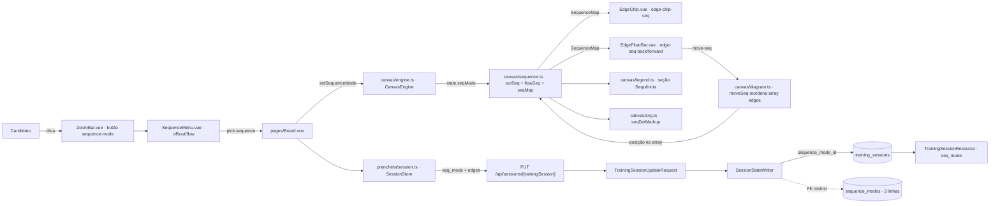
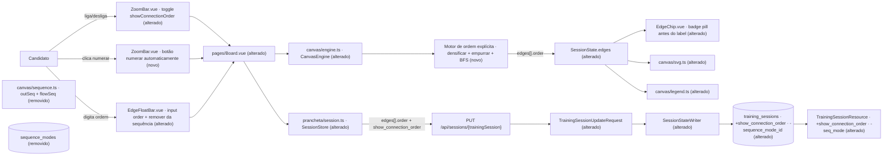

# SPEC: ordem-explicita-de-conexoes

## Metadata
- Source: developer description via /plan
- Service: maxdraw — Prancheta de System Design (mono-repo Laravel 13 + Inertia v3 + Vue 3 + motor TS próprio)
- Tier: complete
- Version: 1.1
- Architecture references: `AGENTS.md`, `docs/agents/architecture.md`, `docs/agents/domain_rules.md`, `docs/agents/data_model.md`, `docs/agents/api_contracts.md`, `docs/agents/coding_guidelines.md`, `.ai/rules/index.md` (+ `.ai/rules/canvas.md`, `.ai/rules/js-prancheta.md`, `.ai/rules/prancheta.md`, `.ai/rules/requests.md`, `.ai/rules/resources.md`, `.ai/rules/services.md`, `.ai/rules/feature.md`)
- Init chain: `.spec/init/project-description.md`, `.spec/init/user-stories.md`, `.spec/init/database-schema.md`, `.spec/init/project-phases.md`

## Context

Hoje a numeração das setas é **derivada** e existe em três modos de catálogo. `resources/js/canvas/sequence.ts` deriva os números do desenho: `outSeq()` numera as saídas de um bloco que tem 2+ saídas, `flowSeq()` faz uma DFS 1..N a partir dos clientes sem entrada, e `seqMap()` escolhe entre os dois conforme `seq_mode` (`off`/`out`/`flow`). Nenhuma aresta guarda número: a **posição no array `edges` é a ordem**, e `moveSeq()` (`resources/js/canvas/diagram.ts`) reordena o array trocando a aresta com a vizinha de mesma origem. O modo escolhido é persistido por FK — `training_sessions.sequence_mode_id` (verified at `database/migrations/2026_08_22_210054_create_training_sessions_table.php:22`) contra o lookup `sequence_modes` (verified at `database/migrations/2026_08_22_210033_create_sequence_modes_table.php`).

Esse desenho tem três custos que a feature endereça: (1) a ordem não é editável diretamente — só empurrável um passo por vez com `‹ ›`; (2) a ordem de saída de um bloco e a ordem do fluxo inteiro são duas leituras diferentes do mesmo array, e nenhuma delas é a "história" que o candidato quer narrar; (3) reordenar exige mutar o array persistido, o que acopla a narrativa à serialização.

A feature substitui tudo isso por **um campo explícito por aresta** (`order: number | null`), **uma única sequência por diagrama** (densa e contínua a partir de 1), **uma flag global de exibição** (`showConnectionOrder` no cliente / `show_connection_order` na persistência) e um **botão de numeração automática por BFS**. O lookup `sequence_modes`, a coluna `training_sessions.sequence_mode_id`, o campo de contrato `seq_mode` e as funções `outSeq`/`flowSeq` são removidos.

### Decisão deliberada: esta feature contradiz a spec inicial

Duas decisões registradas na spec inicial são **revogadas por decisão explícita do desenvolvedor**, e ficam aqui registradas como mudança aprovada, não como divergência acidental:

| Onde | O que dizia | O que passa a valer |
| --- | --- | --- |
| `.spec/init/database-schema.md:262` ("A ordem das arestas é posicional") | "não existe campo de ordem por aresta — a posição no array `edges` é a ordem de saída… Nenhuma coluna `order` foi criada para isso" | `edges[].order` passa a existir **dentro do JSON `edges`** (não como coluna). A posição no array deixa de ter significado semântico. |
| `.spec/init/user-stories.md` US-4.4, AC 3 e 4 | "A ordem é a posição da aresta na lista da sessão — não existe campo de ordem por aresta"; "A mesma ordem governa a travessia do modo `flow`" | US-4.4 é reescrita: a ordem é o campo `order`; o modo `flow` deixa de existir. |
| `.spec/init/user-stories.md` US-4.3 | três modos (`out`/`flow`/`off`) via lookup, botão `1→2` que cicla | Um toggle booleano de exibição + numeração automática sob demanda. |
| `.ai/rules/canvas.md` — seção "Numeração: a ordem das saídas é a posição no array edges" | idem | A regra fica desatualizada pela feature e é reescrita junto com a entrega (`record-rule`), não deletada em silêncio — agora como requisito RIGID (RF-19), ao lado dos `docs/agents/*` que citam o lookup extinto. |
| `.ai/rules/canvas.md` — "glosa e texto do modo vêm do catálogo do servidor; não crie tabela paralela no cliente" | idem | Exceção aprovada e delimitada: o par `ORDER_NAME`/`ORDER_GLOSS` da legenda vira constante no cliente (UI-07). Constante única sim, catálogo paralelo não — o limite fica escrito na própria regra por RF-19. |

Regra de arquitetura citada e mantida (não é o que muda): **Controller → FormRequest → Service → Model → Resource**, com `app/Services/**` sem lógica de apresentação e `app/Http/Requests/**` como o único dono das regras de payload (`docs/agents/architecture.md`, "Layer responsibilities"; `.ai/rules/requests.md`). E: **`resources/js/canvas/**` é TypeScript puro** — nenhum import de Vue/Inertia, nenhum `document`/`window`, varrido por `tests/Feature/Frontend/CanvasEngineTest.php` (`.ai/rules/canvas.md`).

## AS IS — Estado atual

O número da seta nunca é armazenado: ele é recalculado a cada render por `seqMap()`, e a ordem de saída de um bloco é literalmente a posição da aresta em `state.edges`, reordenada por `moveSeq()`. O que atravessa a persistência é apenas o **modo** (`seq_mode` → FK `sequence_mode_id` → lookup `sequence_modes`), e a legenda da tela e a do SVG exportado tiram o texto da seção "Sequência" do `legend_text` desse lookup.

## TO BE — Estado proposto

O motor de ordem explícita (novo) realiza RF-03, RF-03a, RF-04, RF-05, RF-06, RF-07, RF-08, RF-09, RF-10, RF-16 e RF-17; `SessionState.edges` alterado realiza RF-01, RF-02 e RF-11. O toggle e o botão do toolbar realizam UI-02, UI-04 e RF-12; o painel da conexão realiza UI-03 e RF-09; `EdgeChip.vue` alterado realiza UI-01, UI-05 e UI-06; `undo.ts` realiza RF-15 e RF-15a. `sequence.ts` e o lookup `sequence_modes` saem por RF-13, a alteração de `training_sessions`, da FormRequest, do Model e do Resource realiza RF-11, RF-12, RF-14, RF-14a e CT-01 a CT-04, `prancheta/session.ts` realiza RF-18 e a parte de `SessionBody` de CT-01, e a reescrita das referências de arquitetura realiza RF-19.

## Scope

- **In**:
  - Campo `order: number | null` em `Edge` (verified at `resources/js/canvas/types.ts:14`) e em cada item do JSON `edges`.
  - Motor de sequência única por diagrama: densificação, empurrão, remoção da sequência, renumeração após delete.
  - Numeração automática por BFS a partir dos nós sem aresta de entrada.
  - Flag global `showConnectionOrder` / `show_connection_order`, persistida na sessão.
  - Painel da conexão (`EdgeFloatBar.vue`, verified at `resources/js/components/prancheta/EdgeFloatBar.vue:66`) com input numérico e botão de remoção da sequência.
  - Badge visual no chip da aresta, antes do label (`EdgeChip.vue`, verified at `resources/js/components/prancheta/EdgeChip.vue:140`).
  - Persistência: migration (drop de `sequence_modes` e de `training_sessions.sequence_mode_id`, add de `show_connection_order`), `TrainingSessionUpdateRequest`, `SessionStateWriter`, `SessionCreator`, `TrainingSessionResource`, `CatalogService`, `TrainingSessionFactory`.
  - `app/Models/TrainingSession.php`: entrada de `show_connection_order` no atributo `#[Fillable([...])]` (o projeto usa o atributo PHP, não a propriedade) **e** cast `boolean` — sem o cast o SQLite dos testes devolve `1`/`0` e a AC de RF-12 (`=== false`) falha.
  - Contrato do cliente: `SessionBody` e `bodyFrom()` (`resources/js/prancheta/session.ts`) — `seq_mode` sai, `show_connection_order` entra; é a assinatura JSON desse objeto que define `isDirty`.
  - `SESSION_CACHE_VERSION` do rascunho local (`resources/js/prancheta/session.ts`) bumpado para `2` (RF-18).
  - Atualização das referências de arquitetura que descrevem o lookup extinto: `docs/agents/api_contracts.md`, `docs/agents/domain_rules.md`, `docs/agents/data_model.md`, `docs/agents/coding_guidelines.md`, `.ai/rules/requests.md` e `.ai/rules/canvas.md` (RF-19).
  - Remoção de `outSeq`, `flowSeq`, `seqMap`, `moveSeq`, `SEQUENCE_MENU`, `sequenceModeOf`, `SequenceMode`/`SequenceModeResource`/`SequenceModeSeeder`/`SequenceModeFactory`, `SequenceMenu.vue`, `LegendSequence.mode` e o atributo `data-mode` da legenda.
  - Testes: Vitest no motor (`resources/js/canvas/*.test.ts`), Pest nos feature tests (`tests/Feature/**`), incluindo a atualização de `tests/Feature/Frontend/CanvasSequenceTest.php`, que hoje trava por regex a forma do tipo `Edge` sem `order`.
  - Export SVG e legenda automática acompanham o novo campo.
- **Out** (explicitamente excluído):
  - Numeração por camadas, agrupamento visual ou qualquer sequência hierárquica (`1.1`, `2.a`).
  - Campo `kind` semântico happy/error/read. O `kind` técnico atual, validado contra `link_types.slug` (verified at `app/Http/Requests/TrainingSessionUpdateRequest.php:93`), permanece **intocado**.
  - Validador de nó órfão exposto na UI.
  - Alteração dos limites de payload (200 nós / 400 arestas / 60 caracteres / 5000 caracteres).
  - Qualquer forma de avaliação do diagrama — proibida por `tests/Feature/Sessions/NoDiagramEvaluationTest.php`.

## RIGID (Non-Negotiable)

### Functional Requirements

- RF-01 [Ubiquitous]: Toda aresta do diagrama DEVE carregar o atributo `order` do tipo `number | null`, tanto no estado do motor quanto no JSON persistido em `training_sessions.edges`.
  - AC: `Edge` (verified at `resources/js/canvas/types.ts:14`) declara `order: number | null`; um `PUT /api/sessions/{trainingSession}` com `edges[].order` grava o valor e um `GET` subsequente o devolve idêntico.

- RF-02 [Event-Driven]: QUANDO uma ligação é criada por qualquer caminho de inserção, o sistema DEVE gravá-la com `order = null`.
  - AC: após criar uma ligação entre dois blocos, o objeto da aresta tem `order === null` e o conjunto de `order` não nulos do diagrama permanece inalterado.

- RF-03 [Ubiquitous]: Ao final de toda operação que altere o diagrama, o conjunto dos valores de `order` não nulos DEVE ser exatamente `{1, 2, …, N}`, onde `N` é a quantidade de arestas numeradas — densa, contínua e começando em 1.
  - AC: para qualquer sequência de operações, `sort(orders.filter(nonNull))` é igual a `[1..N]`; nunca `[1,2,4,5]`.

- RF-03a [Event-Driven]: QUANDO a prancheta carrega o estado vindo do servidor, o cliente DEVE densificar a sequência no boot e chamar `markSaved()` com a assinatura **já densificada**, de modo que abrir a prancheta não acenda o indicador "não salvo" nem dispare `PUT`.
  - AC: carregar uma sessão cujo `edges[].order` chega esparso (p.ex. `[1,3,7]`) resulta em `[1,2,3]` no estado, `isDirty === false` logo após o boot e 0 requisições `PUT` emitidas sem interação do usuário.

- RF-04 [Event-Driven]: QUANDO o usuário define ou altera o `order` de uma aresta para o valor `k`, o sistema DEVE incrementar em 1 o `order` de todas as arestas que já ocupavam posição `≥ k` e redensificar o resultado.
  - AC: dado `[A=1, B=2, C=3]`, definir `C = 1` produz `[C=1, A=2, B=3]`; definir `A = 3` produz `[B=1, C=2, A=3]`.

- RF-05 [Unwanted]: SE qualquer operação produzir dois `order` iguais no mesmo diagrama, ENTÃO o sistema DEVE redensificar antes de expor o estado, de modo que dois `order` iguais nunca sejam observáveis pela UI, pelo autosave ou pelo export. A **densidade é responsabilidade exclusiva do cliente**: o servidor valida apenas unicidade e faixa (RF-11) e DEVE aceitar um payload esparso sem erro.
  - AC: um payload contendo `order` duplicado é rejeitado com 422 pela FormRequest; um payload com `order` esparso (`[1,3,7]`) retorna 200 e é gravado como veio; nenhuma sequência de operações no motor produz duplicata observável.

- RF-06 [Event-Driven]: QUANDO uma aresta com `order` não nulo é removida, o sistema DEVE decrementar em 1 o `order` de todas as arestas posteriores, sem deixar buraco.
  - AC: dado `[A=1, B=2, C=3]`, remover `B` produz `[A=1, C=2]`.

- RF-07 [Event-Driven]: QUANDO um bloco é removido — o que já leva junto todas as arestas ligadas a ele (verified at `resources/js/canvas/diagram.ts`, `removeNode`) —, o sistema DEVE redensificar a sequência uma única vez, ao final da remoção.
  - AC: remover um bloco com 3 arestas numeradas de um diagrama de 6 arestas numeradas deixa exatamente `[1,2,3]`.

- RF-08 [Ubiquitous]: Arestas com `order === null` NÃO DEVEM contar para `N`, ocupar posição, nem deslocar arestas numeradas.
  - AC: um diagrama com 2 arestas numeradas e 5 com `order === null` tem `N = 2`, e alterar/remover as não numeradas não muda `[1,2]`.

- RF-09 [Event-Driven]: QUANDO o usuário aciona "remover da sequência" no painel da conexão, o sistema DEVE atribuir `order = null` àquela aresta e redensificar as demais.
  - AC: dado `[A=1, B=2, C=3]`, remover `B` da sequência produz `A=1`, `B=null`, `C=2`.

- RF-10 [Event-Driven]: QUANDO o usuário aciona "numerar automaticamente", o sistema DEVE numerar **todas** as arestas vivas do diagrama por BFS, atribuindo `order` de 1 a N em ordem determinística e **sobrescrevendo** qualquer `order` anterior (inclusive os `null`).
  - A escolha de raízes segue o mesmo fallback em três degraus de `sequenceRoots()` hoje: (1) nós de categoria cliente sem aresta de entrada; se vazio, (2) demais nós sem aresta de entrada; se ainda vazio (grafo todo em ciclo), (3) todos os nós. O desempate dentro de cada degrau e na expansão é a ordem do array `edges`.
  - AC: para o mesmo diagrama (mesmos ids, mesma ordem de array), duas execuções consecutivas produzem exatamente o mesmo mapa `id → order`; após a execução **nenhuma** aresta viva permanece com `order === null` e o conjunto é exatamente `[1..N]`; um diagrama com ciclo termina sem laço infinito.

- RF-11 [Ubiquitous]: `edges[].order` DEVE trafegar no corpo do `PUT /api/sessions/{trainingSession}` (verified at `routes/web.php:19`) e ser validado pela `TrainingSessionUpdateRequest` como `integer|min:1|max:400`, reaproveitando a constante `MAX_EDGES` (verified at `resources/js/canvas/limits.ts:8` e `app/Http/Requests/TrainingSessionUpdateRequest.php:24`), ou `null`, com unicidade dentro do array. O servidor NÃO valida densidade (RF-05).
  - AC: `order` não inteiro, `order = 0`, `order` negativo, `order = 401` ou `order` duplicado retornam 422 com mensagem em PT-BR; `order = null` e `order` inteiro entre 1 e 400 retornam 200.

- RF-12 [Ubiquitous]: A sessão DEVE persistir a flag de exibição da ordem como `show_connection_order` e devolvê-la pelo `TrainingSessionResource` (verified at `app/Http/Resources/TrainingSessionResource.php:34`, onde hoje mora `seq_mode`); o cliente a expõe como `showConnectionOrder`.
  - AC: `PUT` com `show_connection_order: false` seguido de `GET /prancheta` traz `session.show_connection_order === false`; sessão nova nasce com o valor padrão definido em RF-12a.

- RF-12a [Ubiquitous]: Sessão criada por `SessionCreator` (verified at `app/Services/SessionCreator.php`) DEVE nascer com `show_connection_order = true`.
  - AC: `POST /api/sessions` com corpo vazio retorna 201 com `show_connection_order: true`.

- RF-13 [Ubiquitous]: O sistema NÃO DEVE mais conter o lookup `sequence_modes`, a coluna `training_sessions.sequence_mode_id`, o campo de contrato `seq_mode`, nem as funções `outSeq`/`flowSeq`/`seqMap`/`moveSeq`/`sequenceModeOf`/`SEQUENCE_MENU` (verified at `resources/js/canvas/sequence.ts` e `resources/js/canvas/diagram.ts`).
  - AC: `grep -rn 'sequence_mode\|seq_mode\|outSeq\|flowSeq' app/ database/ resources/js/ routes/ tests/ docs/agents/ .ai/rules/` retorna 0 ocorrências — a varredura inclui `docs/agents/api_contracts.md`, `docs/agents/domain_rules.md`, `docs/agents/data_model.md`, `docs/agents/coding_guidelines.md`, `.ai/rules/requests.md` e `.ai/rules/canvas.md`; o schema não tem a tabela `sequence_modes` nem a coluna `sequence_mode_id`; `php artisan migrate:fresh --seed --force` roda limpo.
  - Decisão: a atualização desses documentos de arquitetura **entra no escopo** da entrega (RF-19) — deixar referência de arquitetura descrevendo um lookup extinto não é aceitável.

- RF-14 [Event-Driven]: QUANDO a migration de remoção roda sobre uma base existente, cada `training_sessions` DEVE conservar `nodes`, `edges`, `checks`, `estimate`, `notes`, `elapsed_seconds`, `problem_id`, `session_duration_id` e `last_opened_at` sem perda.
  - AC: dada uma base com N sessões contendo diagramas, após `php artisan migrate` as N sessões existem e o conteúdo de `nodes`/`edges` é idêntico ao anterior salvo pela adição da chave `order`.

- RF-14a [Event-Driven]: QUANDO a migration roda sobre uma base existente, o backfill DEVE gravar `order = null` em **todas** as arestas de **todas** as sessões e `show_connection_order = true` fixo para todas — nenhum diagrama antigo nasce numerado e o valor antigo de `seq_mode` não é consultado para derivar nada.
  - AC: após `php artisan migrate` sobre uma base semeada, 0 arestas têm `order` diferente de `null` e 0 sessões têm `show_connection_order` diferente de `true`, inclusive as que estavam em `seq_mode = 'flow'` ou `'out'`; `down()` é não-destrutivo (recria a estrutura sem apagar diagrama).

- RF-15 [Ubiquitous]: Alterações de `order` DEVEM participar da pilha de desfazer, uma vez que `DiagramSnapshot` já serializa `edges` inteiras (verified at `resources/js/canvas/undo.ts`).
  - A granularidade é: (a) a numeração automática de RF-10 empilha **um único** passo de desfazer para o diagrama inteiro; (b) o input de `order` de UI-03 commita em `change`/Enter/blur, um passo por commit — digitar não empilha; (c) o toggle `showConnectionOrder` **não** empilha, por ser visualização, como `setSequenceMode` hoje (`.ai/rules/canvas.md`), embora persista na sessão.
  - AC: definir `order` numa aresta e acionar desfazer restaura o mapa `id → order` anterior de todas as arestas afetadas pelo empurrão; um clique em "numerar automaticamente" seguido de um desfazer restaura o mapa `id → order` de todas as arestas de uma vez; alternar o toggle N vezes não altera o tamanho da pilha de desfazer.

- RF-15a [Ubiquitous]: `showConnectionOrder` NÃO DEVE integrar `DiagramSnapshot` (verified at `resources/js/canvas/undo.ts`) — é estado de visualização persistido, não conteúdo do diagrama (US-3.5).
  - AC: o tipo `DiagramSnapshot` não declara a flag; desfazer após alternar o toggle não reverte a flag.

- RF-16 [Ubiquitous]: A densificação DEVE varrer `state.edges` inteiro, **aresta órfã inclusa** — a que referencia um bloco inexistente e por isso não é desenhada (`liveEdges`, verified at `resources/js/canvas/edges.ts`). A órfã mantém seu `order`, conta para `N` e apenas não renderiza badge, porque não é desenhada. Consequência aceita: enquanto houver órfã no estado, a tela pode exibir uma sequência visualmente descontínua (p.ex. `1, 3, 4`); isso preserva a AC de RF-15 sem densificar no `undo`/`redo`.
  - AC: um teste que cria uma órfã via desfazer parcial mostra que o `order` dela é preservado no estado, que `N` a inclui, que nenhum badge dela aparece no DOM/SVG, e que `undo`/`redo` não disparam densificação.

- RF-17 [Ubiquitous]: A aresta com `bidir = true` (verified at `resources/js/canvas/types.ts:14`) DEVE ocupar **um** `order`, como qualquer outra. A BFS de RF-10 atravessa **somente** o sentido `from → to`, e `bidir` NÃO conta como aresta de entrada em `from` para efeito de escolha de raízes: `bidir` permanece bandeira de desenho, sem semântica de grafo.
  - AC: um diagrama com uma aresta bidirecional produz exatamente um valor de `order` para ela; um nó cuja única aresta incidente é uma `bidir` que dele **parte** continua elegível como raiz da BFS; a numeração é determinística e reproduzível entre execuções.

- RF-18 [Ubiquitous]: `SESSION_CACHE_VERSION` (`resources/js/prancheta/session.ts`) DEVE ser bumpado para `2`, de modo que todo rascunho local gravado no formato v1 seja descartado no boot pelo `isEntry()` e o estado do servidor vença.
  - Consequência aceita e registrada: trabalho ainda não sincronizado que exista apenas no rascunho v1 se perde no primeiro boot após o deploy. Isso é preferível a reidratar um rascunho com `seq_mode` e sem `order`.
  - AC: `SESSION_CACHE_VERSION === 2`; um rascunho local gravado com a chave/versão v1 é ignorado no boot e o estado renderizado é o do servidor; um rascunho v2 continua sendo reidratado normalmente.

- RF-19 [Ubiquitous]: As referências de arquitetura e as regras do repositório que descrevem o desenho revogado DEVEM ser reescritas junto com a entrega: `docs/agents/api_contracts.md`, `docs/agents/domain_rules.md`, `docs/agents/data_model.md`, `docs/agents/coding_guidelines.md`, `.ai/rules/requests.md` e a seção de numeração de `.ai/rules/canvas.md` (via `record-rule`, não deletada em silêncio).
  - `.ai/rules/canvas.md` DEVE explicitar o limite decidido em UI-07: **constante única no cliente sim, catálogo paralelo no cliente não** — a exceção vale para o par `ORDER_NAME`/`ORDER_GLOSS` da legenda e não autoriza recriar no cliente tabelas de lookup do servidor.
  - AC: os seis arquivos não contêm mais `sequence_mode`/`seq_mode`/`outSeq`/`flowSeq` (coberto pelo AC de RF-13) e `.ai/rules/canvas.md` contém a nova regra de numeração explícita mais a frase de limite da constante de legenda.

### UI Requirements

- UI-01 [Ubiquitous]: O badge de ordem DEVE ser renderizado **antes** do label dentro do chip da aresta e ser visualmente distinto dele — pill sólido (fundo preenchido) contra a caixa de texto do label. O mesmo pill sólido DEVE aparecer nos **três** lugares em que a ordem é exibida: o chip da tela, `resources/js/canvas/svg.ts::seqDotMarkup` e a amostra da legenda.
  - Forma decidida: fundo `var(--ec)`, texto na cor do papel, `rounded-full`, com `min-w` e padding horizontal que crescem conforme o número de dígitos; `SEQ_LEAD` passa a depender da contagem de dígitos, em vez de ser fixo.
  - AC: no DOM do chip, o nó do badge precede o nó do label; o badge tem `background` preenchido e o label não; a distinção não depende só de cor (forma + preenchimento); um `order` de 1, 2 e 3 dígitos renderiza pill legível e sem corte nos três lugares, e a geometria da tela e a do SVG conferem (paridade tela↔SVG).

- UI-02 [Event-Driven]: QUANDO o usuário aciona o toggle global de ordem no toolbar, o sistema DEVE alternar `showConnectionOrder` e refletir o novo estado no botão.
  - AC: o toggle vive no toolbar do palco (hoje `ZoomBar.vue`, verified at `resources/js/components/prancheta/ZoomBar.vue:48`), tem `data-testid` estável, e seu estado ligado/desligado é legível por atributo, não só por classe de cor.

- UI-03 [Event-Driven]: QUANDO uma conexão está selecionada, o painel de propriedades da conexão DEVE oferecer um input numérico de `order` e um botão "remover da sequência".
  - Semântica do input: o valor digitado é clampado no cliente para `N` se a aresta **já** é numerada e para `N + 1` se **ainda não** é; o commit acontece em `change`/Enter/blur (RF-15). **Campo vazio é no-op** — o input nunca remove da sequência; quem faz isso é o botão de RF-09.
  - AC: o painel (hoje `EdgeFloatBar.vue`, verified at `resources/js/components/prancheta/EdgeFloatBar.vue:66`) expõe um input `type="number"` com o `order` corrente e um botão que dispara RF-09; ambos com `data-testid` estável, substituindo `edge-seq-back`/`edge-seq-position`/`edge-seq-forward` (verified at linhas 190, 210 e 218 do mesmo arquivo); digitar `999` numa aresta não numerada de um diagrama com `N = 3` resulta em `order = 4`; digitar `999` numa já numerada resulta em `order = 3`; esvaziar o campo e sair dele deixa o `order` anterior intacto.

- UI-04 [Event-Driven]: QUANDO o usuário aciona o botão "numerar automaticamente" no toolbar, o sistema DEVE executar RF-10 e atualizar todos os badges numa única passagem.
  - AC: o botão existe no toolbar com `data-testid` estável; após o clique, todas as arestas válidas exibem badge com valores `1..N`.

- UI-05 [State-Driven]: ENQUANTO uma aresta tiver `order === null`, o chip dela NÃO DEVE renderizar badge de ordem.
  - AC: aresta recém-criada não tem nó de badge no DOM; o chip sem selo e sem label continua "bare", sem borda e sem fundo.

- UI-06 [State-Driven]: ENQUANTO `showConnectionOrder` for `false`, nenhum badge de ordem DEVE ser renderizado na tela nem no SVG exportado, e os valores de `order` DEVEM permanecer intactos no estado e na persistência.
  - AC: desligar a flag remove todos os badges do DOM e do SVG; religar restaura exatamente os mesmos números, sem renumeração e sem sujar o diagrama além do próprio campo da flag.

- UI-07 [Ubiquitous]: A legenda automática — a mesma na tela (`LegendContent.vue`) e no SVG (`resources/js/canvas/svg.ts`, `seqSampleMarkup`) — DEVE refletir a ordem explícita em vez do modo de catálogo removido.
  - Origem do texto decidida: `name` e `text` da seção viram **constantes exportadas** de `resources/js/canvas/legend.ts` (p.ex. `ORDER_NAME` / `ORDER_GLOSS`), ao lado das `UNTYPED_*` já existentes, importadas por `LegendContent.vue` e por `svg.ts`. Nenhum lookup novo é criado no servidor. `LegendSequence.mode` e o atributo `data-mode` são removidos. O limite dessa exceção fica registrado em `.ai/rules/canvas.md` por RF-19: constante única sim, catálogo paralelo no cliente não.
  - AC: com pelo menos uma aresta numerada e `showConnectionOrder = true`, a legenda mostra a seção de sequência com o texto de `ORDER_GLOSS`; com a flag desligada ou sem aresta numerada, a seção não aparece; tela e SVG consomem a mesma constante (0 duplicação de string) e nenhum nó da legenda expõe `data-mode`.

### Contracts

- CT-01: `PUT /api/sessions/{trainingSession}` (verified at `routes/web.php:19`) — corpo passa a incluir `edges[].order: number|null` em cada item de `edges` e `show_connection_order: boolean` no nível raiz; o campo `seq_mode` deixa de ser aceito e deixa de ser normalizado no `prepareForValidation()` (verified at `app/Http/Requests/TrainingSessionUpdateRequest.php:52`). `order` é validado como `integer|min:1|max:400` (`MAX_EDGES`) ou `null`, com unicidade dentro do array e **sem** checagem de densidade (RF-05/RF-11). Resposta permanece `{"id": …, "updated_at": …}`. No cliente, o corpo é montado por `bodyFrom()` sobre `SessionBody` (`resources/js/prancheta/session.ts`), cuja assinatura JSON define `isDirty`: `seq_mode` sai, `show_connection_order` entra.

- CT-02: `TrainingSessionResource` (verified at `app/Http/Resources/TrainingSessionResource.php`) — remove a chave `seq_mode`, acrescenta `show_connection_order: boolean`, e cada item de `edges` passa a carregar `order: number|null`. `#[PreserveKeys]` e a ausência de `user_id` permanecem inalterados. `show_connection_order` DEVE constar do `#[Fillable([...])]` e ser castado a `boolean` em `app/Models/TrainingSession.php`, para que o Resource devolva `true`/`false` e não `1`/`0` sob SQLite.

- CT-03: `GET /prancheta` (Inertia `Board`) — a prop `catalog` deixa de conter a coleção `sequence_modes` (verified at `app/Services/CatalogService.php`, `payload()`); as outras seis coleções permanecem inalteradas. A prop `session` segue CT-02.

- CT-04: Erros de validação de `order` retornam 422 com `errors` chaveado por `edges.{i}.order` e mensagem em PT-BR, no mesmo formato dos erros já existentes de `edges.*` (verified at `app/Http/Requests/TrainingSessionUpdateRequest.php:118-121`).

### Non-Functional Requirements

- RNF-01: A renumeração completa de um diagrama no limite de payload (400 arestas, verified at `resources/js/canvas/limits.ts:8`) DEVE executar em menos de 16 ms por operação no motor TypeScript (medido em Vitest, mediana de 20 execuções), para não perder um quadro de 60 fps durante a edição.

- RNF-02: A numeração automática (RF-10) DEVE ser determinística: 50 execuções consecutivas sobre o mesmo diagrama produzem 0 divergências no mapa `id → order`.

- RNF-03: A migration de RF-14 DEVE ser reversível e não destrutiva do diagrama: `down()` implementado, e 0 sessões com `nodes`/`edges` alterados além da adição da chave `order`, verificado por teste Pest sobre uma base semeada antes da migration.

- RNF-04: `resources/js/canvas/**` DEVE continuar livre de Vue/Inertia e de `document`/`window`: 0 ocorrências, verificadas por `tests/Feature/Frontend/CanvasEngineTest.php`. O gate `composer ci:check` (lint + format + types + Vitest + Pest) DEVE terminar verde.

- RNF-05: O acréscimo de `order` NÃO DEVE alterar nenhum limite de payload existente: `MAX_NODES = 200`, `MAX_EDGES = 400`, `MAX_LABEL = 60`, `MAX_NOTES = 5000` permanecem com os mesmos valores nos dois lados (`resources/js/canvas/limits.ts` e `app/Http/Requests/TrainingSessionUpdateRequest.php:22-27`), e o corpo do autosave no limite cresce no máximo **~6 KB** (≈13 bytes de `"order":NNN,` × 400 arestas ≈ 5,2 KB, mais a chave `show_connection_order`, menos a chave `seq_mode` que sai).

## FLEXIBLE (Implementation Suggestions)

- O motor de ordem pode substituir `resources/js/canvas/sequence.ts` por um módulo de mesmo nível (p.ex. `order.ts`) exportando `densify(edges)`, `setOrder(state, id, k)`, `clearOrder(state, id)` e `autoNumber(edges, nodes)`; manter a mesma disciplina de `MutationResult`/`mutateEdge` do `CanvasEngine` faz o desfazer sair de graça.
- Densificar sempre no final da mutação (um único ponto de saída) tende a ser mais barato de provar do que manter a invariante em cada caminho — RF-05 vira consequência, não regra extra.
- A BFS de RF-10 pode reaproveitar `isClientComponent` / `CLIENT_CATEGORY` (`resources/js/canvas/catalog.ts:34`) para desempatar as raízes, como `sequenceRoots()` faz hoje, e desempatar o resto pela ordem do array `edges` — determinismo sem estado extra.
- No servidor, a unicidade e a densidade de `order` podem ser validadas por uma `Closure` privada na `TrainingSessionUpdateRequest`, no mesmo estilo de `notTheSourceOfTheEdge()` e `knownChecklistItems()`, evitando `Rule::unique` (que não se aplica a JSON).
- `show_connection_order` cabe como `boolean` com default na própria migration de `training_sessions`, dispensando Service novo; `SessionStateWriter::write()` já faz `fill(Arr::only(...))` e só precisa da chave a mais.
- A migration de remoção pode ser dividida em duas (uma para `show_connection_order` + backfill de `edges`, outra para o drop de FK e tabela) para tornar o rollback parcial possível. Com o backfill de RF-14a sendo `order = null` em tudo, o passo de `edges` é uma varredura simples, sem leitura de `seq_mode`.
- Nomes de `data-testid` sugeridos, seguindo o padrão existente: `edge-order-input`, `edge-order-clear`, `order-toggle`, `order-auto`.
- `SequenceMenu.vue` provavelmente sai inteiro; se o toggle precisar de um menu, reaproveitar o padrão de `onClickOutside` já usado em `ZoomBar.vue`.
- A atualização de `.ai/rules/canvas.md` e dos `docs/agents/*` deixou de ser sugestão: virou RF-19 (RIGID). O que continua flexível é só o meio — `record-rule` é o caminho recomendado para a parte de `.ai/rules`.

## Acceptance Criteria Summary

| ID | Criterion | Testable? |
|----|-----------|-----------|
| RF-01 | `Edge` declara `order: number \| null`; valor sobrevive a `PUT` + `GET` | Sim — Vitest + Pest |
| RF-02 | Aresta recém-criada tem `order === null` | Sim — Vitest |
| RF-03 | `orders.filter(nonNull).sort()` é sempre `[1..N]` | Sim — Vitest (property-style) |
| RF-03a | Boot densifica e `markSaved()` densificado ⇒ `isDirty === false`, 0 `PUT` | Sim — Vitest |
| RF-04 | `C=1` sobre `[A=1,B=2,C=3]` produz `[C=1,A=2,B=3]` | Sim — Vitest |
| RF-05 | Duplicado ⇒ 422; esparso ⇒ 200 (densidade é do cliente); motor nunca expõe duplicata | Sim — Pest + Vitest |
| RF-06 | Remover `B` de `[A=1,B=2,C=3]` produz `[A=1,C=2]` | Sim — Vitest |
| RF-07 | Remover bloco com 3 arestas numeradas de 6 deixa `[1,2,3]` | Sim — Vitest |
| RF-08 | 2 numeradas + 5 nulas ⇒ `N = 2`, `[1,2]` estável | Sim — Vitest |
| RF-09 | "Remover da sequência" em `B` produz `A=1, B=null, C=2` | Sim — Vitest |
| RF-10 | BFS cobre todas as vivas, sobrescreve, `[1..N]`; mapa idêntico; ciclo termina | Sim — Vitest |
| RF-11 | `0`/negativo/`401`/duplicado ⇒ 422; `null` e `1..400` ⇒ 200 | Sim — Pest (dataset) |
| RF-12 | `show_connection_order` persiste e volta no Resource | Sim — Pest + AssertableInertia |
| RF-12a | `POST /api/sessions` vazio ⇒ `show_connection_order: true` | Sim — Pest |
| RF-13 | 0 ocorrências em `app/ database/ resources/js/ routes/ tests/ docs/agents/ .ai/rules/`; schema limpo | Sim — Pest (grep + schema) |
| RF-14 | N sessões preservadas; `nodes`/`edges` idênticos salvo `order` | Sim — Pest |
| RF-14a | 0 arestas com `order ≠ null`; 0 sessões com `show_connection_order ≠ true`; `down()` não-destrutivo | Sim — Pest |
| RF-15 | Desfazer restaura o mapa; auto-numerar = 1 passo; toggle não empilha | Sim — Vitest |
| RF-15a | `DiagramSnapshot` não declara `showConnectionOrder` | Sim — Vitest |
| RF-16 | Órfã mantém `order`, conta para `N`, não desenha badge; `undo` não densifica | Sim — Vitest |
| RF-17 | `bidir` = um `order`; BFS só `from → to`; não conta como entrada em `from` | Sim — Vitest |
| RF-18 | `SESSION_CACHE_VERSION === 2`; rascunho v1 descartado no boot | Sim — Vitest |
| RF-19 | Seis arquivos de doc/regra sem o lookup extinto; `canvas.md` com a nova regra e o limite da constante | Sim — Pest (grep) |
| UI-01 | Badge precede label; pill sólido nos 3 lugares; `SEQ_LEAD` por dígitos; paridade tela↔SVG | Sim — Pest Frontend (leitura de fonte) + Vitest |
| UI-02 | Toggle no toolbar com `data-testid` e estado por atributo | Sim — Pest Frontend |
| UI-03 | Input numérico com clamp `N`/`N+1`, vazio = no-op, + botão "remover da sequência" | Sim — Pest Frontend + Vitest |
| UI-04 | Botão "numerar automaticamente" numera `1..N` | Sim — Pest Frontend + Vitest |
| UI-05 | `order === null` ⇒ nenhum badge no DOM | Sim — Vitest |
| UI-06 | Flag `false` esconde badges na tela e no SVG, preserva valores | Sim — Vitest (SVG) + Pest Frontend |
| UI-07 | Legenda usa `ORDER_NAME`/`ORDER_GLOSS` do cliente; sem `data-mode`; tela e SVG na mesma constante | Sim — Vitest + Pest Frontend |
| CT-01 | Corpo aceita `edges[].order` e `show_connection_order`; rejeita `seq_mode` | Sim — Pest |
| CT-02 | Resource sem `seq_mode`, com `show_connection_order` (fillable + cast `boolean`) e `edges[].order` | Sim — Pest |
| CT-03 | `catalog` sem `sequence_modes` | Sim — Pest + AssertableInertia |
| CT-04 | 422 chaveado por `edges.{i}.order`, mensagem PT-BR | Sim — Pest |
| RNF-01 | Renumeração de 400 arestas < 16 ms (mediana de 20) | Sim — Vitest |
| RNF-02 | 50 execuções da BFS, 0 divergências | Sim — Vitest |
| RNF-03 | `down()` implementado; 0 sessões com diagrama alterado | Sim — Pest |
| RNF-04 | 0 ocorrências de Vue/DOM em `canvas/**`; `composer ci:check` verde | Sim — Pest + CI |
| RNF-05 | Limites 200/400/60/5000 inalterados; corpo cresce ≤ ~6 KB | Sim — Pest + Vitest |

## Unresolved Markers

**Nenhum marcador em aberto.** Os 6 marcadores da v1.0 foram resolvidos por decisão do desenvolvedor e aplicados nesta v1.1.

| # | Onde | Assunto | Resolução |
|---|------|---------|-----------|
| 1 | RF-11 / UI-03 | Teto de `order` e comportamento do input acima de `N` | Servidor `integer\|min:1\|max:400` (`MAX_EDGES`); cliente clampa para `N` (já numerada) ou `N+1` (não numerada); campo vazio é no-op |
| 2 | RF-14 | Backfill de `order` e de `show_connection_order` | `order = null` em tudo, `show_connection_order = true` fixo; `down()` não-destrutivo (RF-14a) |
| 3 | RF-15 | Granularidade de desfazer; toggle empilha ou não | Auto-numeração = 1 passo; input commita em `change`/Enter/blur; toggle não empilha e não entra em `DiagramSnapshot` (RF-15a) |
| 4 | RF-16 | Aresta órfã dentro da sequência densa | Órfã mantém `order`, conta para `N`, não desenha badge; sequência visualmente descontínua é consequência aceita |
| 5 | RF-17 | Aresta `bidir` na sequência e na BFS | Uma aresta = um `order`; BFS só `from → to`; `bidir` não conta como entrada em `from` |
| 6 | UI-07 | Origem do texto da legenda após o drop do lookup | Constantes `ORDER_NAME`/`ORDER_GLOSS` em `canvas/legend.ts`; sem lookup novo; limite registrado em `.ai/rules/canvas.md` (RF-19) |

Decisões transversais aplicadas junto: densidade é responsabilidade do cliente (RF-03a/RF-05), `SESSION_CACHE_VERSION → 2` (RF-18), BFS cobre todas as arestas vivas e sobrescreve (RF-10), pill sólido nos três renderizadores (UI-01) e atualização obrigatória de docs/regras (RF-19).

Sem marcadores abertos, a recomendação é **seguir para o planejamento**.
