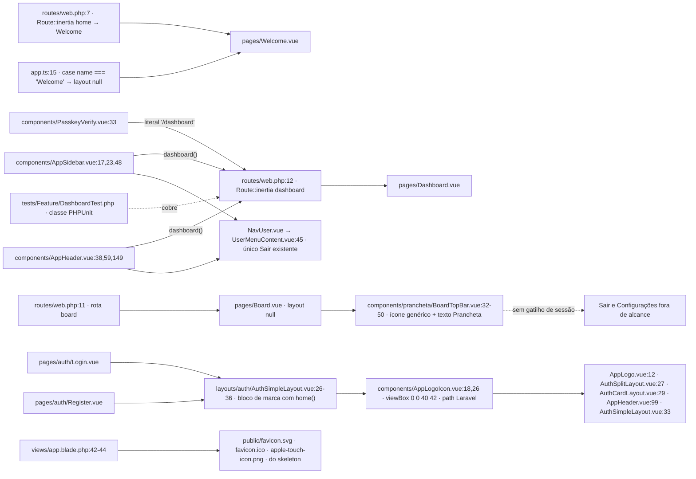
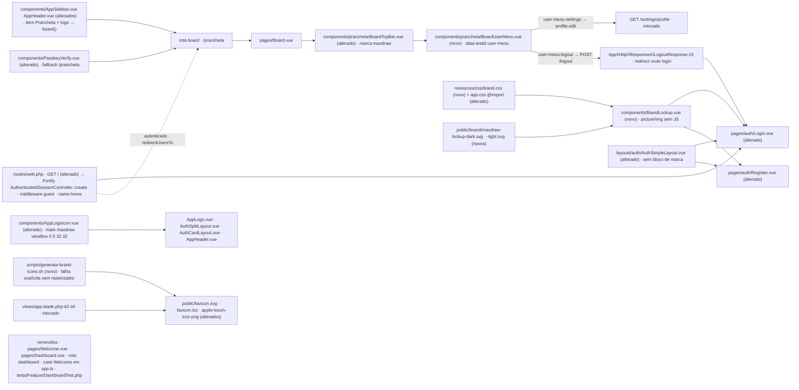

# Implementation Plan

## Request Summary
- Objective: apagar as telas remanescentes do starter kit (`Welcome`, `Dashboard` e a rota `dashboard`), transformar `GET /` na porta de entrada de login (302 → `/prancheta` para quem já entrou), expor **Sair** e **Configurações** dentro da prancheta e trocar a identidade Laravel pela marca maxdraw.
- Scope:
  - **in**: `routes/web.php` (rotas `home` e `dashboard`), `resources/js/pages/{Welcome,Dashboard}.vue`, `resources/js/app.ts`, `resources/js/components/{AppSidebar,AppHeader,PasskeyVerify,AppLogoIcon}.vue`, `resources/js/components/prancheta/BoardTopBar.vue` + novo `BoardUserMenu.vue`, `resources/js/pages/auth/{Login,Register}.vue`, `resources/js/layouts/auth/AuthSimpleLayout.vue`, `resources/css/` (novo `brand.css` + `@import` em `app.css`), `public/brand/*`, `public/favicon.svg|.ico`, `public/apple-touch-icon.png`, `scripts/generate-brand-icons.sh`, testes Pest novos + remoção de `tests/Feature/DashboardTest.php`.
  - **out**: `/settings/*` (rotas, controllers e `resources/js/pages/settings/**` — só o `href` dos links do shell muda), `config/fortify.php`, `bootstrap/app.php`, demais telas de auth (`ConfirmPassword`, `VerifyEmail`, `TwoFactorChallenge`, `ForgotPassword`, `ResetPassword`), `resources/js/canvas/**`, `resources/js/prancheta/**`, `APP_NAME`/`VITE_APP_NAME`, `composer.json`/`package.json`.
- Tier: standard
- Architecture references: `AGENTS.md`, `docs/agents/architecture.md`, `docs/agents/domain_rules.md`, `CLAUDE.md`, `.ai/rules/index.md` → `.ai/rules/routes.md`, `.ai/rules/prancheta.md`, `.ai/rules/auth.md`, `.ai/rules/css.md`, `.ai/rules/feature.md`.

### Regras de camada/delegação que este plano impõe (citadas por tarefa)

| Regra | Fonte | Onde o plano a aplica |
| --- | --- | --- |
| `routes/` só declara URI, nome e middleware; toda lógica delega a controller | `docs/agents/architecture.md` §"Layer responsibilities" | T01 declara `GET /` delegando a `Laravel\Fortify\Http\Controllers\AuthenticatedSessionController::create` — sem closure com decisão |
| O destino pós-autenticação é declarado duas vezes (`config/fortify.php:76`, `bootstrap/app.php:21`) e nenhuma das duas muda | `.ai/rules/routes.md` | T01 obtém o 302 de RF-03 **de graça** pelo middleware `guest` + `redirectUsersTo('/prancheta')`; nenhum dos dois arquivos é editado |
| Sair devolve ao **login**, decidido no servidor por `App\Http\Responses\LogoutResponse:19` | `.ai/rules/routes.md` | T08 só dispara `POST /logout` pelo helper Wayfinder; nenhum destino é escrito no cliente |
| `data-testid` é o contrato entre fases; ordem da topbar é verificada | `.ai/rules/prancheta.md`; `tests/Feature/Frontend/BoardShellTest.php:28-36,73-86` | T09 acrescenta `user-menu` **depois** de `save-button` sem mover/renomear nenhum dos 9 ids atuais |
| Lógica de negócio no servidor; `.vue` só liga, valida e apresenta | `AGENTS.md` §2; `CLAUDE.md` (Inertia + Vue 3) | T08 lê `auth.user` já compartilhado por `HandleInertiaRequests::share()` (`app/Http/Middleware/HandleInertiaRequests.php:41-43`) — nenhum controller/service novo |
| Tokens da prancheta sob o prefixo `sd-`; claro e escuro saem do mesmo `data-theme`, sem `dark:` nem hex nos cinco arquivos de auth | `.ai/rules/css.md`; `tests/Feature/Frontend/AuthScreensTest.php:75-85` | T08/T09/T13/T15 usam só `sd-*`; T12 põe o hex das variantes em `public/brand/*.svg` e a seleção em `resources/css/brand.css` |
| `resources/css/prancheta.css` é comparado token a token com o protótipo por `cssTokens()` (casa o **primeiro** bloco do seletor) | `.ai/rules/css.md`; `tests/Pest.php:356-394`; `tests/Feature/Frontend/ThemeTokensTest.php` | T12 proíbe escrever a regra de marca em `prancheta.css`; arquivo novo `brand.css` importado por `app.css` |
| Teste que bate em `/prancheta` chama `seedCatalog()`; o seed nunca é global | `.ai/rules/feature.md` | T10 chama `seedCatalog()` no teste HTTP da rota `board` |
| Pest apenas; nada de classe estilo PHPUnit | `AGENTS.md` §2 "Tests"; `CLAUDE.md` | T05 remove a classe PHPUnit legada; T06/T07/T10/T16/T18 nascem em Pest (`php artisan make:test --pest`) |
| `npm run build` obrigatório após CSS/JS/Blade; build que falha esvazia `public/build` e derruba ~10 testes | `AGENTS.md` §4; `.ai/rules/auth.md` | T07, T10, T16 e T19 rodam o build antes de declarar a fase pronta |
| `resources/js/{routes,actions,wayfinder}` são artefatos do Wayfinder, gitignored, nunca editados à mão | `AGENTS.md` §4 | T01 obriga regeneração (`npm run build`) e T03/T04 consomem os helpers regenerados; a varredura de RF-05 exclui esses diretórios |
| Dependências não mudam sem aprovação | `AGENTS.md` §"Application Structure"; RNF-05 | Nenhuma tarefa toca `composer.json`/`package.json`; o rasterizador de PR-01 é pacote de sistema instalado fora do repositório |

### Pré-requisito manual (PR-01, não é tarefa de código)

O desenvolvedor instala **no host**, por `apt-get`, um rasterizador de SVG (`librsvg2-bin` → `rsvg-convert`, ou `imagemagick` → `magick`/`convert`; para `.ico` a partir de PNG também serve `icoutils` → `icotool`). Verificado nesta máquina: nenhum dos binários `convert`, `magick`, `rsvg-convert`, `inkscape` existe. A **T17 é a única tarefa bloqueada por isso** e o script que ela cria falha com mensagem explícita nomeando o pacote quando o binário falta — nunca gera arquivo vazio nem pula em silêncio.

## AS IS — Componentes impactados

Verificado no código: a rota `dashboard` tem cinco consumidores de frontend (um por string literal) e um teste; a prancheta é servida fora do `AppLayout` (`app.ts:16-17`), então o único **Sair** do repositório (`UserMenuContent.vue:45`) nunca é renderizado para quem está treinando; a marca é a do Laravel em `AppLogoIcon.vue`, na `BoardTopBar` e nos três ícones de `public/`.

## TO BE — Componentes propostos

`NEW_Home` sai de **T01** (RF-01/RF-02/RF-03/RF-04/CT-01); `Removidos` sai de **T01, T02 e T05** (RF-01, RF-05, RF-08); `NEW_Shell` de **T03** (RF-09); `NEW_Passkey` de **T04** (RF-06); `NEW_UserMenu` de **T08** e sua composição na barra de **T09** (UI-01, UI-02, UI-03, RNF-03, RNF-04, RF-07); `NEW_Logo` de **T11** (UI-04); `NEW_Brandcss`, `NEW_Assets` e `NEW_Lockup` de **T12**, consumidos pelas páginas em **T13** (UI-05); `NEW_Simple` de **T14** (UI-08); `NEW_TopBar` de **T09 + T15** (UI-03, UI-06); `NEW_Script` e `NEW_Icons` de **T17** (UI-07, PR-01). Os testes que travam cada nó são **T06, T07, T10, T16, T18** e o gate final é **T19**.

## Tasks

### T01 — Porta de entrada `/` servindo a tela de login
- **Files**: `routes/web.php`
- **Change**: apagar `Route::inertia('/', 'Welcome')->name('home');` (linha 7) e `Route::inertia('dashboard', 'Dashboard')->name('dashboard');` (linha 12). Declarar no lugar da primeira `Route::get('/', [AuthenticatedSessionController::class, 'create'])->middleware('guest:'.config('fortify.guard'))->name('home');`, com `use Laravel\Fortify\Http\Controllers\AuthenticatedSessionController;` no topo. A rota só declara URI, nome e middleware e **delega ao controller do Fortify** (`docs/agents/architecture.md` §"Layer responsibilities") — nada de closure com decisão. `create()` devolve o `LoginViewResponse`, ou seja, o mesmo `Inertia::render('auth/Login', ['canResetPassword' => ..., 'status' => ...])` registrado em `app/Providers/FortifyServiceProvider.php:53-56` (CT-01). O 302 de RF-03 vem do middleware `guest` + `$middleware->redirectUsersTo('/prancheta')` (`bootstrap/app.php:21`): **não editar** `bootstrap/app.php` nem `config/fortify.php:76` (`.ai/rules/routes.md` — as duas declarações do destino pós-login ficam em sincronia e inalteradas). Depois da edição, regenerar os artefatos do Wayfinder com `npm run build` — o export `dashboard` de `resources/js/routes/index.ts:387` some, e qualquer import remanescente quebra `npm run types:check`; por isso T02–T04 vivem na mesma fase.
- **Covers**: RF-01, RF-02, RF-03, RF-04, CT-01, CT-04
- **Tests**: `tests/Feature/HomeEntrypointTest.php` (T06); regressão obrigatória de `tests/Feature/ExampleTest.php:14`, `tests/Feature/Settings/ProfileUpdateTest.php:76` e `tests/Feature/Auth/VerificationNotificationTest.php:31`, que resolvem `route('home')` e **não podem ser editados**
- **Risk**: Medium — errar o middleware quebra `ExampleTest` (guest 200) ou o 302 de RF-03; a varredura `RegistrationFlowTest.php:117` reprova qualquer rota nova com middleware `verified`
- **Dependencies**: none

### T02 — Remover as páginas do starter kit
- **Files**: `resources/js/pages/Welcome.vue` (excluir), `resources/js/pages/Dashboard.vue` (excluir), `resources/js/app.ts:15`
- **Change**: apagar os dois arquivos de página e remover a linha `case name === 'Welcome':` do `switch` de `app.ts`, mantendo intacto `case name === 'Board': return null;` — `tests/Feature/Frontend/BoardShellTest.php:20-22` casa esse trecho por regex.
- **Covers**: RF-01, RF-05
- **Tests**: `tests/Feature/Frontend/StarterKitCleanupTest.php` (T07); `BoardShellTest` continua verde
- **Risk**: Low
- **Dependencies**: none (mesma fase de T01)

### T03 — Reapontar o shell autenticado para a prancheta
- **Files**: `resources/js/components/AppSidebar.vue:17,20-26,48`, `resources/js/components/AppHeader.vue:38,56-62,149`
- **Change**: em cada arquivo, trocar `import { dashboard } from '@/routes';` por `import { board } from '@/routes';`; o **único** item de `mainNavItems` passa a `{ title: 'Prancheta', href: board(), icon: LayoutGrid }` (mantendo exatamente 1 item); o `<Link>` que embrulha `<AppLogo />` passa a `:href="board()"`. Não mexer em `rightNavItems`/`footerNavItems`, em `NavUser`/`UserMenuContent` (que seguem servindo o shell de `/settings/*`) nem em nada sob `resources/js/pages/settings/**` — RF-09 muda só o alvo dos links (`git diff --exit-code resources/js/pages/settings` tem de ficar limpo).
- **Covers**: RF-05, RF-09
- **Tests**: T07 (`frontendSource` dos dois componentes)
- **Risk**: Medium — esses dois componentes renderizam todas as telas de `/settings/*`; import quebrado derruba a área inteira e o `types:check`
- **Dependencies**: T01

### T04 — Fallback da verificação por passkey para a prancheta
- **Files**: `resources/js/components/PasskeyVerify.vue:33`
- **Change**: `router.visit(response.redirect ?? '/dashboard')` vira `router.visit(response.redirect ?? '/prancheta')` (ou o helper Wayfinder `board()` equivalente). Nenhuma outra alteração no fluxo de passkeys (Scope Out).
- **Covers**: RF-05, RF-06
- **Tests**: T07 (asserção de conteúdo)
- **Risk**: Low
- **Dependencies**: none (mesma fase de T01)

### T05 — Remover o teste legado do dashboard
- **Files**: `tests/Feature/DashboardTest.php` (excluir)
- **Change**: excluir o arquivo — exclusão aprovada pelo desenvolvedor (RF-08) e, além disso, é a única classe estilo PHPUnit da suíte, proibida por `AGENTS.md` §2 "Tests". Nada equivalente volta.
- **Covers**: RF-08
- **Tests**: T07 confere a ausência; `php artisan test --compact` fica verde
- **Risk**: Low
- **Dependencies**: T01 (a rota que ele cobre deixa de existir)

### T06 — Teste da porta de entrada `/`
- **Files**: `tests/Feature/HomeEntrypointTest.php` (novo, Pest via `php artisan make:test --pest HomeEntrypointTest`)
- **Change**: três casos — (a) `$this->get('/')->assertOk()->assertInertia(fn (AssertableInertia $page) => $page->component('auth/Login')->has('canResetPassword')->has('status'))` sem `actingAs`; (b) `$this->actingAs(User::factory()->create())->get('/')->assertRedirect(route('board', absolute: false))`; (c) `route('home', absolute: false)` resolve para `/` e a rota nomeada `home` existe exatamente uma vez (`Route::getRoutes()->getByName('home')`).
- **Covers**: RF-02, RF-03, RF-04, CT-01
- **Tests**: este é o teste; rodar `php artisan test --compact --filter="HomeEntrypoint|ExampleTest|ProfileUpdate|VerificationNotification"`
- **Risk**: Low
- **Dependencies**: T01

### T07 — Teste do expurgo do starter kit
- **Files**: `tests/Feature/Frontend/StarterKitCleanupTest.php` (novo, Pest)
- **Change**: assertar (a) `file_exists(resource_path('js/pages/Welcome.vue'))` e `.../Dashboard.vue` falsos e `file_exists(base_path('tests/Feature/DashboardTest.php'))` falso; (b) `Route::getRoutes()->getByName('dashboard')` é `null`; (c) varredura por `dashboard` em `resources/js/**.{vue,ts}`, `resources/views`, `routes`, `tests`, `app`, `config`, `bootstrap`, **excluindo** `resources/js/{routes,actions,wayfinder}` (artefatos do Wayfinder) e `vendor` → 0 ocorrências (RF-05); (d) `frontendSource('app.ts')` sem `Welcome`; (e) `frontendSource('components/AppSidebar.vue')` e `frontendSource('components/AppHeader.vue')` contêm `board(`, `'Prancheta'` e exatamente 1 item em `mainNavItems`; (f) `frontendSource('components/PasskeyVerify.vue')` contém `'/prancheta'` e não `'/dashboard'`. Antes de rodar, executar `npm run build` (regenera Wayfinder e repovoa `public/build`).
- **Covers**: RF-01, RF-05, RF-06, RF-08, RF-09
- **Tests**: este é o teste; `php artisan test --compact --filter="StarterKitCleanup|BoardShell"`
- **Risk**: Medium — varredura mal recortada dá vermelho falso ao casar os arquivos gerados pelo Wayfinder
- **Dependencies**: T01, T02, T03, T04, T05

### T08 — Menu de usuário da prancheta (componente novo)
- **Files**: `resources/js/components/prancheta/BoardUserMenu.vue` (novo)
- **Change**: componente de raiz única (`
`) que lê `usePage().props.auth.user` — prop já compartilhada por `HandleInertiaRequests::share()` (`app/Http/Middleware/HandleInertiaRequests.php:41-43`), sem controller, service ou estado de sessão no cliente (`AGENTS.md` §2; `CLAUDE.md`). Gatilho = `<PranchetaButton>` com `aria-haspopup="menu"`, `:aria-expanded="open"` (vinculado, não literal), iniciais de `auth.user.name` via `getInitials` (`resources/js/composables/useInitials.ts`) **sempre visíveis** e o nome completo visível a partir de `md` e em `sr-only` abaixo desse breakpoint. **Nenhuma referência a `avatar`** — a tabela `users` não tem essa coluna. Popup com `role="menu"` e exatamente dois itens, nesta ordem: `data-testid="user-menu-settings"` → `<Link :href="edit()">` (`@/routes/profile`) rotulado **Configurações**, e `data-testid="user-menu-logout"` → `<Link :href="logout()" as="button" @click="router.flushAll()">` (`@/routes`, helper `POST`) rotulado **Sair**; o destino após sair continua sendo decidido no servidor por `App\Http\Responses\LogoutResponse:19` (`.ai/rules/routes.md`). Handler de `Escape` fecha o menu e devolve o foco ao gatilho (`trigger.value?.focus()`, no padrão de `components/prancheta/ModalSheet.vue`; o retorno de foco fica sem cobertura de teste por decisão A-05). Apenas tokens `sd-*` (`bg-sd-panel`, `border-sd-line-2`, `text-sd-ink-2`, `rounded-sd`, `shadow-sd-1/2`), **sem `dark:` e sem hex** (`.ai/rules/css.md`). Não reutilizar `UserMenuContent.vue` (primitivas shadcn + rótulos em inglês).
- **Covers**: UI-01, UI-02, RNF-04, RF-07 (gatilho cliente)
- **Tests**: `tests/Feature/Frontend/BoardUserMenuTest.php` (T10)
- **Risk**: Medium — acessibilidade por asserção de fonte e fallthrough de atributos precisam casar exatamente com os `data-testid` do contrato
- **Dependencies**: none (fase 2)

### T09 — Compor o menu na barra superior
- **Files**: `resources/js/components/prancheta/BoardTopBar.vue`
- **Change**: importar `BoardUserMenu` e renderizar `<BoardUserMenu data-testid="user-menu" />` como **último** filho do contêiner `data-testid="topbar"`, depois de `data-testid="save-button"` (`.ai/rules/prancheta.md`; a ordem é conferida por `strpos` crescente). Nenhum dos 9 `data-testid` verificados em `tests/Feature/Frontend/BoardShellTest.php:28-36` pode ser removido, renomeado ou reordenado (RNF-03). O arquivo continua sem `dark:` e sem hex (UI-03).
- **Covers**: UI-01, UI-03, RNF-03
- **Tests**: T10; `BoardShellTest` continua verde
- **Risk**: Medium — o teste de ordem da topbar é literal e frágil a reposicionamento
- **Dependencies**: T08

### T10 — Testes do menu de usuário e do fluxo de saída
- **Files**: `tests/Feature/Frontend/BoardUserMenuTest.php` (novo, Pest)
- **Change**: (a) teste HTTP `seedCatalog(); $this->actingAs(User::factory()->create())->get(route('board'))->assertOk()` — `seedCatalog()` é obrigatório em toda rota `board` (`.ai/rules/feature.md`); (b) `frontendSource` da `BoardTopBar` contém `data-testid="user-menu"` e a cadeia `problem-picker → sessions-button → topbar-spacer → save-chip → theme-button → export-button → save-button → user-menu` é crescente por `strpos` no template; (c) `frontendSource('components/prancheta/BoardUserMenu.vue')` contém `user-menu-settings`, `user-menu-logout`, `auth.user`/`name`, iniciais, `aria-haspopup="menu"`, `:aria-expanded=` e um handler de `Escape`, e **não** contém `avatar`, `dark:` nem `/#[0-9a-fA-F]{3,8}\b/`; (d) contrato do RF-07: `POST route('logout')` autenticado → `assertRedirect(route('login'))`, `assertGuest()`, token de sessão diferente do anterior e `GET route('board')` seguinte redirecionando para `login`. Rodar `npm run build` antes de `php artisan test --compact --filter="BoardUserMenu|BoardShell"`.
- **Covers**: UI-01, UI-02, UI-03, RF-07, RNF-03, RNF-04
- **Risk**: Low
- **Dependencies**: T08, T09

### T11 — `AppLogoIcon` com o mark maxdraw
- **Files**: `resources/js/components/AppLogoIcon.vue:16-28`; consumidores a revisar: `resources/js/components/AppLogo.vue:12`, `resources/js/layouts/auth/AuthSplitLayout.vue:27`, `resources/js/layouts/auth/AuthCardLayout.vue:29`, `resources/js/components/AppHeader.vue:99`
- **Change**: trocar `viewBox="0 0 40 42"` + o `path` do logotipo Laravel pelo mark de `.spec/init/design/logo/maxdraw-mark.svg`: `viewBox="0 0 32 32"`, `path d="M9 9h14M9 9v14M9 23h14M23 9v14"` e dois `rect` 12×12 `rx="3"`. Decidir explicitamente entre mark monocromático (`currentColor`, honrando o `fill-current` dos consumidores) e cores da marca fixas — e ajustar as classes nos quatro pontos de uso conforme a decisão. O consumo em `AuthSimpleLayout.vue:33` desaparece em T14. Nenhum desses quatro arquivos está na lista de RNF-02, então hex de marca é permitido neles — mas não pode vazar para `pages/auth/Login.vue`, `pages/auth/Register.vue`, `layouts/auth/AuthSimpleLayout.vue`, `components/prancheta/PranchetaInput.vue` e `components/InputError.vue`.
- **Covers**: UI-04
- **Tests**: `tests/Feature/Frontend/BrandTest.php` (T16)
- **Risk**: Low
- **Dependencies**: none (fase 3)

### T12 — Assets do lockup e seleção de variante sem JavaScript
- **Files**: `public/brand/maxdraw-lockup-dark.svg` (novo), `public/brand/maxdraw-lockup-light.svg` (novo), `resources/css/brand.css` (novo), `resources/css/app.css` (`@import './brand.css';` junto dos imports existentes), `resources/js/components/BrandLockup.vue` (novo)
- **Change**: copiar os dois lockups de `.spec/init/design/logo/` para `public/brand/` (assets versionados, servidos direto de `public/` — sem passar pelo Vite, sem entrada em `package.json`, RNF-05). `BrandLockup.vue`: raiz única, `<picture>`/par de `` apontando para `/brand/maxdraw-lockup-{dark,light}.svg`, com texto alternativo acessível; **zero JavaScript** na escolha da variante. `brand.css` cobre os três estados, espelhando `resources/css/prancheta.css:48-49`: `:root[data-theme='dark']`, `:root[data-theme='light']` e `@media (prefers-color-scheme: dark) { :root:not([data-theme='light']) … }` para o atributo ausente (`resources/js/composables/useTheme.ts:87-94` só escreve `data-theme` após escolha explícita). **Proibido escrever essas regras em `resources/css/prancheta.css`**: `cssTokens()` (`tests/Pest.php:356-394`) casa o **primeiro** bloco cujo seletor bate e `ThemeTokensTest` compara esse bloco token a token com o protótipo congelado — um seletor novo lá pode deslocar o match e derrubar a suíte de tema (`.ai/rules/css.md`).
- **Covers**: UI-05 (mecanismo)
- **Tests**: T16
- **Risk**: Medium — acoplamento CSS↔teste de tema; caminho de asset errado só aparece em runtime
- **Dependencies**: none (fase 3)

### T13 — Lockup nas telas de Login e Register
- **Files**: `resources/js/pages/auth/Login.vue`, `resources/js/pages/auth/Register.vue`
- **Change**: renderizar `<BrandLockup data-testid="brand-lockup" />` **uma única vez** no topo do template de cada página. As duas páginas seguem sem `dark:` e sem literal hexadecimal (RNF-02, `tests/Feature/Frontend/AuthScreensTest.php:75-85`) — todo hex fica nos SVGs sob `public/brand/`. Preservar o que os testes já travam: imports e uso de `PranchetaInput`/`PranchetaButton`, `<InputError :message="errors.X" />` e os links recíprocos `register()`/`login()` (`AuthScreensTest.php:26-49,87-95`), além dos literais `/forgot-password` e `/reset-password` (`.ai/rules/auth.md` — o reset segue desligado e o Wayfinder não gera esses helpers).
- **Covers**: UI-05
- **Tests**: T16
- **Risk**: Low
- **Dependencies**: T12

### T14 — `AuthSimpleLayout` sem bloco de marca
- **Files**: `resources/js/layouts/auth/AuthSimpleLayout.vue:1-4,26-36`
- **Change**: remover o `<Link :href="home()">` com `<AppLogoIcon class="size-9 fill-current" />` e o ``, junto dos imports que ficarem órfãos (`AppLogoIcon`, `home`, e `Link` se não sobrar uso). Preservar `data-testid="auth-shell"`, o bloco de título/descrição e as classes que `AuthScreensTest.php:65-73` verifica (`bg-sd-paper`, `font-sd-ui`, `text-sd-ink`, `bg-sd-panel`, `border-sd-line`, `shadow-sd-2`); o arquivo continua sem `dark:` e sem hex. Consequência aceita: `ConfirmPassword`, `VerifyEmail`, `TwoFactorChallenge`, `ForgotPassword` e `ResetPassword` ficam sem marca no topo e **não** recebem nenhuma outra alteração. O nome de rota `home` continua existindo (RF-04) — só este consumo sai.
- **Covers**: UI-08
- **Tests**: T16
- **Risk**: Low
- **Dependencies**: none (fase 3)

### T15 — Marca maxdraw na barra superior da prancheta
- **Files**: `resources/js/components/prancheta/BoardTopBar.vue:29-50`
- **Change**: substituir o `<svg>` de dois `rect` genéricos e o `Prancheta` pela marca maxdraw com rótulo acessível (`aria-label` ou ``), mantendo o contêiner divisor (`border-r border-sd-line`) e o `data-testid="topbar"`. Usar `<AppLogoIcon />` (já atualizado em T11) ou ``: **não inlinar o SVG com hex** — UI-03/RNF-02 valem para o arquivo inteiro da `BoardTopBar` (`frontendSource` não pode casar `/#[0-9a-fA-F]{3,8}\b/` nem conter `dark:`). Nenhum `data-testid` existente muda (RNF-03).
- **Covers**: UI-06
- **Tests**: T16; `BoardShellTest` continua verde
- **Risk**: Medium — risco direto de introduzir hex e reprovar UI-03
- **Dependencies**: T11

### T16 — Testes de identidade visual
- **Files**: `tests/Feature/Frontend/BrandTest.php` (novo, Pest)
- **Change**: (a) `frontendSource('components/AppLogoIcon.vue')` contém `M9 9h14M9 9v14M9 23h14M23 9v14` e não contém `M17.2 5.633 8.6.855 0 5.633v26.51`; (b) `pages/auth/Login.vue` e `pages/auth/Register.vue` contêm `data-testid="brand-lockup"` exatamente uma vez cada e a rota renderiza 200 (`$this->get(route('login'))` / `route('register')`); (c) a fonte de marca (`components/BrandLockup.vue` + `resources/css/brand.css` lido por `file_get_contents`) contém as três condições — `[data-theme='dark']`, `[data-theme='light']` e `prefers-color-scheme: dark` sob `:root:not([data-theme='light'])` — e a seleção não depende de JS (`BrandLockup.vue` sem `useTheme`/`matchMedia`); (d) `layouts/auth/AuthSimpleLayout.vue` não contém `AppLogoIcon` nem `home()`; (e) `components/prancheta/BoardTopBar.vue` não contém `<rect x="3" y="3" width="7" height="7" rx="1.5" />` nem `>Prancheta<` e tem rótulo acessível. Rodar `npm run build` e `php artisan test --compact --filter="Brand|AuthScreens|BoardShell|ThemeTokens"`.
- **Covers**: UI-04, UI-05, UI-06, UI-08, RNF-02
- **Risk**: Low
- **Dependencies**: T11, T12, T13, T14, T15

### T17 — Script pontual dos ícones do app e binários versionados
- **Files**: `scripts/generate-brand-icons.sh` (novo), `public/favicon.svg`, `public/favicon.ico`, `public/apple-touch-icon.png`
- **Change**: script de execução única no host (o diretório `scripts/` já existe; **nada** é acrescentado a `package.json`/`composer.json`, RNF-05, e nenhum passo de build novo é criado). Guarda no topo: `command -v` para `rsvg-convert` / `magick` / `convert` (+ `icotool` quando só houver `rsvg-convert`); faltando rasterizador, o script **sai com código ≠ 0 e mensagem explícita nomeando o pacote apt a instalar** (PR-01) — nunca gera arquivo vazio nem pula em silêncio. Saídas, todas derivadas de `.spec/init/design/logo/maxdraw-mark.svg` como fonte única: `public/favicon.svg` = cópia byte a byte do mark; `public/apple-touch-icon.png` = 180×180 achatado sobre `#0A0E13` (iOS não aceita transparência); `public/favicon.ico` = derivado do mesmo mark. Rodar uma vez e **commitar os três binários**. Não tocar em `resources/views/app.blade.php:42-44` — as três tags continuam apontando para os mesmos caminhos.
- **Covers**: UI-07, PR-01
- **Tests**: `tests/Feature/Frontend/BrandAssetsTest.php` (T18)
- **Risk**: Medium — única tarefa dependente de pré-requisito manual de host; se PR-01 não estiver satisfeito, a tarefa para aqui com mensagem clara em vez de entregar ícone quebrado
- **Dependencies**: T11 (mesma decisão de marca), PR-01 (manual)

### T18 — Teste dos ícones do app
- **Files**: `tests/Feature/Frontend/BrandAssetsTest.php` (novo, Pest)
- **Change**: (a) `public/favicon.svg` contém `M9 9h14M9 9v14M9 23h14M23 9v14`; (b) `getimagesize(public_path('apple-touch-icon.png'))` devolve `180 × 180` e uma amostragem por GD (`imagecreatefrompng` + `imagecolorat`, `ext-gd` carregada — verificado) não encontra pixel totalmente transparente nos quatro cantos e no centro; (c) os três arquivos deixaram de ser os do skeleton, comparando `hash_file('sha256', …)` com as constantes registradas hoje: `favicon.svg` `242f4f8f93f5fbc6c8aeec500c9bac02dcfe68daba166d484c5cdc986c88d8ee`, `favicon.ico` `4606a56e6ef3f5ec39201497f57069d5457ce9cea25227134d0ba378788e9070`, `apple-touch-icon.png` `4001aa032ff113e1a268a9bbf1ab0fd9949439f9f54a85895956eb323aba977d`; (d) `resources/views/app.blade.php` continua com as três tags apontando para `/favicon.ico`, `/favicon.svg` e `/apple-touch-icon.png`.
- **Covers**: UI-07
- **Risk**: Low
- **Dependencies**: T17

### T19 — Gate final e verificações de não-regressão
- **Files**: nenhum arquivo de aplicação (verificação); `vendor/bin/pint --dirty --format agent` sobre o PHP tocado (`routes/web.php` e os testes novos)
- **Change**: rodar `npm run build` e depois **`composer ci:check`** — o comando exato do gate (RNF-01, `AGENTS.md` §1: `npm run lint:check` + `format:check` + `types:check` + `npm test` + `composer test`); não trocar de runner. Confirmar: exit 0 sem baseline nova de PHPStan e sem `ignoreErrors` novo em `phpstan.neon`; `git diff --exit-code composer.json package.json` limpo (RNF-05); `git diff --exit-code resources/js/pages/settings` limpo (RF-09); os 9 `data-testid` de `BoardShellTest.php:28-36` intactos (RNF-03); `php artisan route:list --name=dashboard` com 0 rotas e `--name=home` com exatamente 1 rota em `/` (RF-01, RF-04).
- **Covers**: RNF-01, RNF-03, RNF-05, RF-01, RF-04, RF-09
- **Risk**: Medium — é aqui que aparecem quebras cruzadas (Wayfinder, `public/build` esvaziado, Prettier em CSS/Vue novos)
- **Dependencies**: T01–T18

## Execution Phases
| Phase | Tasks | Parallel-safe? |
|-------|-------|----------------|
| 1 — Porta de entrada `/` e expurgo do starter kit | T01, T02, T03, T04, T05, T06, T07 | Parcial — T01–T05 tocam arquivos distintos e podem andar juntos; T06 depende de T01 e T07 depende de T01–T05. A fase é indivisível: remover a rota `dashboard` sem reapontar `AppSidebar`/`AppHeader`/`PasskeyVerify` quebra `npm run types:check` no meio |
| 2 — Menu de usuário na prancheta | T08, T09, T10 | Não — T09 depende de T08 e T10 depende de ambos (mesmo arquivo `BoardTopBar.vue` em T09) |
| 3 — Identidade maxdraw nas telas | T11, T12, T13, T14, T15, T16 | Parcial — T11, T12 e T14 são paralelos (arquivos disjuntos); T13 depende de T12, T15 depende de T11, T16 depende de todos |
| 4 — Ícones do app | T17, T18 | Não — T18 verifica os binários que T17 gera; T17 está bloqueada por PR-01 |
| 5 — Fechamento e gate | T19 | Não — tarefa única, depende de todas as anteriores |

## Risks
| Risk | Blast radius | Mitigation | Rollback |
|------|-------------|------------|----------|
| Remover a rota `dashboard` sem regenerar/limpar os consumidores derruba o Wayfinder (`MISSING_EXPORT`) e o `npm run types:check` | Build inteiro do frontend; `public/build` esvaziado derruba ~10 testes com `ViteManifestNotFoundException` (`.ai/rules/auth.md`) | T01–T04 na mesma fase; `npm run build` obrigatório em T07 antes de rodar a suíte | `git checkout -- routes/web.php resources/js` + `npm run build` |
| `GET /` com middleware errado quebra `ExampleTest`, `ProfileUpdateTest` e `VerificationNotificationTest`, que não podem ser editados | 3 testes fora do escopo + os layouts que importam `home()` | `guest:'.config('fortify.guard')` + T06 cobrindo os dois estados; nunca mexer em `fortify.home`/`redirectUsersTo` | Reverter `routes/web.php` |
| CSS de marca escrito em `prancheta.css` desloca o match de `cssTokens()` e derruba `ThemeTokensTest` | Suíte de tema inteira (comparação com o protótipo congelado) | T12 obriga arquivo novo `resources/css/brand.css` importado por `app.css` | Remover o `@import` e o arquivo novo |
| Hex ou `dark:` vazando para os cinco arquivos de RNF-02 (Login, Register, AuthSimpleLayout, PranchetaInput, InputError) ou para a `BoardTopBar` | `AuthScreensTest:75-85` e o AC de UI-03 ficam vermelhos | Hex confinado a `public/brand/*.svg` e a `AppLogoIcon`/`brand.css`; T13/T15 explicitam a proibição | Reverter o `.vue` afetado |
| Novo nó na topbar movendo/renomeando `data-testid` existente | `BoardShellTest` (34 asserções de peça + ordem) | RNF-03 explícito em T09; `user-menu` entra como **último** filho | `git checkout -- resources/js/components/prancheta/BoardTopBar.vue` |
| PR-01 não satisfeito no host (nenhum rasterizador instalado hoje) | Só T17/T18 — o resto da feature entrega sem eles | Script com `command -v` e falha explícita nomeando o pacote apt; fase 4 isolada no fim da ordem | `git checkout -- public/favicon.svg public/favicon.ico public/apple-touch-icon.png` |
| Menu de usuário quebrando teclado/leitor de tela sem que a suíte perceba (retorno de foco não tem cobertura, A-05) | Acessibilidade da única saída de conta da prancheta | RNF-04 por asserção de fonte em T10 + verificação manual do retorno de foco antes do merge | Remover `<BoardUserMenu>` da topbar (o backend de logout não muda) |
| Shell autenticado sem caminho de volta a partir de `/settings/*` | Todas as telas de configurações | RF-09 em T03 (item "Prancheta" + logo → rota `board`), com `git diff --exit-code resources/js/pages/settings` limpo | Reverter `AppSidebar.vue`/`AppHeader.vue` |

## Rollout
1. Fase 1 é a única com risco de build quebrado no meio — feche-a com `npm run build` + `php artisan test --compact` antes de seguir.
2. Fases 2 e 3 são independentes entre si depois da fase 1; se precisar fatiar a entrega, o menu de usuário (fase 2, US-1.2) tem prioridade sobre a marca (fase 3).
3. Fase 4 pode ser adiada sem bloquear as demais: até ela rodar, os ícones do skeleton continuam servidos e nada regride.
4. Depois do merge: re-rodar `/ai-context` — `docs/agents/api_contracts.md:22,24` e `docs/agents/architecture.md:39,42` passam a citar rotas/páginas inexistentes (limitação conhecida registrada no SPEC).
5. Sugestão FLEXIBLE (não é tarefa): registrar com `record-rule` no glob `routes/**` que `/` é a porta de entrada de login, para que a próxima passagem não recrie uma landing.

## Open Questions
- Nenhuma bloqueante. O SPEC 1.1 fechou as seis decisões (A-01…A-06) e nenhuma contradição foi encontrada entre o SPEC e a arquitetura resolvida (`AGENTS.md`, `docs/agents/architecture.md`, `.ai/rules/*`) durante a exploração do código.
- Ponto de atenção não bloqueante para o desenvolvedor decidir em T11: mark **monocromático** (`currentColor`, honrando o `fill-current` dos quatro consumidores) **ou** cores fixas da marca. A escolha muda as classes de `AppLogo.vue:12`, `AuthSplitLayout.vue:27`, `AuthCardLayout.vue:29` e `AppHeader.vue:99`, e — se as cores forem fixas — obriga a `BoardTopBar` a consumir o ícone por componente/`` em vez de inlinar o SVG, para não violar UI-03.

## Assumptions
- `Laravel\Fortify\Http\Controllers\AuthenticatedSessionController::create()` devolve `LoginViewResponse`, que resolve o `Inertia::render('auth/Login', …)` registrado em `FortifyServiceProvider::configureViews()` — verificado em `vendor/laravel/fortify/src/Http/Controllers/AuthenticatedSessionController.php:47-50` e `app/Providers/FortifyServiceProvider.php:53-56`.
- O middleware `guest` redireciona o autenticado para `/prancheta` por `$middleware->redirectUsersTo('/prancheta')` (`bootstrap/app.php:21`), o que entrega RF-03 sem código novo. **[UNVERIFIED]** em execução: só será confirmado por T06.
- Os helpers Wayfinder `board`, `logout` (POST) e `profile.edit` já são gerados hoje (`resources/js/routes/index.ts:88,306` e `resources/js/routes/profile/index.ts:7`) — verificado; o export `dashboard` (`index.ts:387`) desaparece com T01.
- `ext-gd` está carregada nesta máquina (verificado por `php -m`), então T18 pode inspecionar dimensão e transparência do PNG sem dependência nova.
- A extensão PHP `imagick` também está carregada, mas **[UNVERIFIED]** se ela tem delegate de SVG (a leitura de teste falhou por erro de arquivo temporário, sem conclusão). O plano mantém PR-01 como decidido no SPEC — rasterizador de sistema via `apt-get` — e não depende de `imagick`.
- `resources/js/{routes,actions}` estão no `.gitignore` (verificado) e são regenerados pelo plugin Wayfinder do Vite a cada `npm run build`; nenhuma tarefa os edita.
- Nenhum outro teste da suíte referencia `dashboard` ou `Welcome` além de `tests/Feature/DashboardTest.php` — verificado por varredura em `resources`, `routes`, `tests`, `app`, `config`, `bootstrap`, `docs`, `README.md` e `.github/workflows`.
