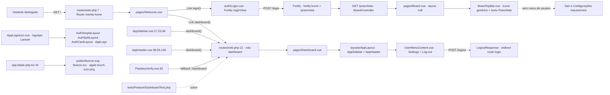
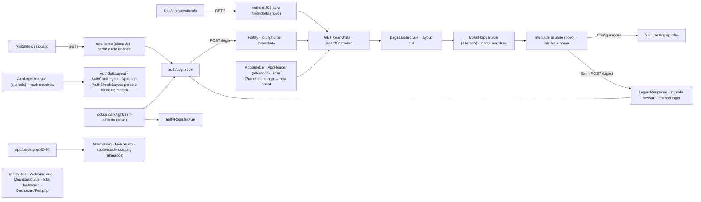

# SPEC: remover-telas-starter-kit-logout-e-logo

## Metadata
- Source: developer description via /plan
- Service: maxdraw — Prancheta de System Design (mono-repo Laravel 13 + Inertia v3 + Vue 3 + motor TS próprio)
- Tier: standard
- Version: 1.1
- Architecture references: `AGENTS.md`, `docs/agents/architecture.md`, `docs/agents/domain_rules.md`, `CLAUDE.md`, `.ai/rules/index.md` (+ `.ai/rules/routes.md`, `.ai/rules/prancheta.md`, `.ai/rules/auth.md`, `.ai/rules/css.md`, `.ai/rules/feature.md`)
- Init chain: `.spec/init/project-description.md`, `.spec/init/user-stories.md`, `.spec/init/project-phases.md`
- Brand assets: `.spec/init/design/logo/maxdraw-mark.svg`, `maxdraw-mark-light.svg`, `maxdraw-lockup-dark.svg`, `maxdraw-lockup-light.svg` (verified at `.spec/init/design/logo/`)

### Pré-requisitos manuais de ambiente (não são tarefa de código)

- **PR-01 — Rasterizador no host.** A geração de `public/apple-touch-icon.png` e `public/favicon.ico` (UI-07) exige um rasterizador de SVG instalado **no host**, via `apt-get` (ex.: `librsvg2-bin` → `rsvg-convert`, ou `imagemagick` → `magick`/`convert`). Verificado: nenhum de `convert`, `magick`, `rsvg-convert`, `inkscape`, `cairosvg`, `Pillow` existe hoje na máquina. A instalação é passo manual do desenvolvedor, **fora do repositório**: não entra em `composer.json` nem em `package.json` (RNF-05 permanece intacto), não vira dependência, não vira script de build. O script pontual de geração roda **uma única vez** e os binários resultantes entram versionados; se o binário não existir, o script DEVE falhar com mensagem explícita apontando o pacote a instalar, em vez de gerar arquivo vazio ou silenciosamente pular.

## Context

O app entregue nas Phases 1–20 é a prancheta: `GET /prancheta` é a única tela de produto (`resources/js/pages/Board.vue`), e o destino pós-autenticação já está declarado duas vezes em `/prancheta` — `config/fortify.php:76` (`'home' => '/prancheta'`) e `bootstrap/app.php:21` (`$middleware->redirectUsersTo('/prancheta')`).

Sobraram do starter kit duas telas que nenhum fluxo do produto usa: `Route::inertia('/', 'Welcome')->name('home')` (verified at `routes/web.php:7`) e `Route::inertia('dashboard', 'Dashboard')->name('dashboard')` (verified at `routes/web.php:12`), com as páginas `resources/js/pages/Welcome.vue` e `resources/js/pages/Dashboard.vue`. A rota `dashboard` ainda é referenciada por `resources/js/components/AppSidebar.vue:17,23,48`, `resources/js/components/AppHeader.vue:38,59,149`, `resources/js/pages/Welcome.vue:3,21`, `resources/js/pages/Dashboard.vue:4,11` e — como string literal de fallback — `resources/js/components/PasskeyVerify.vue:33` (`router.visit(response.redirect ?? '/dashboard')`). O único teste que cobre a rota é `tests/Feature/DashboardTest.php` (verified at `tests/Feature/DashboardTest.php:15,24`).

Sair da conta hoje só existe no menu do starter kit (`resources/js/components/UserMenuContent.vue:45`, consumido por `NavUser.vue:50` dentro de `AppSidebar`/`AppHeader`), que **não é renderizado na prancheta**: `resources/js/app.ts:16-17` devolve `layout: null` para a página `Board`. Consequência funcional: quem está treinando não tem como sair nem chegar às configurações sem digitar a URL. US-1.2 (`.spec/init/user-stories.md:46`) exige "Sair encerra a sessão, invalida o token e devolve ao login" — o backend já cumpre (`App\Http\Responses\LogoutResponse:19` redireciona para `route('login')`, ligado em `FortifyServiceProvider::register()` e travado por `tests/Feature/Auth/LoginFlowTest.php:80`), mas a UI da prancheta não expõe o gatilho.

A identidade visual ainda é a do Laravel: `resources/js/components/AppLogoIcon.vue` carrega o `path` do logotipo do framework (viewBox `0 0 40 42`), o `BoardTopBar` desenha um ícone genérico de dois retângulos + texto "Prancheta" (verified at `resources/js/components/prancheta/BoardTopBar.vue:32-50`), e `public/favicon.svg`, `public/favicon.ico`, `public/apple-touch-icon.png` (verified at `public/`) são os do skeleton, referenciados por `resources/views/app.blade.php:42-44`.

### Regras de arquitetura que esta feature está obrigada a respeitar

| Regra | Fonte | Como incide aqui |
| --- | --- | --- |
| `routes/` só declara URI, nome e middleware; nenhuma lógica vive na rota | `docs/agents/architecture.md`, "Layer responsibilities" | A porta de entrada em `/` é declaração de rota + view do Fortify, não um controller novo com lógica de decisão |
| O destino pós-autenticação é declarado **duas vezes** e tem de ficar em sincronia | `.ai/rules/routes.md`; `config/fortify.php:76`; `bootstrap/app.php:21` | Nenhum dos dois é alterado — a feature não muda o destino, só remove o que apontava para fora dele |
| Sair devolve ao **login**, não a `/`, via `App\Http\Responses\LogoutResponse` | `.ai/rules/routes.md`; `app/Http/Responses/LogoutResponse.php:19` | O item **Sair** só dispara `POST /logout`; o destino continua sendo decidido no servidor |
| `data-testid` é o contrato entre fases; `tests/Feature/Frontend/BoardShellTest.php` confere peça a peça e a **ordem** da barra superior | `.ai/rules/prancheta.md`; `tests/Feature/Frontend/BoardShellTest.php:28-36,73-86` | O menu de usuário entra com `data-testid` próprio e **depois** de `save-button`, sem mover nenhum id existente |
| Tokens da prancheta vivem sob o prefixo `sd-`; claro e escuro saem do mesmo `data-theme`, sem variante `dark:` nem cor literal | `.ai/rules/css.md`; `tests/Feature/Frontend/AuthScreensTest.php:75-85` | Login/Register/`AuthSimpleLayout` não podem ganhar hex nem `dark:` — o lockup por tema tem de ser resolvido fora desses cinco arquivos |
| Lógica de negócio fica no servidor; `.vue` só liga, valida e apresenta | `CLAUDE.md` (Inertia + Vue 3); `AGENTS.md` §2 | O menu de usuário lê `auth.user` de `HandleInertiaRequests::share()` (verified at `app/Http/Middleware/HandleInertiaRequests.php:41-43`); nada de estado de sessão no cliente |
| Teste que bate em `/prancheta` chama `seedCatalog()` | `.ai/rules/feature.md` | Todo teste novo do menu de usuário na `BoardTopBar` que passe pela rota `board` chama `seedCatalog()` |
| Pest apenas; nada de classe estilo PHPUnit | `AGENTS.md` §2 "Tests"; `CLAUDE.md` | O `tests/Feature/DashboardTest.php` removido é justamente uma classe PHPUnit legada; nada equivalente volta |
| `npm run build` obrigatório após mudança de CSS/JS/Blade; build que falha esvazia `public/build` e derruba ~10 testes | `AGENTS.md` §4; `.ai/rules/auth.md` | A troca de marca mexe em `.vue` e em `app.blade.php`: build antes de declarar pronto |

## AS IS — Estado atual

Hoje `/` cai numa vitrine do starter kit e a única saída da conta mora num layout que a prancheta nunca renderiza (`app.ts:16-17` devolve `layout: null` para `Board`). A rota `dashboard` é referenciada por cinco arquivos de frontend, um deles por string literal, e a marca em toda a aplicação ainda é a do Laravel.

## TO BE — Estado proposto

`NEW_Home` e `NEW_Redirect` realizam RF-02, RF-03 e RF-04 (a porta de entrada em `/`); `NEW_UserMenu` realiza UI-01, UI-02, UI-03, RF-07 e o contrato CT-02; `NEW_Nav` realiza RF-09 (o que fica no lugar do item "Dashboard" removido por RF-05); `NEW_TopBar` realiza UI-06; `NEW_Brand`, `NEW_Lockup` e UI-08 realizam UI-04, UI-05 e a saída do bloco de marca do `AuthSimpleLayout`; `NEW_Icons` realiza UI-07. O nó `Removidos` é isolado de propósito: ele reúne o que RF-01, RF-05 e RF-08 apagam — `Welcome.vue`, `Dashboard.vue`, a rota `dashboard` e o teste que a cobria — e por isso não tem aresta de entrada nem de saída.

## Scope

- **In**:
  - Remoção de `resources/js/pages/Welcome.vue`, `resources/js/pages/Dashboard.vue`, da rota `dashboard` e do `Route::inertia('/', 'Welcome')`.
  - Nova semântica de `GET /`: login para quem está deslogado, redirect para `/prancheta` para quem está logado.
  - Limpeza de toda referência à rota `dashboard` em `.vue`/`.ts`/`.php`, incluindo o literal `'/dashboard'` de `PasskeyVerify.vue:33`.
  - Reapontamento da navegação do `AppSidebar`/`AppHeader` para a rota `board` (item "Prancheta" + link do logo) — apenas o alvo dos links, sem tocar no conteúdo das telas de `/settings/*`.
  - Saída do bloco de marca de `layouts/auth/AuthSimpleLayout.vue`, com o lockup passando a viver em `pages/auth/Login.vue` e `pages/auth/Register.vue`.
  - Remoção de `tests/Feature/DashboardTest.php` (exclusão aprovada pelo desenvolvedor) e ajuste dos testes que passam a divergir do novo comportamento de `/`.
  - Menu de usuário na `BoardTopBar` com **Sair** e **Configurações**, no visual `PranchetaButton` / tokens `sd-*`.
  - Identidade maxdraw: `AppLogoIcon.vue`, lockup em Login/Register, marca na `BoardTopBar`, `favicon.svg`, `favicon.ico`, `apple-touch-icon.png`.
- **Out** (explicitamente excluído, não regride nem é tocado):
  - `/settings/*` — rotas, controllers e páginas (`routes/settings.php`, `app/Http/Controllers/Settings/**`, `resources/js/pages/settings/**`). O reapontamento de RF-09 muda apenas o `href` dos links de navegação do shell, não o conteúdo dessas telas.
  - As demais telas de auth (`ConfirmPassword`, `VerifyEmail`, `TwoFactorChallenge`, `ForgotPassword`, `ResetPassword`): elas ficam **sem marca no topo** como consequência aceita de UI-08, e nenhuma outra alteração é feita nelas.
  - `auth/VerifyEmail.vue`, `auth/TwoFactorChallenge.vue` e todo o fluxo de passkeys além do literal de fallback da linha 33.
  - As telas órfãs `auth/ForgotPassword.vue`, `auth/ResetPassword.vue`, `auth/ConfirmPassword.vue`.
  - `config/fortify.php` — `Features::resetPasswords()` segue desligado e `'home' => '/prancheta'` (verified at `config/fortify.php:76`) não muda.
  - `bootstrap/app.php` `redirectUsersTo('/prancheta')` (verified at `bootstrap/app.php:21`).
  - `APP_NAME` / `VITE_APP_NAME` (`"Prancheta de System Design"`, verified at `.env.example:1,65`) — nenhum AC pede renomear o app.
  - O motor `resources/js/canvas/**` e `resources/js/prancheta/**`.

## RIGID (Non-Negotiable)

### Functional Requirements

- RF-01 [Ubiquitous] O sistema NÃO DEVE conter os arquivos `resources/js/pages/Welcome.vue` e `resources/js/pages/Dashboard.vue`, nem a declaração `Route::inertia('dashboard', 'Dashboard')->name('dashboard')` (verified at `routes/web.php:12`), nem a declaração `Route::inertia('/', 'Welcome')->name('home')` (verified at `routes/web.php:7`).
  - AC: `ls resources/js/pages/Welcome.vue resources/js/pages/Dashboard.vue` retorna erro para os dois caminhos; `php artisan route:list --name=dashboard` retorna 0 rotas; `grep -n "Welcome" routes/web.php` não retorna linha.

- RF-02 [Event-Driven] QUANDO um usuário **não autenticado** requisitar `GET /`, o sistema DEVE responder HTTP 200 renderizando o componente Inertia `auth/Login`.
  - AC: `$this->get('/')->assertOk()->assertInertia(fn ($page) => $page->component('auth/Login'))` passa sem `actingAs`.

- RF-03 [State-Driven] ENQUANTO houver um usuário autenticado na sessão, QUANDO ele requisitar `GET /`, o sistema DEVE responder HTTP 302 para `/prancheta`.
  - AC: `$this->actingAs(User::factory()->create())->get('/')->assertRedirect(route('board', absolute: false))` passa.

- RF-04 [Ubiquitous] O sistema DEVE preservar o nome de rota `home` apontando para `GET /`, porque três testes fora do escopo desta feature resolvem esse nome: `tests/Feature/ExampleTest.php:14`, `tests/Feature/Settings/ProfileUpdateTest.php:76` e `tests/Feature/Auth/VerificationNotificationTest.php:31`, e os layouts `resources/js/layouts/auth/AuthSplitLayout.vue:24` e `AuthCardLayout.vue:25` o importam como `home()`. (`AuthSimpleLayout.vue:27` deixa de importá-lo por UI-08 — o import órfão sai junto com o bloco de marca; isso não afeta a obrigação de preservar o nome de rota.)
  - AC: `php artisan route:list --name=home` lista exatamente 1 rota com URI `/`; `php artisan test --compact --filter="ExampleTest|ProfileUpdateTest|VerificationNotificationTest"` fica verde sem editar esses três arquivos de teste.

- RF-05 [Ubiquitous] O sistema NÃO DEVE conter nenhuma referência à rota `dashboard` — identificador `dashboard`, helper `dashboard()` ou a URL literal `/dashboard` — em arquivos `.vue`, `.ts` ou `.php` versionados.
  - AC: `grep -rn "dashboard" --include=*.vue --include=*.ts --include=*.php resources routes tests app config bootstrap | grep -v "resources/js/\(routes\|actions\|wayfinder\)/"` retorna 0 linhas. Alcança obrigatoriamente `AppSidebar.vue:17,23,48`, `AppHeader.vue:38,59,149` e `PasskeyVerify.vue:33`.

- RF-06 [Event-Driven] QUANDO a verificação por passkey concluir com sucesso e a resposta do servidor não trouxer `redirect`, o cliente DEVE navegar para `/prancheta`.
  - AC: `resources/js/components/PasskeyVerify.vue` contém `response.redirect ?? '/prancheta'` (ou o helper Wayfinder equivalente da rota `board`) e nenhuma ocorrência de `'/dashboard'`.

- RF-07 [Event-Driven] QUANDO o usuário acionar o item **Sair** do menu de usuário da `BoardTopBar`, o sistema DEVE submeter `POST /logout` (rota `logout`, verified at `php artisan route:list --name=logout` → `Laravel\Fortify\Http\Controllers\AuthenticatedSessionController`), invalidar a sessão e conduzir o navegador à tela de login.
  - AC: após `POST /logout`, `assertGuest()` passa, `session()->token()` difere do token anterior, a resposta é `assertRedirect(route('login'))`, e `GET /prancheta` seguinte redireciona para `login` — o mesmo contrato já travado por `tests/Feature/Auth/LoginFlowTest.php:80`.

- RF-08 [Ubiquitous] O sistema NÃO DEVE conter o arquivo `tests/Feature/DashboardTest.php` (exclusão aprovada pelo desenvolvedor, por remover junto a rota que ele cobria).
  - AC: `ls tests/Feature/DashboardTest.php` retorna erro e `php artisan test --compact` fica verde.

- RF-09 [Ubiquitous] No lugar da referência a `dashboard` removida por RF-05, o shell autenticado (`AppSidebar`/`AppHeader`, renderizado em produção para toda página `settings/*` via `resources/js/app.ts:20-23`) DEVE apontar para a rota `board`: o único item de `mainNavItems` (verified at `AppSidebar.vue:20-26` e `AppHeader.vue:56-62`) passa a ter título **"Prancheta"** e `href` da rota `board`, e o `<Link>` que embrulha `<AppLogo />` (verified at `AppSidebar.vue:48` e `AppHeader.vue:149`) passa a apontar para a mesma rota. Decisão do desenvolvedor: `/settings/*` não pode ficar sem caminho de volta; muda apenas o alvo dos links, nunca o conteúdo daquelas telas.
  - AC: `frontendSource('components/AppSidebar.vue')` e `frontendSource('components/AppHeader.vue')` contêm o helper Wayfinder da rota `board` (ou `/prancheta`) nos três pontos — item de nav e link do logo em cada componente — e o título `Prancheta` no item de nav; `mainNavItems` continua com exatamente 1 item em cada componente; nenhuma ocorrência de `dashboard` sobra (coberto por RF-05); nenhum arquivo sob `resources/js/pages/settings/**` é modificado (`git diff --exit-code resources/js/pages/settings` limpo).

### UI Requirements

- UI-01 [Ubiquitous] A `BoardTopBar` DEVE exibir, no canto direito, um gatilho de menu de usuário com as **iniciais derivadas de `auth.user.name`** sempre visíveis, mais o **nome completo** visível a partir do breakpoint `md` e em `sr-only` abaixo dele. A fonte é a prop compartilhada `auth.user` (verified at `app/Http/Middleware/HandleInertiaRequests.php:41-43`). **NÃO existe avatar**: a tabela `users` não tem coluna `avatar` (verified at `database/migrations/0001_01_01_000000_create_users_table.php`) e `HandleInertiaRequests` compartilha o model cru, logo `auth.user.avatar` seria sempre `undefined` — nenhum código pode depender dele. Motivo do recorte: a topbar já carrega 7 controles e o nome completo em telas estreitas competiria por largura.
  - AC: `resources/js/components/prancheta/BoardTopBar.vue` (ou o componente de menu que ela compõe) contém um elemento com `data-testid="user-menu"` que renderiza `auth.user.name` — **a renderização em `sr-only` satisfaz este AC** — e um nó de iniciais derivadas desse mesmo `name`, sem qualquer referência a `avatar`; um teste HTTP com `actingAs` + `seedCatalog()` em `GET /prancheta` responde 200 e o `frontendSource` confirma o binding.

- UI-02 [Event-Driven] QUANDO o gatilho de UI-01 for acionado, o menu DEVE apresentar exatamente dois itens de ação, nesta ordem: **Configurações** (navega para `/settings/profile`) e **Sair** (submete `POST /logout`).
  - AC: o menu expõe `data-testid="user-menu-settings"` e `data-testid="user-menu-logout"`; o primeiro aponta para a rota `profile.edit` (verified at `routes/settings.php`), o segundo para a rota `logout`; nenhum terceiro item de ação existe no menu.

- UI-03 [Ubiquitous] O gatilho e os itens do menu DEVEM usar o `PranchetaButton` e apenas tokens `sd-*` (`bg-sd-panel`, `border-sd-line-2`, `text-sd-ink-2`, `rounded-sd`, `shadow-sd-1/2` — `.ai/rules/css.md`), sem classe `dark:` e sem cor hexadecimal literal, e o novo nó DEVE ser posicionado **depois** de `data-testid="save-button"`.
  - AC: `frontendSource('components/prancheta/BoardTopBar.vue')` não casa com `/#[0-9a-fA-F]{3,8}\b/` nem contém `dark:`; a ordem `problem-picker → sessions-button → topbar-spacer → save-chip → theme-button → export-button → save-button → user-menu` é crescente por `strpos`, mantendo verde `tests/Feature/Frontend/BoardShellTest.php:73-86`.

- UI-04 [Ubiquitous] `resources/js/components/AppLogoIcon.vue` DEVE renderizar o mark maxdraw — `viewBox="0 0 32 32"`, o traço `M9 9h14M9 9v14M9 23h14M23 9v14` e os dois `rect` de 12×12 com `rx="3"` (verified at `.spec/init/design/logo/maxdraw-mark.svg`) — e não o path do logotipo Laravel hoje presente em `AppLogoIcon.vue:26`.
  - AC: `frontendSource('components/AppLogoIcon.vue')` contém `M9 9h14M9 9v14M9 23h14M23 9v14` e não contém o trecho `M17.2 5.633 8.6.855 0 5.633v26.51`.

- UI-05 [State-Driven] As telas `auth/Login` e `auth/Register` DEVEM exibir o lockup maxdraw na variante correspondente ao tema, cobrindo **três** estados (verified at `.spec/init/design/logo/maxdraw-lockup-{dark,light}.svg`):
  1. ENQUANTO `data-theme="dark"` → `maxdraw-lockup-dark`;
  2. ENQUANTO `data-theme="light"` → `maxdraw-lockup-light`;
  3. ENQUANTO o atributo `data-theme` estiver **ausente** (estado padrão — `resources/js/composables/useTheme.ts:92-94` só o escreve após escolha explícita do usuário) → a variante DEVE ser resolvida por `prefers-color-scheme`, resultando em `maxdraw-lockup-dark` quando o SO está no escuro e `maxdraw-lockup-light` caso contrário.
  A seleção DEVE ser **puramente CSS / `<picture>`, sem JavaScript**, espelhando o padrão já usado em `resources/css/prancheta.css:49` (`:root:not([data-theme='light'])` + `prefers-color-scheme`). Não há flash de troca porque `config/inertia.php` tem `ssr.enabled = true`.
  - AC: as duas telas renderizam um elemento com `data-testid="brand-lockup"`; a fonte (`frontendSource` sobre as duas páginas e/ou sobre o CSS de marca) contém as **três** condições — o seletor `[data-theme='dark']`, o seletor `[data-theme='light']` e a media query `prefers-color-scheme: dark` sob um seletor que casa com a ausência do atributo (`:root:not([data-theme='light'])`) — e nenhuma seleção de variante depende de JS. `tests/Feature/Frontend/AuthScreensTest.php:75-85` continua verde: `pages/auth/Login.vue`, `pages/auth/Register.vue` e `layouts/auth/AuthSimpleLayout.vue` seguem **sem** `dark:` e **sem** literal hexadecimal (o hex das variantes fica nos assets sob `public/brand/`, fora desses arquivos).

- UI-06 [Ubiquitous] A `BoardTopBar` DEVE substituir o ícone genérico de dois retângulos e o texto `Prancheta` (verified at `resources/js/components/prancheta/BoardTopBar.vue:32-50`) pela marca maxdraw.
  - AC: `frontendSource('components/prancheta/BoardTopBar.vue')` não contém `<rect x="3" y="3" width="7" height="7" rx="1.5" />` nem `>Prancheta<`, e contém a marca maxdraw com rótulo acessível (`aria-label` ou ``).

- UI-07 [Ubiquitous] `public/favicon.svg`, `public/favicon.ico` e `public/apple-touch-icon.png` (verified at `public/`, referenciados em `resources/views/app.blade.php:42-44`) DEVEM reproduzir o mark maxdraw, tendo **`maxdraw-mark.svg` como fonte única** dos três (traço `#1e6f6c`, rects `#3ddad7` / `#E6EDF3`; a variante `maxdraw-mark-light.svg` não é usada aqui):
  - `public/favicon.svg` = cópia de `.spec/init/design/logo/maxdraw-mark.svg`;
  - `public/apple-touch-icon.png` = **180×180**, com **fundo sólido `#0A0E13`** (iOS não aceita transparência);
  - `public/favicon.ico` = derivado do mesmo mark.
  A geração é um **script pontual, rodado uma única vez no host, com os binários commitados** — depende do rasterizador de PR-01 e DEVE falhar com mensagem explícita se o binário não existir. Sem script de build novo, sem dependência nova (RNF-05).
  - AC: `public/favicon.svg` contém o traço `M9 9h14M9 9v14M9 23h14M23 9v14`; `file public/apple-touch-icon.png` reporta `180 x 180` e o PNG não tem pixel transparente (fundo `#0A0E13`); `public/favicon.ico` não é byte-idêntico ao arquivo hoje versionado, assim como os outros dois; as três tags de `app.blade.php:42-44` permanecem apontando para os mesmos caminhos; `git diff --exit-code composer.json package.json` fica limpo.

- UI-08 [Ubiquitous] `layouts/auth/AuthSimpleLayout.vue` NÃO DEVE mais renderizar o bloco de marca — o `<Link :href="home()">` com `<AppLogoIcon class="size-9 fill-current" />` (verified at `AuthSimpleLayout.vue:27,33`) sai, junto com os imports que ficarem órfãos. A marca nas telas de auth passa a ser responsabilidade da página (UI-05), eliminando a marca duplicada em Login/Register. Consequência aceita explicitamente pelo desenvolvedor: `ConfirmPassword`, `VerifyEmail`, `TwoFactorChallenge`, `ForgotPassword` e `ResetPassword` ficam **sem marca no topo** e não recebem nenhuma outra alteração. `AppLogoIcon.vue` continua sendo atualizado por UI-04, pois segue em uso via `AppLogo.vue` no sidebar/header e via `AuthSplitLayout`/`AuthCardLayout`.
  - AC: `frontendSource('layouts/auth/AuthSimpleLayout.vue')` não contém `AppLogoIcon` nem `home()`; o arquivo continua sem `dark:` e sem literal hexadecimal (RNF-02); `tests/Feature/Frontend/AuthScreensTest.php` fica verde e `data-testid="brand-lockup"` aparece exatamente uma vez em cada uma das duas telas de UI-05.

### Contracts

- CT-01: `GET /` — nome de rota `home`. Deslogado: 200, Inertia `auth/Login` com as props hoje fornecidas por `Fortify::loginView` (`canResetPassword`, `status`, verified at `app/Providers/FortifyServiceProvider.php:53-56`). Autenticado: 302 → `/prancheta`.
- CT-02: `POST /logout` — nome de rota `logout`, controller `Laravel\Fortify\Http\Controllers\AuthenticatedSessionController` (verified at `php artisan route:list --name=logout`). Resposta 302 → `route('login')` por `App\Http\Responses\LogoutResponse` (verified at `app/Http/Responses/LogoutResponse.php:19`). Nenhuma alteração no contrato — a feature apenas passa a acioná-lo pela prancheta.
- CT-03: `GET /settings/profile` — nome de rota `profile.edit` (verified at `routes/settings.php`), destino do item **Configurações**. Contrato inalterado.
- CT-04 (removido): `GET /dashboard` — nome de rota `dashboard` (verified at `routes/web.php:12`) deixa de existir. Consumidores conhecidos: `AppSidebar.vue`, `AppHeader.vue`, `Welcome.vue`, `Dashboard.vue`, `PasskeyVerify.vue`, `tests/Feature/DashboardTest.php` — todos tratados por RF-05 e RF-08.

### Non-Functional Requirements

- RNF-01: `composer ci:check` (npm lint:check + format:check + types:check + vitest, depois `composer test`, verified at `AGENTS.md` §1) DEVE terminar com código de saída 0, sem baseline nova de PHPStan e sem `ignoreErrors` adicionado a `phpstan.neon`.
- RNF-02: Nenhum arquivo entre `pages/auth/Login.vue`, `pages/auth/Register.vue`, `layouts/auth/AuthSimpleLayout.vue`, `components/prancheta/PranchetaInput.vue` e `components/InputError.vue` PODE conter a substring `dark:` ou casar com `/#[0-9a-fA-F]{3,8}\b/` — a asserção literal de `tests/Feature/Frontend/AuthScreensTest.php:75-85`.
- RNF-03: A contagem de `data-testid` hoje verificados em `tests/Feature/Frontend/BoardShellTest.php:28-36` (`topbar`, `problem-picker`, `problem-name`, `sessions-button`, `topbar-spacer`, `save-chip`, `theme-button`, `export-button`, `save-button`) DEVE permanecer intacta: nenhum id removido, nenhum renomeado.
- RNF-04: O menu de usuário DEVE ser operável por teclado, com o critério verificável hoje sendo **asserção de fonte** (estilo `frontendSource(...)`, como em `tests/Feature/Frontend/BoardShellTest.php`): o gatilho declara `aria-haspopup="menu"`, declara `aria-expanded` vinculado ao estado de abertura (binding, não literal fixo) e existe um handler de `Escape` (`@keydown.esc` ou equivalente) que fecha o menu.
  - AC: `frontendSource` do componente do menu casa com `aria-haspopup="menu"`, com `aria-expanded` em forma vinculada (`:aria-expanded=` / `v-bind`) e com um handler de `Escape`. O teste roda no `vitest.config.ts` atual (`environment: 'node'`, `include` inalterado) — `jsdom` e `@vue/test-utils` foram **recusados** pelo desenvolvedor, RNF-05 intacto.
- RNF-05: A feature NÃO PODE adicionar nem remover dependência em `composer.json` ou `package.json` (`AGENTS.md` §"Application Structure": dependências não mudam sem aprovação). Os quatro SVGs de marca entram como asset versionado, não como pacote. O rasterizador de PR-01 é pacote **de sistema instalado no host por fora do repositório** e por isso não viola esta regra.

### Limitações conhecidas (registradas, não são AC)

- **Retorno de foco ao gatilho após `Escape` no menu de usuário.** O comportamento **DEVE ser implementado** (acessibilidade), mas fica **explicitamente sem cobertura de teste**: verificá-lo exigiria DOM real (`jsdom` + `@vue/test-utils`), dependências recusadas pelo desenvolvedor em A-05. RNF-04 cobre apenas os atributos e o handler por asserção de fonte; a regressão de foco, se ocorrer, só será percebida em verificação manual.
- **`.ico` e `.png` de UI-07 verificáveis apenas por metadados/binário.** Não há como assertar o desenho dentro do `favicon.ico` e do `apple-touch-icon.png` no runner atual; o AC se apoia em dimensão, ausência de transparência e diferença binária em relação aos arquivos do skeleton.
- **Documentação gerada desatualizada ao fim da feature.** `docs/agents/api_contracts.md:22,24` e `docs/agents/architecture.md:39,42` passam a citar rotas/páginas inexistentes até o próximo `/ai-context`.

## FLEXIBLE (Implementation Suggestions)

- `GET /` pode ser resolvido sem controller novo: uma rota nomeada `home` sob o middleware `guest` renderizando a mesma view do Fortify já satisfaz RF-02+RF-03, porque `redirectUsersTo('/prancheta')` (`bootstrap/app.php:21`) faz o desvio do autenticado sem código extra. Alternativa igualmente válida: `Route::get('/', ...)` delegando ao `AuthenticatedSessionController::create` do Fortify.
- O menu pode nascer como componente novo `resources/js/components/prancheta/BoardUserMenu.vue`, consumido pela `BoardTopBar` — mantém a `BoardTopBar` como barra de composição e isola o `PranchetaButton` do gatilho. Reaproveitar `UserMenuContent.vue` diretamente é desaconselhado: ele importa primitivas shadcn (`@/components/ui/dropdown-menu`) e rótulos em inglês ("Settings", "Log out"), fora do vocabulário `sd-*` da prancheta.
- O lockup por tema, já decidido como seleção sem JS (UI-05), pode nascer como `<picture>` com `<source media="(prefers-color-scheme: dark)">` mais regras `[data-theme='...']`, ou como um par de `` sob `public/brand/` alternados por CSS. Qualquer das formas mantém o hex fora de `.vue` e satisfaz RNF-02 sem esforço.
- Atenção: `AppLogoIcon` é hoje consumido com `fill-current` em `AppLogo.vue:12`, `AuthSplitLayout.vue:27`, `AuthCardLayout.vue:29` e `AppHeader.vue:99` — o consumo em `AuthSimpleLayout.vue:33` desaparece por UI-08. O mark maxdraw traz `fill` próprio nos dois `rect`; convém decidir se o novo ícone honra `currentColor` (mark monocromático) ou fixa as cores da marca — e ajustar as classes desses quatro pontos de uso de acordo.
- O script pontual de UI-07 pode usar `rsvg-convert` (`librsvg2-bin`) ou `magick`/`convert` (`imagemagick`), conforme o que o desenvolvedor instalar em PR-01; um `command -v` no topo do script cobre a falha explícita exigida. O resultado entra versionado, sem script de build novo e sem entrada em `package.json`.
- Uma vez encerrada a feature, `docs/agents/api_contracts.md:22,24` e `docs/agents/architecture.md:39,42` passam a citar rotas/páginas inexistentes; ambos são gerados por `/ai-context` e o re-run resolve.
- Registrar com `record-rule` (glob `routes/**`) que `/` é a porta de entrada de login, para que a próxima passagem não recrie uma landing.

## Acceptance Criteria Summary

| ID | Criterion | Testable? |
|----|-----------|-----------|
| RF-01 | `Welcome.vue`, `Dashboard.vue`, rota `dashboard` e `Route::inertia('/', 'Welcome')` ausentes | Sim — `ls` + `route:list --name=dashboard` = 0 |
| RF-02 | `GET /` deslogado → 200 Inertia `auth/Login` | Sim — Pest + `AssertableInertia` |
| RF-03 | `GET /` logado → 302 `/prancheta` | Sim — Pest `actingAs` + `assertRedirect` |
| RF-04 | Nome de rota `home` preservado em `/` | Sim — `route:list --name=home` + 3 testes existentes verdes |
| RF-05 | Zero referência a `dashboard` em `.vue`/`.ts`/`.php` | Sim — grep com exit code |
| RF-06 | Fallback de passkey aponta para `/prancheta` | Sim — asserção de conteúdo em `PasskeyVerify.vue` |
| RF-07 | **Sair** faz `POST /logout`, invalida sessão, leva ao login | Sim — `assertGuest` + token diferente + `assertRedirect(route('login'))` |
| RF-08 | `tests/Feature/DashboardTest.php` removido, suíte verde | Sim — `ls` + `php artisan test --compact` |
| RF-09 | Item "Prancheta" + link do logo do `AppSidebar`/`AppHeader` apontam para a rota `board`; `pages/settings/**` intocado | Sim — `frontendSource` + `git diff --exit-code resources/js/pages/settings` |
| UI-01 | `data-testid="user-menu"` com iniciais de `auth.user.name` sempre visíveis e o nome completo (visível em `md`+, `sr-only` abaixo); zero uso de `avatar` | Sim — `frontendSource` + teste HTTP com `seedCatalog()` |
| UI-02 | Itens **Configurações** e **Sair**, nessa ordem, e só eles | Sim — `data-testid` + alvo de rota |
| UI-03 | Tokens `sd-*`, sem `dark:`/hex, posicionado após `save-button` | Sim — regex + `strpos` crescente |
| UI-04 | `AppLogoIcon.vue` com o path do mark maxdraw | Sim — asserção de conteúdo |
| UI-05 | Lockup nos três estados — `data-theme="dark"`, `data-theme="light"` e atributo ausente via `prefers-color-scheme` — sem JS | Sim — `data-testid="brand-lockup"` + asserção das três condições na fonte + `AuthScreensTest` verde |
| UI-06 | `BoardTopBar` sem ícone genérico e sem o texto "Prancheta" | Sim — asserção de ausência |
| UI-07 | Três ícones derivados de `maxdraw-mark.svg`; PNG 180×180 com fundo `#0A0E13` | Parcial — SVG e dimensão/opacidade do PNG são assertáveis; `.ico` só por diferença binária |
| UI-08 | `AuthSimpleLayout.vue` sem bloco de marca (sem `AppLogoIcon`, sem `home()`) | Sim — asserção de ausência + `AuthScreensTest` verde |
| RNF-01 | `composer ci:check` exit 0 | Sim |
| RNF-02 | Cinco arquivos de auth sem `dark:` e sem hex | Sim — teste já existente |
| RNF-03 | Nove `data-testid` da topbar preservados | Sim — teste já existente |
| RNF-04 | `aria-haspopup="menu"`, `aria-expanded` vinculado e handler de `Escape` presentes na fonte | Sim — `frontendSource` no runner atual (`environment: 'node'`); retorno de foco fica como limitação conhecida, não AC |
| RNF-05 | `composer.json`/`package.json` inalterados | Sim — `git diff --exit-code` nesses dois arquivos |
| PR-01 | Rasterizador instalado no host antes de gerar os ícones de UI-07 | Não — pré-requisito manual de ambiente; o script falha com mensagem explícita se ausente |

## Open Questions

Nenhuma. Todas as pendências foram decididas pelo desenvolvedor em `.handoff/clarifier-answers.md` e já estão aplicadas aos requisitos acima (versão 1.1).

### Decisões registradas

| # | Pergunta | Decisão | Onde vive agora |
| --- | --- | --- | --- |
| A-01 | O que fica no lugar do item "Dashboard" no `AppSidebar`/`AppHeader`? | Apontar para a prancheta: item "Prancheta" + link do logo na rota `board`; conteúdo de `/settings/*` intocado | RF-09, Scope (In/Out) |
| A-02 | Variante de marca e pipeline dos três ícones | `maxdraw-mark.svg` como fonte única; PNG 180×180 com fundo `#0A0E13`; script pontual no host com binários commitados; rasterizador via `apt-get` como pré-requisito manual | UI-07, PR-01, RNF-05 |
| A-03 | Marca duplicada em Login/Register | Lockup na página; `AuthSimpleLayout` perde o bloco de marca; demais telas de auth ficam sem marca (aceito) | UI-08, UI-05, RF-04, Scope (Out) |
| A-04 | Variante do lockup quando `data-theme` está ausente | Seguir `prefers-color-scheme`, seleção puramente CSS/`<picture>`, sem JS; três estados no AC | UI-05 |
| A-05 | Verificabilidade do critério de teclado | Asserção de fonte (atributos + handler de `Escape`); retorno de foco implementado mas sem cobertura de teste; `jsdom`/`@vue/test-utils` recusados | RNF-04, Limitações conhecidas |
| A-06 | Composição do gatilho do menu de usuário | Iniciais de `auth.user.name` sempre visíveis, nome completo em `md`+ e `sr-only` abaixo; **não existe coluna `avatar`** — correção factual ao SPEC 1.0 | UI-01 |

### Notas de correção aplicadas na 1.1

- UI-01 dizia "avatar/iniciais". `users` não tem coluna `avatar` (verified at `database/migrations/0001_01_01_000000_create_users_table.php`) e `HandleInertiaRequests` compartilha o model cru: `auth.user.avatar` seria sempre `undefined`. O requisito passou a falar apenas em iniciais derivadas de `auth.user.name`.
- RF-04 citava `AuthSimpleLayout.vue:27` entre os consumidores de `home()`; com UI-08 esse consumo deixa de existir, e a justificativa foi corrigida sem enfraquecer a obrigação de preservar o nome de rota.

### Histórico (resolvido — mantido para rastreabilidade)

- ~~Navegação do `AppSidebar`/`AppHeader` depois que o item "Dashboard" sai.~~ Resolvido por A-01 → RF-09 (leitura (b): item e link do logo apontam para a rota `board`, dando caminho de volta a partir de `/settings/*` sem alterar o conteúdo daquelas telas).
- ~~Variante de marca e geração dos três ícones de UI-07.~~ Resolvido por A-02 → UI-07 + PR-01 (`maxdraw-mark.svg` como fonte única; PNG 180×180 com fundo sólido `#0A0E13`; geração pontual no host com rasterizador instalado por fora do repositório; `maxdraw-mark-light.svg` não é usado nos ícones).
